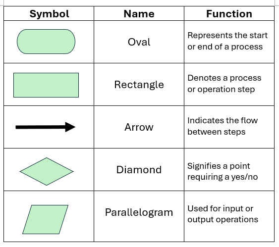

**[Home](README.md)** | **[Projects](Projects.md)** | **[Resources](Resources.md)** | **[Documentation](Documentary.md)** | **[Big Ideas](Big_Ideas.md)** | **[Data Compression](Data_Compression.md)** | **[Quiz Documentation](Quiz_Documentation.md)** | **[AP Topics](AP_Topics.md)** | **[Pseudocode/Swift](Pseudocode_Swift.md)** | **[Review](Review.md)**

# **[AP Topics](AP_Topics.md)**

# **Unit 1: Creative Development**
[Unit 1 Tutorial Video](https://drive.google.com/file/d/1FvfG1asd2-SAfnafli7ZoFw6rLW8Lz8Q/view?usp=sharing)

## **Collaboration**

Creating a program is a collaborative process which brings ideas into life with the development of software. And while people create a program it is almost impossible to work alone. So people collaborate and create programs together. 

A very important part of this topic is what computing innovation is. A computing innovation is a device that uses a computer program to get and transform data. Social media websites are examples for computing innovations because many computer programs work to collect data and make the website as a whole to work. 

**Note:** New solutions can be found in both smaller groups and larger groups. 

**Note:** Group work is ALWAYS better than individual work while creating a program because new perspectives are needed while creating a computing innovation.

Collaboration helps a program to be created easier because:
- Multiple perspectives can be seen
- Different improvements can come from different people
- Students develop new thinking skills
- It increases the student responsibility
- Students can understand new points of views for the same thing
- Helps students to understand diverse cultures
- Eliminates bias

Students from different backgrounds can:
- Identify different problems
- Find new solutions to these problems
- Prepare all the students in the group to the real world

Collaboration can happen in 3 steps of creating a program:
- Planning
- Designing
- Testing and Debugging

   

## **Program Function and Purpose**

A program is called to an instruction set that tells the computer how to complete a task. These programs exist because they help people do work faster and easily, they give information and create entertainment. 

Every program has something in common. They all have something called a function. 
- Function → What the program does
- Purpose → Why the function is created
**Example:** Calculators perform operations (making operations is the function).
**Example:** This program helps people to solve problems (helping people solve problems is the purpose).

Programs work by taking data from the user which is called inputs and they respond by giving out outputs which are basically answers that computers give after receiving an input. 
**Example:** In a calculator 15 + 4 is entered. The inputs are the numbers 4, 15 and the + operation. 
**Example:** The output of this operation is 19.

If you understand a program’s purpose and function you can also know if the program is working correctly. 
**Example:** If you understand that the calculator needs to add the entered numbers you can know if the output of the operations are correct. You can know that the answer is wrong when the output is 15+4=22.

In CS Principles, knowing the difference between a function and a purpose is so important because it is the main part when you are designing your own program. 

   

## **Program Design and Development**
While you are creating a program you are not only typing code, you are going through a process called the iterative development. You go through this process again and again until the program is perfect. This process is:

      - Plan
          - You start by figuring out the problem you are trying to solve. 
          - You can use brainstorming.
              - How much time will the program take to create?
              - What does the program include in it?
              - What are the main features of the program and what these features need to have?
              - What does the code structure need to include in the program?
        - Pseudocode Using
              - Bulletpoint way to plan codes more easily and faster
        -  Flowcharts
              - Shape-using way to plan codes more easily and faster
      - Code
          - Starting to write the code in programming languages like:
          - Python, Swift, Java
              - It's important to use readable code by using clear variable names
              - Organizing and leaving comments so everyone can understand the code easily.
      - Test
          - If you just publish your code without testing it's basically gambling because you don’t know if the code will work as intended. 
          - Look for errors in the code
          - Look for incorrect results in the result
          - Give different inputs and just observe
          - Give the first part of your program to other people and test the program with real users. Get their feedback. 
      - Improve
          - After testing, analyze the mistakes and try to solve them. 
      - Repeat
          - Repeat everything in this process until the program is perfect. 

## **Identifying and Correcting Errors**
In programming there are 4 main types of errors:

**Syntax Error:**
- A typo error in the code structure. A code part that doesn’t conform with the code language used. 

**Example:** print(What“)
There is a “ missing before the text.

 

**Run-Time Error:**
- A mistake in the program that happens after the program is runned. So it happens in the middle of the run-time. 

**Example:** print(15/0)
Something divided by 0 is undefined and the code can’t show that so it stops during the run-time and gives an error.

 

**Logic Error:**
Logic errors are the hardest mistakes to solve while testing the code. They are sense errors and they are seen when the program doesn’t work as intended. There are no code errors. 

**Example:**

a = 97

IF (a>90){

DISPLAY (“A”)

IF (a>80){

DISPLAY (“B”)

IF (a>70){

DISPLAY (“C”)

IF (a>60){

DISPLAY (“D”)

ELSE{

DISPLAY (“F”)

 

The output appears as ABCD because the score is bigger than 60, 70, 80, 90. There needs to be If else (Elif) instead of if (not in the first if). 

**Overflow Error:**
These mistakes happen when the number or text is too big that it exceeds the range of the program. 

**Example:**
x=15786*197387
print(x)

 

**Correcting Errors**
- Correcting errors is called debugging and it is made with testing. 
- Syntax errors are easy to fix because the program shows which line the problem is. 
- Run-time errors are solved by making sure there isn’t something that doesn’t exist. (Like something divided into 0)
- Logic errors are really hard to solve because they aren’t in a few specific lines of the code structure. The programmer needs to think thoroughly and test the program many times to make sure it works correctly. 

   

# **Unit 2: Data**
[Unit 2 Tutorial Video](https://drive.google.com/file/d/1uqg6Bfj1CiPNuqszWxRTWmwcz8Nxgp7a/view?usp=sharing)

## **Binary Numbers**
- A bit is the smallest unit of information a computer can store. It can either be 1 or 0. These digits mean true/false, yes/no, off/on etc. However bits are also the biggest units of information a computer can manipulate. 

**Note:** n bits → 2² 

We convert decimals and binary numbers with each other because decimals are used in our daily lives when binary numbers are used in the computers. 

**Conversion**
- **N1 (2 to the power of 0)**
- **N2 (2 to the power of 1)**
- **N3 (2 to the power of 2)**
- **N4 (2 to the power of 3)**
- **…**
- **print(...,N4,N3,N2,N1)**

**Note:** The same patterns of bits can represent things in the computers. (Like the color of a certain part in an image)

 

**Big Example:**
-Colors in an image are created by red, green and blue. They all have values between 0 and 255. 

Red 		- [255, 0, 0] 		- 	[11111111, 0, 0]

Green 	- [0, 255, 0]  		- 	[0, 11111111, 0]

Blue 		- [0, 0, 255] 		-	[0, 0, 11111111]

Example	- [200, 150, 255]	-	[11001000, 10010110, 11111111]

 

## **Data Compression**

- Data compression is basically reducing file size to save space or speed up transmission. The goal is to keep the same information using fewer bits. Compressions look for patterns and get rid of unnecessary information and data. 

**Example:** xxxxxyyyzzzz = 5x3y4z
- 12 digit to 6 digits
- Saved 6 digits.

 

Compression is divided into 2 parts:
Compression
- Making a file smaller
- Uses an encoding algorithm to compress files

Decompression
- Getting the file back to the original
- Uses a decoding algorithm to decompress the files

Types of Data Compression:
- Lossless: No data lost, original file can be restored.
Used for text 

- Lossy: Some data lost, exact file cannot be restored. 
Used for images and sound

**Note:** Compression Ratio is → Original Size / Compressed Size

**Note:** Percent Reduction is → ((Original Size - Compressed Size) / Original Size * 100)

**Summary:**
Lossless - Size is larger, quality is better
- Often used in important files

Lossy - Size smaller, quality is slightly worse
- Often used in files that aren’t so important (that just spend area in the computer)
  
- Data compression is important because it saves area in the computer.

 

**Metadata:**
- Data about data
- It helps people to know what a file is about without opening it.
**Examples:**
- Size of file
- Date of file
- Name of file
- Type of file
 
   

## **Extracting Information From Data**
In data science to extract information the user has to visualize and manipulate the data. 

**Some examples of data extraction:**
-Social Media Apps
-Posts
-Likes
-Comments
-Views

**Some examples of data extraction:**
-Online Stores
-Items we searched
-Items we viewed

**Note:** The users of websites create data too. (Messaging a friend etc.)

**Note:** Companies that store data are having hard times trying to give meaning to these data sets. They need to analyze them. 

**Data:** Raw information from the computer.

**Information:** Processed and analyzed data.

Information is the organized and processed form of data. (Information is usable.)

Prefix Meta:
An underlying definition or description.

      Metadata: 
      - Data that describes data
      - Describes whatever the data is connected to
      - It helps classification
      - Makes it easier to retrieve information
      
      Examples:
      - Author of file
      - Name of file
      - Size of file
      - Type of file
      - Date of file
      - Usage of file

      Difference Between Data and Metadata:
      - Data is content that reports observations
      - Metadata describes relevant information about data

**Data Cleaning, Data Analytics:**
Unstructured data is hard to sort and manage. So people need to clean them up and structure them. There are 2 ways to structure data sets:

Adding a storage format which kills the invalid data

Using log files to group data that are easier to manipulate like grouping data that are from the same dates. 

Note: Sometimes data sizes may exceed the range of what the computer can handle. To fix these overloads, the analysis needs to be done and the physical servers like CPU’s should be the needed amount. Also there should be a backup for most things. 

   

## **Using Programs With Data**
- The use of internet and digital devices increase which cause data to flood. So people have hard times finding the information they are looking for. But there is an easier way to find information. 

      - Data Mining: The steps of finding data to turn them into usable information.
   
      - Finding the data from cloud platforms
      - Storing the data in a database like repositories
      - Preparing the data for analysis by deciding the tools for analysis
      - Analyzing the data by using data visualization tools to understand patterns
  
      Often graphs are used to understand data:
      - Picture graphs use pictures to represent values
      - Bar graphs use horizontal and vertical lines to show values
      - Line graphs represent values by using lines
      - Scatterplots are like line graphs but they draw a best fit line as well

   

# **Unit 3: Algorithms and Programming**
[Unit 3 Tutorial Video](https://drive.google.com/file/d/1rc4zCoxNbSTyCmlCWeWOZFZx5Ep75mOa/view?usp=sharing) | [Unit 3 Tutorial Video Part 2](https://drive.google.com/file/d/1MX6RoSCVRPETl2RdK3-CFuptkbeqEA5u/view?usp=sharing)
## **Variables and assignments:**

The purpose of a program is to manipulate information in many forms.

Variable: name of the location of the information in the memory,

Most programming languages require that programmers be explicit about what kind of information needs to be manipulated. In turn, it guarantees that it is easy to manipulate the data.

Examples:
- Int: 5, -2
- Double: 5.1, -2,7
- Char: “a”, “b”
- Boolean: T/F

NOTE: Many popular programming languages use standard type names such as int and double for numbers, char and string for letters and worlds respectively, and Boolean for True or false, as shown in the table above.

A variable can store only one value as a result of an assignment statement. When you assign a value to a variable, it changes to the new one (it forgets the old variable).

 

Shortly, an assignment can store only one value as a variable.

You can assign a single number or word to a variable;

a = 5

a = this

 

You can also assign the result of an expression;

a = 5 + 4 – 3

 

You can assign “number”, “word” and “result”

a = 5

b = a

c = a + 7 + b

c = 17

   

## **Data abstraction (info hiding):**

A popular way of defining abstraction is hiding information. Related program variables can be bundled together. We can use lists to bundle related variables.

**aList = [3, 7, 8, 10, 23]**

Within a list, when accessing its parts using an integer index, aList [1] gives us the value 3, aList[2] = 7, and so on. 

NOTE: Lists allow for data abstraction in that we can give a name to a set of memory cells.

**For example:** In a colorList, a list that holds three colours [‘red’, ‘blue’, ‘green’] instead
of using three separate variables, color1, color2, etc.

**For example: **
Flavour list [vanilla, chocolate, melon, strawberry, lemon]
This list is where flavours in an ice cream shop are put in.

NOTE: List Index in the Exam Reference Sheet starts at 1. This concept is confusing because, in many programming languages, the index values start at 0. Index starts from 0 at swift. But here it starts from 1.

   

## **Mathematical expressions:**

While writing programs, it is often necessary to include calculations. 

Calculations are called **expressions**.

An expression is a combination of one or more operators and operands that perform
Calculations.

      The process of obtaining a value is called an evaluation.
      Add + a+b
      Subtract - a-b
      Multiply * a*b
      Divide / a/b
      Remainder % a%b (MOD)
      The operation MOD (short for modulus) is an important operation in computer
      science, but one you probably don’t use a lot in math class.

NOTE: Modulus refers to the remainder after division. 

**For example**, to find 5 MOD 3:

Therefore, **5 MOD 3 = 2**

Notice that the resulting 1 isn’t important. It is only the remainder that counts.

**For example:** 7 MOD 2 = 1

- **Result isn’t important in MOD.**
- **!!There is an order of operations in CSP!!**

**For example,** let’s look at the expression 3 – 5 * 4 MOD 3. 

-The operations with first precedence in this example are multiplication and MOD. Since multiplication is to the left of MOD, begin with executing multiplication:

3 – 5 *4 MOD 3 = 3 – 20 MOD 3

- Selection uses a Boolean condition to evaluate which of two parts of an algorithm to use. **(T/F), (Y/N)**, etc.

**Iteration is the process where the algorithm repeats itself until it meets a condition.**

- Different algorithms can solve the same problem.
- A good example for this is Google Maps on a cell phone. Once the from and to locations get filled, the software provides multiple routes as options.

There are many ways to express algorithms. Some of them include;

- Natural language
- Pseudocode
- Visual & textual programming languages

## **Strings:**

In computer science, a character is a symbol that appears on the keyboard such as a **letter, digit, or punctuation mark**. A collection of these characters is usually surrounded with double quotes: 

“computer” is called a string.

Strings can be words, sentences, single letters or even numbers

      Example:
      “a”, “ab”, “5”, “56”
      String a = “a”
      String ab = “ab”
 

Strings can be concatenated using the + sign:
This is called **concatenation**

      For example:
      Phrase “computer science”
      “science” and “computer” are substrings of the variable phrase.

## **Boolean expressions:**

T/F, Y/N → Boolean expressions are relational operators and logical operations to make
Decisions.

For example:
a = b 
This evaluates to true if a and b are equal. Otherwise, it evaluates to false.
      The relational operators;
      
      =, ≠, <, >, ≤, ≥
are used to test the relationship between two variables, expressions or values.

      Text:
      NOT condition
      Block:
      NOT condition

- Evaluates to TRUE if condition is false;
- Otherwise evaluates to FALSE

      Text:
      condition 1 AND condition 2
      Block:
      condition1 AND condition2

- Evaluates to TRUE if both condition1 and condition2 are true
- Otherwise evaluates to FALSE

      Text:
      Condition1 or condition2
      Block:
      Condition1 or condition2

- Evaluates to TRUE if condition1 is true or if condition2 is true, or if both condition1 and
- condition2 are true; Otherwise evaluates to FALSE

      1: TRUE if condition = false Because of NOT
      2: TRUE is condition1 and condition2 = true
      3: TRUE is condition 1 or condition2 = true

   

## **Conditionals:**

**An IF / ELSE statement is called a conditional statement.**

-Sometimes while designing a program, one or more program statements will be
executed when a condition is true.

-The condition within an IF statement is usually a Boolean expression that returns a
true or false.

Some parts of the code work when somethings **T/F/>/</≤/≥**

      1) if condition = TRUE
      The code happens else nothing
 

      2)if condition = TRUE
      The part under IF happens, else the part under else happens
      Below is an illustration of a simple IF statement
 

      IF (number 1 > number 2)
      }
      SmallerNumber number 2
      }
      ELSE IF (number 1 < number 2)
      {
      SmallerNumber number 1
      }

## **Nested Conditionals:**

**An additional IF statement in a program or code snippet that already has an IF statement is called a Nested IF statement.**

We can write more complex if statements and create programs with more specific
results.

      IF (number 1 > number 2)
      }
      SmallerNumber number 2
      }
      ELSE
      IF  (number 1 = number 2)
      {
      SmallerNumber number 
      }
      ELSE
      {
      SmallerNumber number 1
      }

## **Iteration:**

**The loop that repeats a certain part of the code.**

There are **2 ways:**

      Repeat N times
      Here, the code in the block of statements is executed n times.

 

      Repeat until….
      Here, the code in block of statements repeat until the condition happens (until the Boolean expression condition evaluates to true).

NOTE: The “REPEAT n TIMES” is a predetermined loop; that is, the loop will execute the program statements within the loop n number of times. Just needs to loop that amount

NOTE: The “repeat until condition” executes if the condition is true. Needs a specific ending condition to happen

      For example:
      Number = 1
      REPEAT UNTIL (number>10)
      {
      Number = Number +1
      }

- When the number is equal or higher than 10 the loop ends. The above loop will execute 9 times. When the number is given the value 10, the loop will terminate.

## **Developing algorithms:**

- An algorithm is a clear, step by step, detailed computable set of instructions. Sequence, selection & iteration are fundamental blocks of algorithms.
- Algorithms are building blocks for programs. Algorithms are written in English or pseudocode so that humans can understand them.
- Programs are algorithms that are written in a programming language so that computers can understand them.

**!!Linear search!!**
**It is one straightforward way to perform the search by starting at the beginning of the list and comparing each value, in turn, to the target element.**

**Let’s look at an Example:**

      Suppose you were to use a linear search for the location of 21 in the list [5, 16, -3, 21, 7]. 
      Start at index 1 and move forward.
      Target value= 4
      5 16 -3 21 7

 

      We start from 5: 21 is not found at index 1. Try index 2
      21 is not found at index 2. Try index 3 
      21 is not found at index 3. Try index 4.
      21 is found at index 4. End search.

In this example, 21 is tried to be found. We start from Index 1. We move on until we find 21. We find 21 at index 4. The answer is 4

**!!Flowcharts!!**

## **Lists:**

- Every value is stored at a specific position. 
- The number corresponding to each position is INDEX or SUBSCIRPT.

**As stated on the exam reference sheet, the index value begins at 1.**

 

      Text:
      aList ← [value1, value2, value3, …]

      Block:
      aList ← value1, value2, value3

Creates a new list that contains the values: value1, value2, value3, and …. 
- At indices 1, 2, 3, and … respectively and assigns it to aList
- In this example I created aList that contains values in it. 

 

      Text:
      APPEND (aList, value)

      Block:
      Append - aList, value

- The length of aList is increased by 1, and value is placed at the end of aList. 
- In this example I added a value to aList. 

 

      Text:
      REMOVE (aList, i) 
      
      Block:
      Remove - aList, i

- Removes the item at index i in aList and shifts to the left any values at indices greater than i. The length of aList is decreased by 1. 
- In this example I removed a value from aList.

## **Binary Search:**
Binary search is one of the searching types in coding when the list or array values that are numbers are in proper order. 
	
**NO ORDER = NO BINARY SEARCH**

**Example:**

      let userID: [Int] = [2, 5, 8, 12, 16, 23, 29, 34, 49, 58, 68, 74, 93]
      let target: Int = 74
      func search(_ array:[Int], _ target:Int) -> Int {
    var start: Int = 0
    var end: Int = array.count - 1
    var mid: Int = (start+end)/2
    
    while true{
        if array[mid] == target{
            return mid
        }
        else if array[mid] < target{
            start = mid + 1
        }
        else if array[mid] > target{
            end = mid - 1
        }
        mid = (start+end)/2
          }
      }
      print(search(userID, target))

In this example of a program that does binary search the target is 74. The function search first creates a start and end value which is then used to find the mid value which is the midpoint of the start and the end. Then if the midpoint value of the array is equal to the target then the target has been found. But if the value is higher, then the lower parts are deleted by adding 1 to the midpoint and equaling it as the new start. If the target value is lower than the midpoint value, the mid is decreased by 1 and the new end value becomes this. 

## **Calling Procedures**
Some procedures need some input values to be entered when they are called. So while calling procedures you need to enter the needed values for the function to work. Some procedures need strings, some need integers. It changes with the procedure. 

**WRONG DATA TYPE ENTERED WHILE CALLING A FUNCTION = ERROR**
      
**Example:**

      let userID: [Int] = [2, 5, 8, 12, 16, 23, 29, 34, 49, 58, 68, 74, 93]
      let target: Int = 74
      func search(_ array:[Int], _ target:Int) -> Int {
      ...
          }
      }
      print(search(userID, target))

In this example there is a function named search. This function asks for an “array” which can consist of integer values because of the [Int] and a “target” value which too can be an integer only. After the function has been called, an integer value can be an output because of the -> Int. 

When we move to the calling part of the function which was print(search(userID, target)). There is no need to write like array:aaaa or target:bbbb because I used _ and _ while creating the function at the start so the user can only write aaaa or bbbb. 

# **Developing Procedures**

Procedure-named program piece that serves a specific purpose. 

A whole program is created by procedures that have specific functions working together. 

2 types of procedures:
- Return a value
- Execute a block of statements

Don’t forget about the robot procedures in the AP CSP questions. 

1. Naming a procedure is important - gives clue about its purpose

2. Think about the parameter

	RotateLeft()
	MoveForward()
	RotateRight()
	MoveForward()
	MoveForward()
	RotateRight()
	MoveForward()
	RotateLeft()

- THIS IS detourLeft()

	MoveForward()
	RotateLeft()
	MoveForward()

- THIS IS turnCorner()

THIS CODE —>

	RotateLeft()
	MoveForward()
	RotateRight()
	MoveForward()
	MoveForward()
	RotateRight()
	MoveForward()
	RotateLeft()
	MoveForward()
	RotateLeft()
	MoveForward()
	MoveForward()
	MoveForward()

IS EQUAL TO THIS CODE —>

	detourLeft()
	turnCorner()
	MoveForward()
	MoveForward()

This code is shorter, easier to write, easier to debug, uses less space, is better from every perspective. 

# **Libraries**

**Library** - A file that has shortened procedures for coders to use to write code more efficiently. 

**API** - It helps with how the procedures from the libraries can be used. The documentation. It simplifies the interactions with an app or a coding language without needing to become an expert of it. 

Libraries are often used to shorten the code, write easier. Cause some codes can be way too long.

You don’t need to know how the procedure you take from the library works. You just have to know how to call it. 

The exam reference sheet for AP CSP (The robot codes) can be an example of a Library. 

# **Random Values**

**Note:** in AP CSP RANDOM(a, b) --> Means numbers from a to b (a&b included)

When you are given two random values and asked about a variables value that is affected by these randoms you need to try both the lowest and the highest values that the random values have and form a range for the last variable. 

**RANGE IS IMPORTANT**

# **Simulations**

Computer simulations can be limited and have bias. They mimic the real world. 

- A simulation will not always have the same result.
- A simulation has results which aren’t more accurate than an experiment.
- A simulation can model real-world events that are not practical for experiments.
- A simulation investigates a phenomenon without real world constraints of time, money or safety. 

Faults in the real world aren’t in the simulations. Like gravity or weight when you are throwing a dice. 

# **Algorithmic Efficiency**

The code is tried to be shortened.

There are different algorithms and the goal of the coder is to use the most efficient, easiest one of them. 

**Example:** Card Sorting

**Algorithm 1**

The first 2 cards are being compared the lower one is put on the left side. Then the second 2 cards are being compared and swapped if the lower card is on the right side. It goes on like this.

**Algorithm 2:**

Every card is looked at and the lowest card is founded, put on the left side. Then the second lowest card is found and put beside the lowest card and it goes on like this. 

The **second algorithm has less comparisons and swaps**. It more efficient, effective, fast, easy. So according to algorithmic efficiency the second algorithm should be picked by the coder. 

**Diff between Exponential and Linear and Factorial:**

**Exponential** - Unreasonable amount of time

**Linear** - Reasonable amount of time

**Factorial** - Unreasonable amount of time

**Heuristic** is an approach to a problem that produces a solution that is not guaranteed to always find an optimal solution. 

Heuristics are used when a problem can be solved but would take an unreasonable amount of time. 

# **Undecidable Problems**

There are **2 types of problems**
- Decidable
- Undecidable

Undecidable problems don’t have algorithms that always produce a yes or no answer to the problem being faced. 

**Real life examples:**
- When a website takes too long to open
- When an app doesn’t open

After a certain time the computer stops trying to solve the problem

# **The Internet**
It wasn’t practical for computers to work alone. They were capable of sending and receiving data but they didn’t have someplace where they could share data. 

**A packet** - Small amount of data sent over a network. 

Each packet has:
- A source
- A destination
- Information

**A computer network** - A group of interconnected computing devices capable of sending or receiving data. 

**A computer system** - A group of computing devices and programs working together for a joint purpose.

**Packet switching** - The message file is broken to pieces and sent to the receiver without order. 

**Path** - Sequence of directly connected computing devices from sender to receiver. 

**Routing** - The process of finding a path from sender to receiver. 

**Bandwidth** - Max amount of data that can be sent in a fixed amount of time on a computer network. (Bits per second)

**Computer Protocol Models:**

- OSI: The layers you have to go through to communicate 7 groups of protocols.
- TCP: Establishes a common standart for how to send messages between devices on the internet.
- IETF: Manages the development of standards and tech discussions about the internet in an open process. 

**Narrow Waist Layers**
1. Network Access Layer: About the hardware, wifi, wires
2. Internet Layer: The 1s and the 0s are being transported to the receiver. Metadata contains information of the receiver.
3. Transport Layer: Open standards enable different developers to build hardware and software to communicate within the internet.
4. Application Layer: Some are web servers, some are domain name services.

- This is a web server:
- https://www.mycompany.com

- This is a DNS
- www.mycompany.com

# **Fault Tolerance**
Think of 7 cities that have roads to each other like A to B to C to D to E to F to G. If for instance road C-D collapses then A, B, C can’t communicate with other cities. 
So this example wasn’t fault tolerant. 

Let’s think of these 7 cities in a different way. Every city has roads to every other city. So if the road between C-D collapses every city can still communicate with each other. Because this example is fault tolerant. 

**Note:** The internet is a fault tolerant system. 

With more devices and connections the system only gets more and more strong. It produces new ways to communicate and the fault tolerance increases. The data can communicate from different routes. 

# **Parallel and Distributed Computing**
Computers have some tasks they need to do. They schedule these tasks. 

1. **Sequential Computing**
- Computers do the tasks one by one
- Example: Task A: 10 ms, Task B: 30 ms, Task C: 40 ms
- Total process time is 10+ 30 + 40 = 80 ms
- Tasks are independant
      
2. **Parallel Computing**
- The tasks are done simultaneously
- Hardware driven: Many cores are used to do these tasks at the same time
- Data driven: Lots of data can be processed in the same way
- So the tasks are done quicker: Supercomputers link hundreds of CPUs to work fast
- Example: Task A: 10 ms, Task B: 30 ms, Task C: 40 ms
- Total Process time is equal to the longest task = 40 ms
          
3. **Distributed Computing**
- Tasks are sent to other computers
- It runs in the mix of parallel and sequential computing
- It can be faster or slower than parallel
- Google web search

# **Beneficial and Harmful Effects**
Think of a drone

1. **Benefits:** Deliveries, finding lost people, aerial photography
2. **Harms:** Flying in restricted zones is illegal, privacy concerns

Think of a Wii Controller

1. **Benefits:** Gets people active
2. **Harms:** Injuries, broken TV

Think of 3D Printers

- They can create parts including themselves.
- So computing innovations can create themselves or computing innovations. 

**Note:** A computing innovation can have an impact beyond its purpose. 

# **Digital Divide**

**Socioeconomics** - Refer to the total amount of money entered into the households(Some people may not have enough money to afford a computer)

**Geographic** - The place where there is internet connection and where there isn’t(A computer may not connect to the internet at a mountain)

**Demographics** - Include age(you may not have a computer when you are very young), religion(Amish people don’t have cars)…

**Countries** - Every country has different limitations to certain computing innovations.(Computers aren’t common in rural areas)

# **Computing Bias**

Think of Netflix:
- It takes your information
    - Name
    - Address
    - When you watch
    - What you watch
    - What you binge
    - Style of shows selected 
- It shows you the Netflix exclusive content
    - To keep your subscription
 
  
This computing bias can be a good thing because it guesses what you will pick next to watch. 

**All software can be biased - unintentionally or intentionally**

**Bias should be avoided while coding.**

# **Crowdsourcing**
**Presentation Link:** file:///Users/kaankoca/Downloads/5.4%20Crowdsourcing.pdf

Crowdsourcing is basically when a large amount of people contribute a small amount of data or ideas or work to solve a specific problem. Also it happens from the internet. Here are some examples of crowdsourcing:

- Wikipedia: Many people write down information and in final long articles are created
- Google Maps: User traffic reports helps the app to change something wrong
- Youtube: Users upload their videos and people can have a wide variety of things to watch
- Yelp: Users write reviews which help other users help decide where to go

**5 Problems That Crowdsourcing Can Solve:**
- Crowdsourcing can help people to make their minds and decide on a restaurant to go. (Yelp)
- It can help people to choose a movie out of a group of them. (IMDB)
- It makes people buy the right product from Amazon or Trendyol because of the reviews. 
- It helps people to get help on their homeworks by asking questions to people. (eOdev)
- Choosing the right application by looking at their scores given by people. (App Store)

# **Legal and Ethical Concerns**
**Presentation Link:** file:///Users/kaankoca/Downloads/5.5%20Legal%20and%20Ethical%20Concerns.pdf

While technology is growing, it makes people think how some things have changed legally and ethically. There are now new responsibilities for people in order to use technology wisely.

**Legal** - Concerns about the law and technology

**Ethical** — what is right or wrong even if it is not illegal

Both of these matter and people should act according to these concerns and responsibilities about them

- Downloading movies or songs from non-original websites without paying is illegal
- Using a photo from the internet without credit or permission is illegal due to copyright. 
- A company selling your private information is illegal. 
- Plagiarism which is copying your code from the internet is wrong. 
- Social media collecting kids’ information is unethical and illegal. 

# **Safe Computing**
**PII (Personally Identifiable Information):**
- Social Security Number
- Age
- Race
- Phone Number
- Date of Birth
- Email Address
- Mailing Address
- Medical Information
- Credit Card Information

**Note:** PII can be used to impersonate someone or steal identity. 

Many websites collect data that are PII. They are used for practical use of the internet and show people some recommendations and etc. 

**Cookies** - Are information that you give your consent to that almost every website has. These cookies are used to learn more about you and give you a recommendation, idea or etc. that is about the websites purpose. 

**Note:** Once information enters the internet, it is very hard to erase them. 

In order to use a device there needs to be authentication. 
Authentication measures:
- **Strong passwords**
    - 10 or more characters
    - Symbol
    - Number
    - Lowercase and Uppercase letters
        - Not birthdays, 12345678, passwords, etc.
- **Multi-factor authentication**
    - When you need to enter a website with your password and a one time code sent to your phone
    - So it is to confirm your identity. 

**Virus and Malvare**
- **Virus:** Duplicates itself to gain access to a website
- **Malware:** Infiltrate a system by acting as legitimate programs or by attaching itself to legitimate programs

**Note:** People must do virus scans on their computers. 

**Encryption and Decryption:**
- **Encryption** is the process of encoding data to prevent unauthorized access. 
- **Decryption** is the process of decoding this encrypted data. 

**2 Types of Encryption:**
- **Symmetric**
    - Both the sender and the receiver now the code’s encryption details. 
- **Asymmetric**
    - Both the sender and the receiver don’t know how to decrypt the code. 
    - There is a public key for encrypting and a private key for decrypting

**Phising:**
- Phising is people tricking people into clicking a link or opening an attachment. 
- Phising emails look like
    - Your bank
    - Credit card company
    - Social networking site
    - Online store

**Keylogging:**
- Keylogging is recording every keystroke that you made on your computer to gain access to your passwords and important information. 

**Rouge Access Point:**
- A wireless network that can give unauthorized access to secure networks. 
