**[Home](README.md)** | **[Projects](Projects.md)** | **[Resources](Resources.md)** | **[Documentation](Documentary.md)** | **[Big Ideas](Big_Ideas.md)** | **[Data Compression](Data_Compression.md)** | **[Quiz Documentation](Quiz_Documentation.md)** | **[AP Topics](AP_Topics.md)** | **[Pseudocode/Swift](Pseudocode_Swift.md)** | **[Review](Review.md)**

# **[Documentation](Documentary.md)**

 

## Scratch Tic Tac Toe 

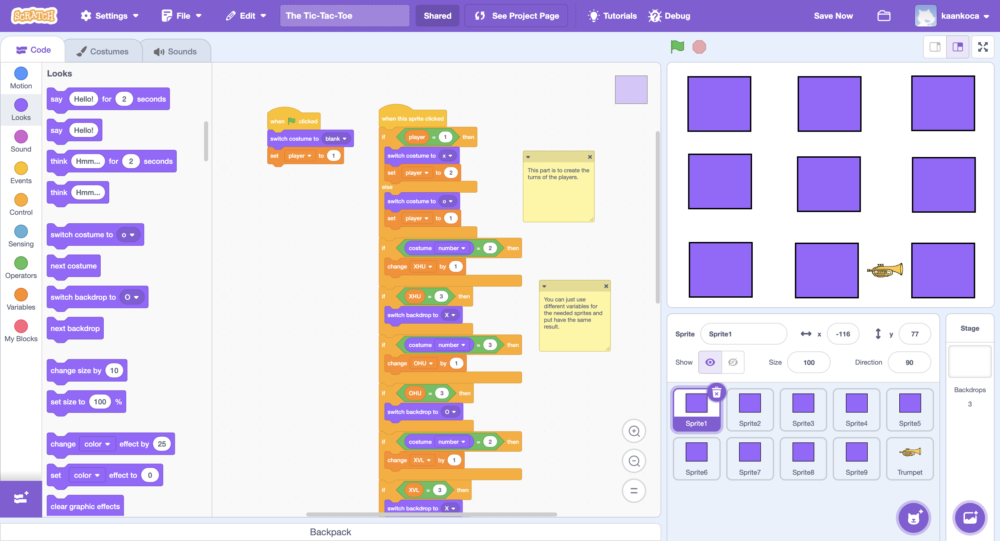  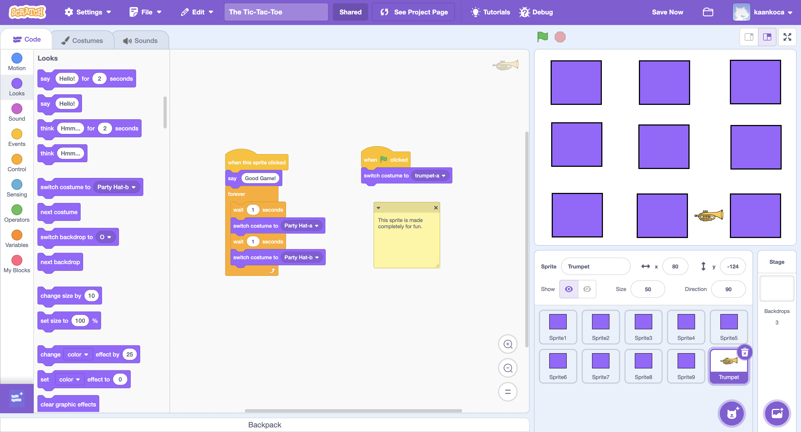  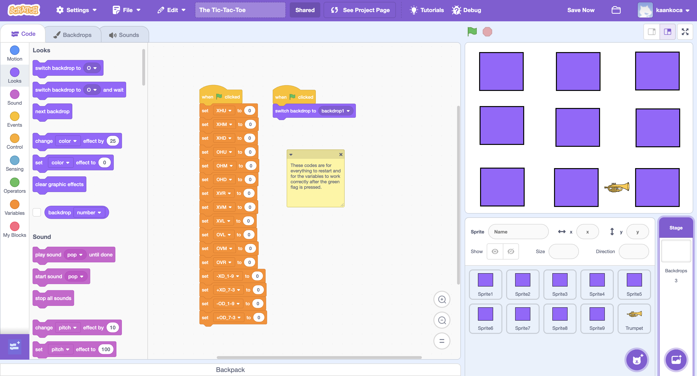

 

## Swift Box/Tic Tac Toe

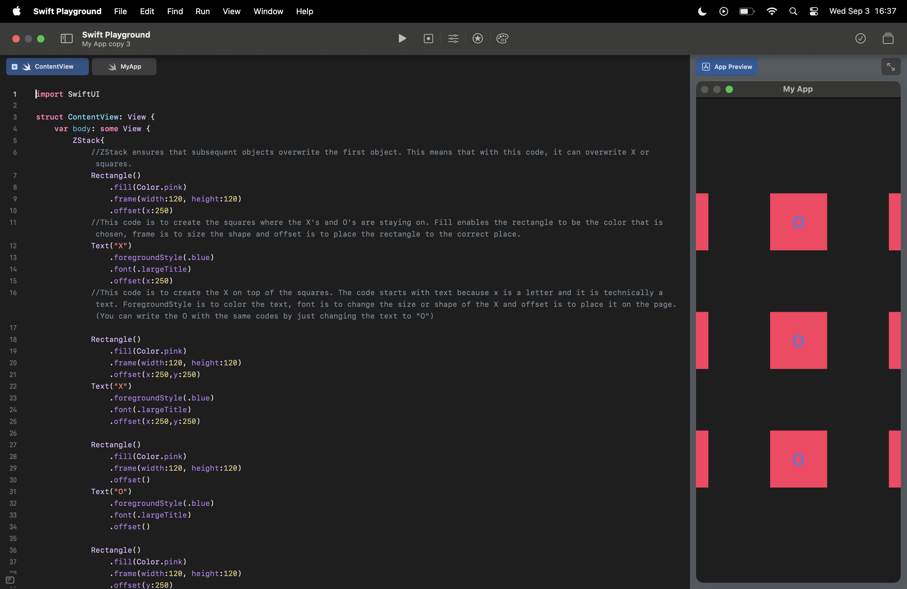

    //1 September 2025
    import SwiftUI

    struct ContentView: View {
    var body: some View {
        ZStack{
            //ZStack ensures that subsequent objects overwrite the first object. This means that with this code, it can overwrite X or squares.
            Rectangle()
                .fill(Color.pink)
                .frame(width:120, height:120)
                .offset(x:250)
            //This code is to create the squares where the X's and O's are staying on. Fill enables the rectangle to be the color that is chosen, frame is to size the shape and offset is to place the rectangle to the correct place. 
            Text("X")
                .foregroundStyle(.blue)
                .font(.largeTitle)
                .offset(x:250)
            //This code is to create the X on top of the squares. The code starts with text because x is a letter and it is technically a text. ForegroundStyle is to color the text, font is to change the size or shape of the X and offset is to place it on the page. (You can write the O with the same codes by just changing the text to "O")
            
            Rectangle()
                .fill(Color.pink)
                .frame(width:120, height:120)
                .offset(x:250,y:250)
            Text("X")
                .foregroundStyle(.blue)
                .font(.largeTitle)
                .offset(x:250,y:250)
            
            Rectangle()
                .fill(Color.pink)
                .frame(width:120, height:120)
                .offset()
            Text("O")
                .foregroundStyle(.blue)
                .font(.largeTitle)
                .offset()
            
            Rectangle()
                .fill(Color.pink)
                .frame(width:120, height:120)
                .offset(y:250)
            Text("O")
                .foregroundStyle(.blue)
                .font(.largeTitle)
                .offset(y:250)
            
            Rectangle()
                .fill(Color.pink)
                .frame(width:120, height:120)
                .offset(x:-250)
            Text("X")
                .foregroundStyle(.blue)
                .font(.largeTitle)
                .offset(x:-250)
            
            Rectangle()
                .fill(Color.pink)
                .frame(width:120, height:120)
                .offset(x:-250,y:250)
            Text("X")
                .foregroundStyle(.blue)
                .font(.largeTitle)
                .offset(x:-250,y:250)
            
            Rectangle()
                .fill(Color.pink)
                .frame(width:120, height:120)
                .offset(y:-250)
            Text("O")
                .foregroundStyle(.blue)
                .font(.largeTitle)
                .offset(y:-250)
            
            Rectangle()
                .fill(Color.pink)
                .frame(width:120, height:120)
                .offset(x:250, y:-250)
            Text("X")
                .foregroundStyle(.blue)
                .font(.largeTitle)
                .offset(x:250,y:-250)
            
            Rectangle()
                .fill(Color.pink)
                .frame(width:120, height:120)
                .offset(x:-250,y:-250)
            Text("X")
                .foregroundStyle(.blue)
                .font(.largeTitle)
                .offset(x:-250,y:-250)
        }
    }
    }

 

## Swift Favorites

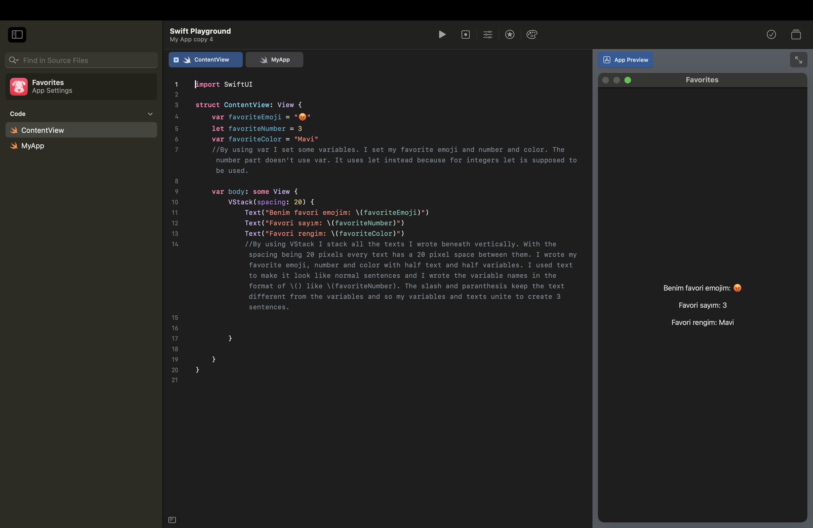

       //1 September 2025
    import SwiftUI

    struct ContentView: View {
    var favoriteEmoji = "😡"
    let favoriteNumber = 3
    var favoriteColor = "Mavi"
    //By using var I set some variables. I set my favorite emoji and number and color. The number part doesn't use var. It uses let instead because for integers let is supposed to be used. 
    
    var body: some View {
        VStack(spacing: 20) {
            Text("Benim favori emojim: \(favoriteEmoji)")
            Text("Favori sayım: \(favoriteNumber)")
            Text("Favori rengim: \(favoriteColor)")
            //By using VStack I stack all the texts I wrote beneath vertically. With the spacing being 20 pixels every text has a 20 pixel space between them. I wrote my favorite emoji, number and color with half text and half variables. I used text to make it look like normal sentences and I wrote the variable names in the format of \() like \(favoriteNumber). The slash and paranthesis keep the text different from the variables and so my variables and texts unite to create 3 sentences. 
            
            
        }
       
    }
    }

 

## Swift Ice Cream Shop

       //1 September 2025
    import SwiftUI

    struct ContentView: View {
    var body: some View{
        let ConePrice = 15
        let ConeAmount = 3
        let Total = ConePrice*ConeAmount
        //This code is basically a library of my variables. With the let codes I can set integer variables like the price and amount of cones. By multiplyin these two variables I find the total. 
        
        VStack{
            Text("One cone price is \(ConePrice).")
                .bold()
                .foregroundColor(.blue)
            Text("The cone amount you chose is \(ConeAmount).")
                .bold()
                .foregroundColor(.yellow)
            Text("The total price is \(Total)")
                .bold()
                .foregroundColor(.green)
            //With VStack you can put texts or shapes or etc. vertically. So I used texts and the variables I wrote before and united them to create sentences that showed the user all the variables in a correct way. I made the texts bol with the code .bold() and changed the colors with .foregroundColor(.color).
        }
                
    }
    }

 

## Swift Hamburger Cafe

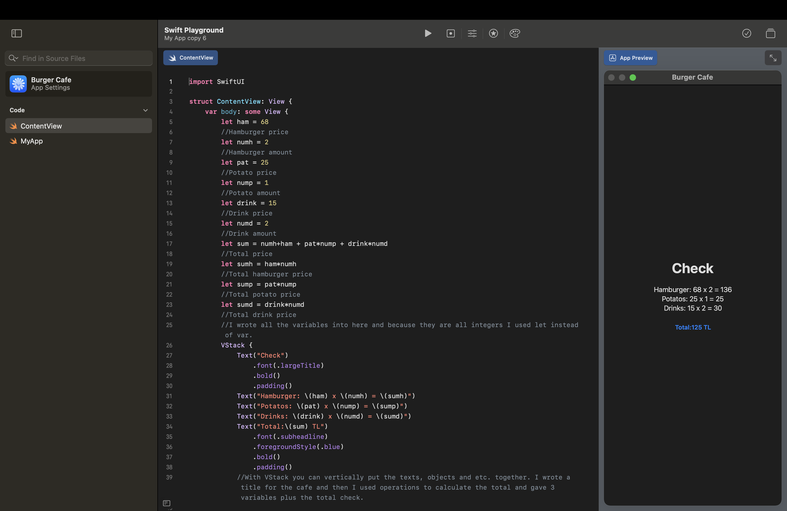

    //2 September 2025
    import SwiftUI

    struct ContentView: View {
    var body: some View {
        let ham = 68
        //Hamburger price
        let numh = 2
        //Hamburger amount
        let pat = 25
        //Potato price
        let nump = 1
        //Potato amount
        let drink = 15
        //Drink price
        let numd = 2
        //Drink amount
        let sum = numh+ham + pat*nump + drink*numd
        //Total price
        let sumh = ham*numh 
        //Total hamburger price
        let sump = pat*nump
        //Total potato price
        let sumd = drink*numd
        //Total drink price
        //I wrote all the variables into here and because they are all integers I used let instead of var.
        VStack {
            Text("Check")
                .font(.largeTitle)
                .bold()
                .padding()
            Text("Hamburger: \(ham) x \(numh) = \(sumh)")
            Text("Potatos: \(pat) x \(nump) = \(sump)")
            Text("Drinks: \(drink) x \(numd) = \(sumd)")
            Text("Total:\(sum) TL")
                .font(.subheadline)
                .foregroundStyle(.blue)
                .bold()
                .padding()
            //With VStack you can vertically put the texts, objects and etc. together. I wrote a title for the cafe and then I used operations to calculate the total and gave 3 variables plus the total check. 
            
            
            
        }
        
    }
    }

 

## Swift Calculator

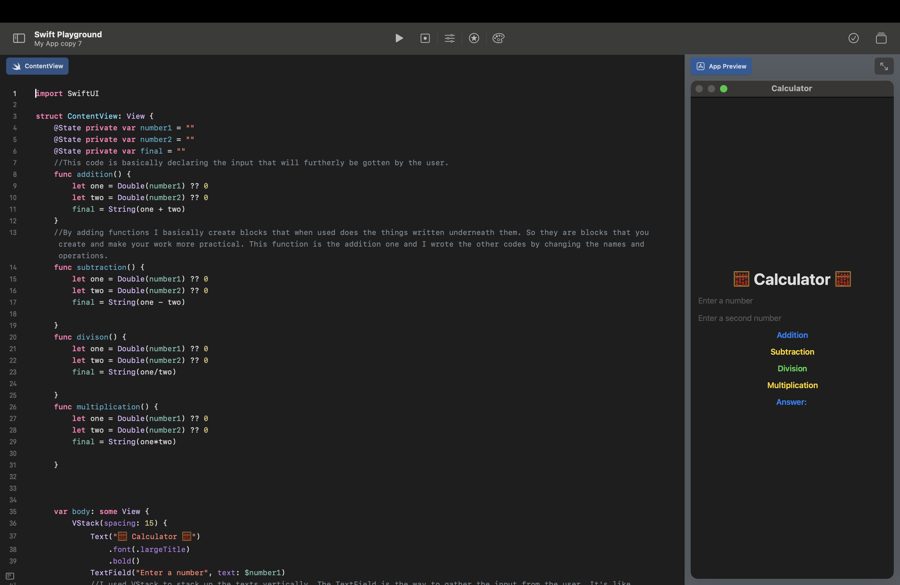  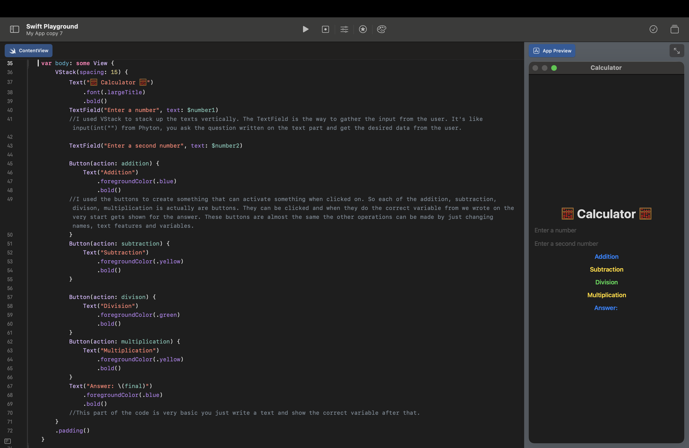

     //3 September 2025
    import SwiftUI

    struct ContentView: View {
    @State private var number1 = ""
    @State private var number2 = ""
    @State private var final = ""
    //This code is basically declaring the input that will furtherly be gotten by the user.
    func addition() {
        let one = Double(number1) ?? 0
        let two = Double(number2) ?? 0
        final = String(one + two)
    }
    //By adding functions I basically create blocks that when used does the things written underneath them. So they are blocks that you create and make your work more practical. This function is the addition one and I wrote the other codes by changing the names and operations.
    func subtraction() {
        let one = Double(number1) ?? 0
        let two = Double(number2) ?? 0
        final = String(one - two)
        
    }
    func divison() {
        let one = Double(number1) ?? 0
        let two = Double(number2) ?? 0
        final = String(one/two)
        
    }
    func multiplication() {
        let one = Double(number1) ?? 0
        let two = Double(number2) ?? 0
        final = String(one*two)
        
    }
    
    
    
    var body: some View {
        VStack(spacing: 15) {
            Text("🧮 Calculator 🧮")
                .font(.largeTitle)
                .bold()
            TextField("Enter a number", text: $number1)
            //I used VStack to stack up the texts vertically. The TextField is the way to gather the input from the user. It's like input(int("") from Phyton, you ask the question written on the text part and get the desired data from the user. 
            
            TextField("Enter a second number", text: $number2)
            
            Button(action: addition) {
                Text("Addition")
                    .foregroundColor(.blue)
                    .bold()
            //I used the buttons to create something that can activate something when clicked on. So each of the addition, subtraction, divison, multiplication is actually are buttons. They can be clicked and when they do the correct variable from we wrote on the very start gets shown for the answer. These buttons are almost the same the other operations can be made by just changing names, text features and variables.
            }
            Button(action: subtraction) {
                Text("Subtraction")
                    .foregroundColor(.yellow)
                    .bold()
            }
            
            Button(action: divison) {
                Text("Division")
                    .foregroundColor(.green)
                    .bold()
            }
            Button(action: multiplication) {
                Text("Multiplication")
                    .foregroundColor(.yellow)
                    .bold()
            }
            Text("Answer: \(final)")
                .foregroundColor(.blue)
                .bold()
            //This part of the code is very basic you just write a text and show the correct variable after that.
        }
        .padding()
    }
    
    
    }

 

## Profile Image

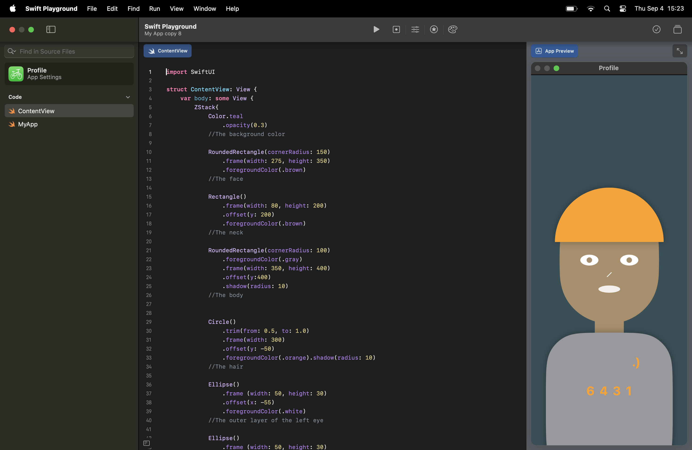  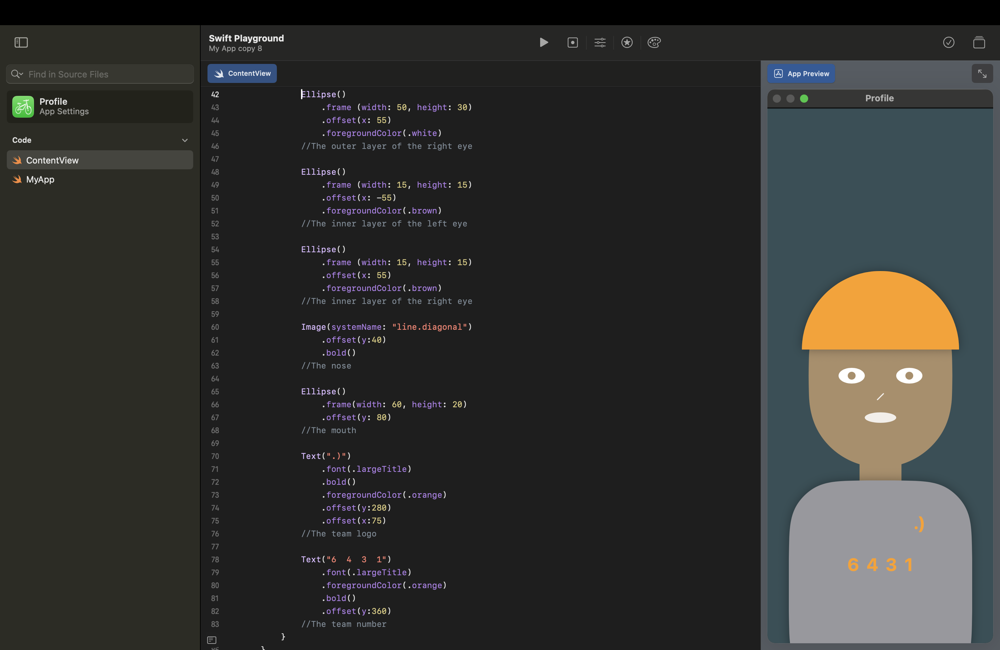

    //4 September 2025
    import SwiftUI

    struct ContentView: View {
    var body: some View {
        ZStack{
            Color.teal
                .opacity(0.3)
            //The background color
            
            RoundedRectangle(cornerRadius: 150)
                .frame(width: 275, height: 350)
                .foregroundColor(.brown)
            //The face
            
            Rectangle()
                .frame(width: 80, height: 200)
                .offset(y: 200)
                .foregroundColor(.brown)
            //The neck
            
            RoundedRectangle(cornerRadius: 100)
                .foregroundColor(.gray)
                .frame(width: 350, height: 400)
                .offset(y:400)
                .shadow(radius: 10)
            //The body
            
            
            Circle()
                .trim(from: 0.5, to: 1.0)
                .frame(width: 300)
                .offset(y: -50)
                .foregroundColor(.orange).shadow(radius: 10)
            //The hair
            
            Ellipse()
                .frame (width: 50, height: 30)
                .offset(x: -55)
                .foregroundColor(.white)
            //The outer layer of the left eye  
            
            Ellipse()
                .frame (width: 50, height: 30)
                .offset(x: 55)
                .foregroundColor(.white)
            //The outer layer of the right eye
            
            Ellipse()
                .frame (width: 15, height: 15)
                .offset(x: -55)
                .foregroundColor(.brown)
            //The inner layer of the left eye
            
            Ellipse()
                .frame (width: 15, height: 15)
                .offset(x: 55)
                .foregroundColor(.brown)
            //The inner layer of the right eye
            
            Image(systemName: "line.diagonal")
                .offset(y:40)
                .bold()
            //The nose
            
            Ellipse()
                .frame(width: 60, height: 20)
                .offset(y: 80)
            //The mouth
            
            Text(".)")
                .font(.largeTitle)
                .bold()
                .foregroundColor(.orange)
                .offset(y:280)
                .offset(x:75)
            //The team logo
            
            Text("6  4  3  1")
                .font(.largeTitle)
                .foregroundColor(.orange)
                .bold()
                .offset(y:360)
            //The team number
        }
    }
    }

 

## Swift Clock

  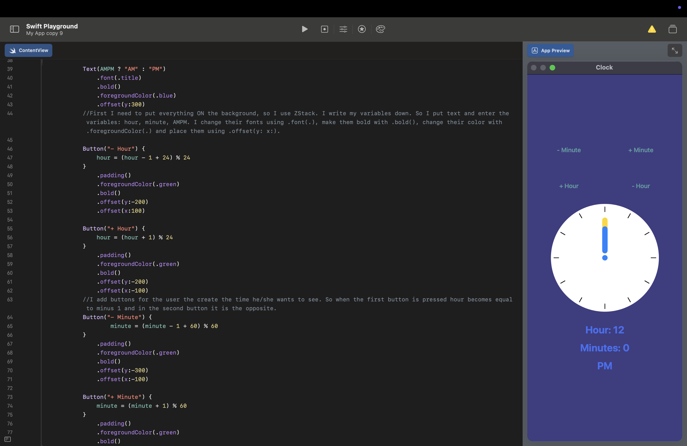  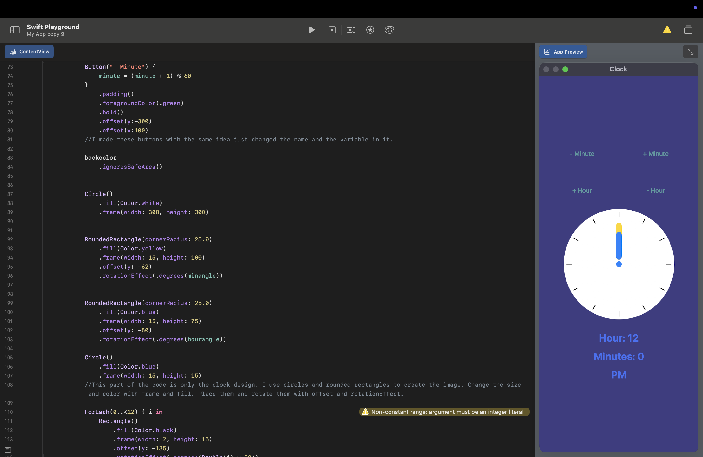  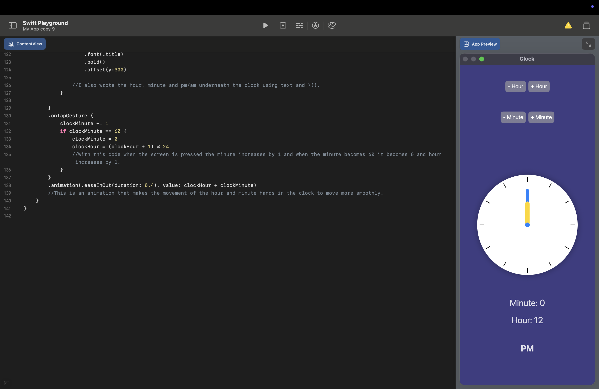

    // 4 September 2025
    import SwiftUI

    struct ContentView: View {
    @State private var clockHour: Int = 12
    @State private var clockMinute: Int = 0
    //I created the variables clockhour and clockminute. I used state because I want the variables to update according to the changes. 
    var isMorning: Bool {
        clockHour < 12
    }
    //I created isMorning to decide wheater it is am or pm. 
    var hourRotation: Double {
        Double(clockHour % 12) * 30 + Double(clockMinute) * 0.5
    }
    
    var minuteRotation: Double {
        Double(clockMinute) * 6
    }
    //I create hour and minute rotation variables and use double because I want to have 0.0's not just 0's.
    
    var body: some View {
        let bgColor = isMorning ? Color.yellow.opacity(0.5) : Color.indigo.opacity(0.5)
        //I create bgcolor to make the background yellow when its am and indigo when it is pm. 
        
        ZStack {
            bgColor.ignoresSafeArea()
            //to have the whole screen as a bakground
            
           
            Circle()
                .fill(Color.white)
                .frame(width: 320, height: 320)
                .shadow(radius: 10)
            //The big circle at the center.
            
           
            ForEach(0..<12) { i in
                Rectangle()
                    .fill(Color.black)
                    .frame(width: 2, height: 15)
                    .offset(y: -145) // place at edge of circle
                    .rotationEffect(.degrees(Double(i) * 30))
            }
            //The lines around the big circles which represent the hours.
            
            
            RoundedRectangle(cornerRadius: 25.0)
                .fill(Color.blue)
                .frame(width: 10, height: 115)
                .offset(y: -57)
                .rotationEffect(.degrees(minuteRotation))
            //the minute hand
            
            
            RoundedRectangle(cornerRadius: 25.0)
                .fill(Color.yellow)
                .frame(width: 14, height: 75)
                .offset(y: -37)
                .rotationEffect(.degrees(hourRotation))
            //the hour hand
            
           
            Circle()
                .fill(Color.blue)
                .frame(width: 15, height: 15)
            //the small circle in the center
            
          
            VStack(spacing: 12) {
                HStack {
                    Button("- Hour") {
                        clockHour = (clockHour - 1 + 24) % 24
                    }
                    .padding(8)
                    .foregroundColor(.white)
                    .background(Color.gray.opacity(0.7))
                    .cornerRadius(8)
                    .offset(y:-350)
                    
                    Button("+ Hour") {
                        clockHour = (clockHour + 1) % 24
                    }
                    .padding(8)
                    .background(Color.gray.opacity(0.7))
                    .foregroundColor(.white)
                    .cornerRadius(8)
                    .offset(y:-350)
                    //I use hstack to put the buttons side by side. I make the minus and plus hour and when they are pressed the hour becomes minus or plus 1. I use foregroundColor, padding, cornerRadius, background(Color) and offset to change colors of the text, the background, create a blank space, make the resctangle softer and place correcly. 
                    
                }
                
                HStack {
                    Button("- Minute") {
                        clockMinute = (clockMinute - 1 + 60) % 60
                    }
                    .padding(8)
                    .background(Color.gray.opacity(0.7))
                    .foregroundColor(.white)
                    .cornerRadius(8)
                    .offset(y:-300)
                    
                    Button("+ Minute") {
                        clockMinute = (clockMinute + 1) % 60
                    }
                    .padding(8)
                    .background(Color.gray.opacity(0.7))
                    .foregroundColor(.white)
                    .cornerRadius(8)
                    .offset(y:-300)
                    //I use hstack to put the buttons side by side. I make the minus and plus minutes and when they are pressed the minute becomes minus or plus 1. I use foregroundColor, padding, cornerRadius, background(Color) and offset to change colors of the text, the background, create a blank space, make the resctangle softer and place correcly. 
                }
                
                Text("Hour: \(clockHour % 12 == 0 ? 12 : clockHour % 12)")
                    .font(.title)
                    .offset(y:300)
                
                Text("Minute: \(clockMinute)")
                    .font(.title)
                    .offset(y:200)
                
                Text("\(isMorning ? "AM" : "PM")")
                    .font(.title)
                    .bold()
                    .offset(y:300)
                
                //I also wrote the hour, minute and pm/am underneath the clock using text and \().
            }

        }
        .onTapGesture {
            clockMinute += 1
            if clockMinute == 60 {
                clockMinute = 0
                clockHour = (clockHour + 1) % 24
                //With this code when the screen is pressed the minute increases by 1 and when the minute becomes 60 it becomes 0 and hour increases by 1. 
            }
        }
        .animation(.easeInOut(duration: 0.4), value: clockHour + clockMinute)
        //This is an animation that makes the movement of the hour and minute hands in the clock to move more smoothly. 
    }
    }

 

## Swift Ben Ten Watch

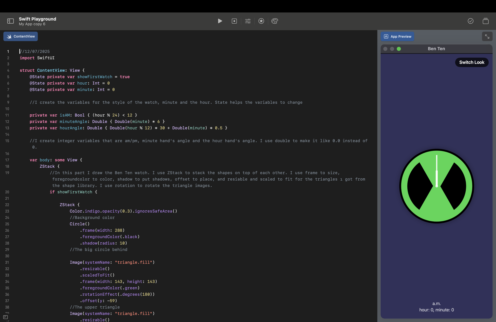  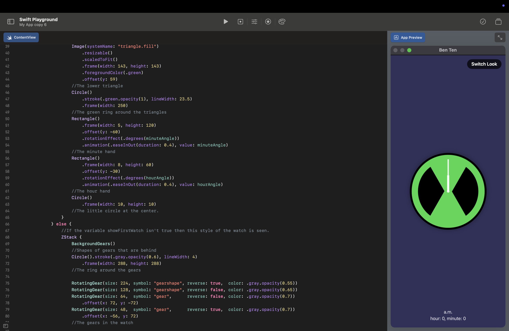  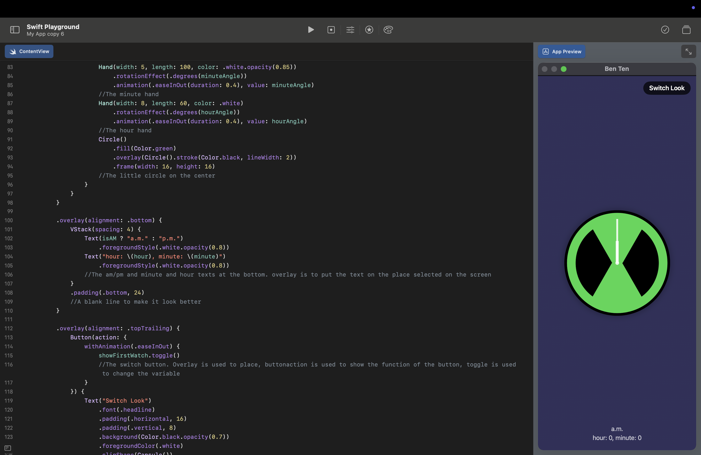  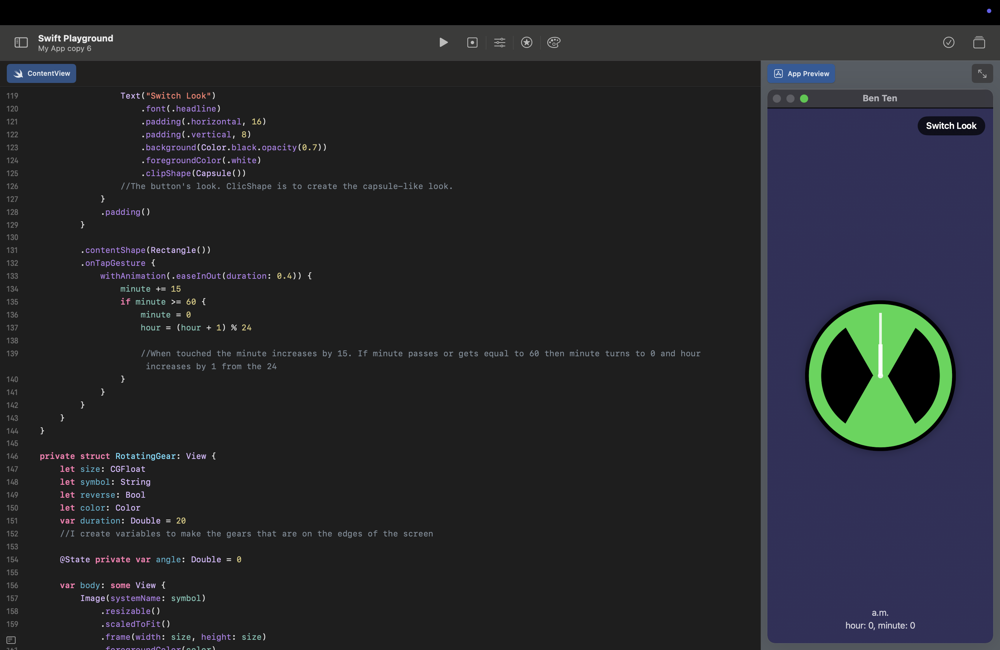 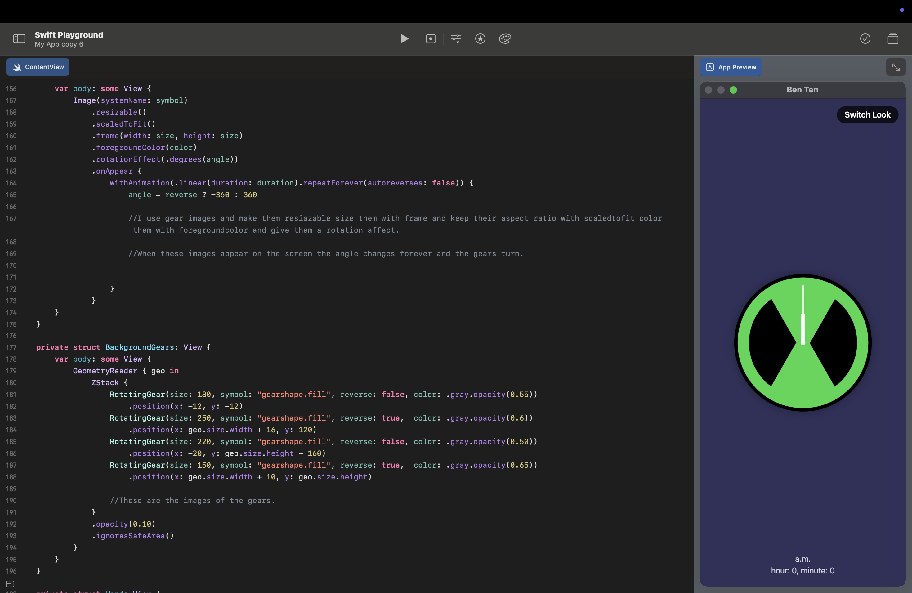  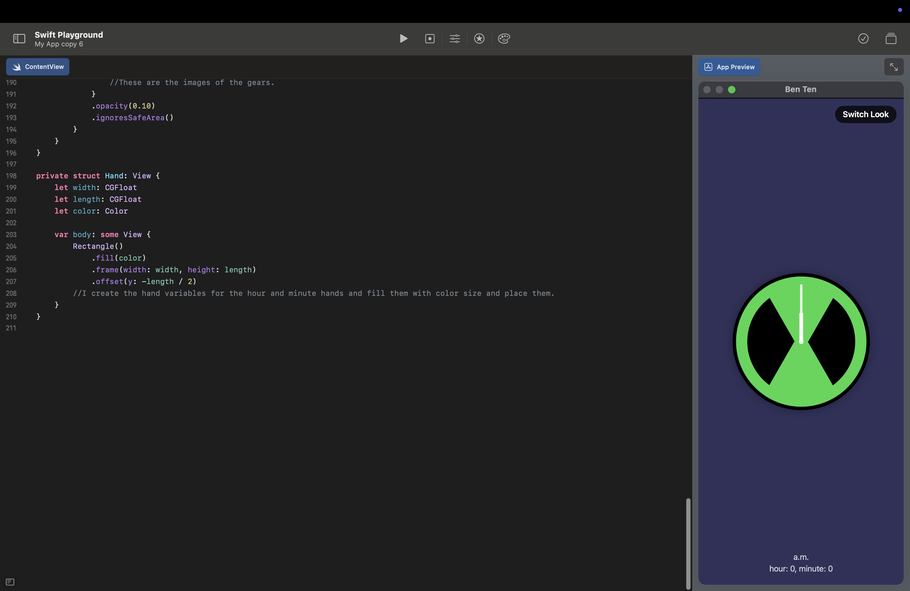

    //12/07/2025
    import SwiftUI

    struct ContentView: View {
    @State private var showFirstWatch = true 
    @State private var hour: Int = 0
    @State private var minute: Int = 0
    
    //I create the variables for the style of the watch, minute and the hour. State helps the variables to change
    
    private var isAM: Bool { (hour % 24) < 12 }
    private var minuteAngle: Double { Double(minute) * 6 }
    private var hourAngle: Double { Double(hour % 12) * 30 + Double(minute) * 0.5 }
    
    //I create integer variables that are am/pm, minute hand's angle and the hour hand's angle. I use double to make it like 0.0 instead of 0. 
    
    var body: some View {
        ZStack {
            //In this part I draw the Ben Ten watch. I use ZStack to stack the shapes on top of each other. I use frame to size, foregroundcolor to color, shadow to put shadows, offset to place, and resiable and scaled to fit for the triangles ı got from the shape library. I use rotation to rotate the triangle images. 
            if showFirstWatch {
   
                ZStack {
                    Color.indigo.opacity(0.3).ignoresSafeArea()
                    //Background color
                    Circle()
                        .frame(width: 288)
                        .foregroundColor(.black)
                        .shadow(radius: 10)
                    //The big circle behind
                    
                    Image(systemName: "triangle.fill")
                        .resizable()
                        .scaledToFit()
                        .frame(width: 143, height: 143)
                        .foregroundColor(.green)
                        .rotationEffect(.degrees(180))
                        .offset(y: -59)
                    //The upper triangle
                    Image(systemName: "triangle.fill")
                        .resizable()
                        .scaledToFit()
                        .frame(width: 143, height: 143)
                        .foregroundColor(.green)
                        .offset(y: 59)
                    //The lower triangle
                    Circle()
                        .stroke(.green.opacity(1), lineWidth: 23.5)
                        .frame(width: 250)
                    //The green ring around the triangles
                    Rectangle()
                        .frame(width: 5, height: 120)
                        .offset(y: -60)
                        .rotationEffect(.degrees(minuteAngle))
                        .animation(.easeInOut(duration: 0.4), value: minuteAngle)
                    //The minute hand
                    Rectangle()
                        .frame(width: 8, height: 60)
                        .offset(y: -30)
                        .rotationEffect(.degrees(hourAngle))
                        .animation(.easeInOut(duration: 0.4), value: hourAngle)
                    //The hour hand
                    Circle()
                        .frame(width: 10, height: 10)
                    //The little circle at the center. 
                }
            } else {
                //If the variable showFirstWatch isn't true then this style of the watch is seen.
                ZStack {
                    BackgroundGears()
                    //Shapes of gears that are behind
                    Circle().stroke(.gray.opacity(0.6), lineWidth: 4)
                        .frame(width: 288, height: 288)
                    //The ring around the gears
                    
                    RotatingGear(size: 224, symbol: "gearshape", reverse: true,  color: .gray.opacity(0.55))
                    RotatingGear(size: 128, symbol: "gearshape", reverse: false, color: .gray.opacity(0.65))
                    RotatingGear(size: 64,  symbol: "gear",      reverse: false, color: .gray.opacity(0.7))
                        .offset(x: 72, y: -72)
                    RotatingGear(size: 48,  symbol: "gear",      reverse: true,  color: .gray.opacity(0.7))
                        .offset(x: -56, y: 72)
                    //The gears in the watch
                    
                    Hand(width: 5, length: 100, color: .white.opacity(0.85))
                        .rotationEffect(.degrees(minuteAngle))
                        .animation(.easeInOut(duration: 0.4), value: minuteAngle)
                    //The minute hand
                    Hand(width: 8, length: 60, color: .white)
                        .rotationEffect(.degrees(hourAngle))
                        .animation(.easeInOut(duration: 0.4), value: hourAngle)
                    //The hour hand
                    Circle()
                        .fill(Color.green)
                        .overlay(Circle().stroke(Color.black, lineWidth: 2))
                        .frame(width: 16, height: 16)
                    //The little circle on the center
                }
            }
        }

        .overlay(alignment: .bottom) {
            VStack(spacing: 4) {
                Text(isAM ? "a.m." : "p.m.")
                    .foregroundStyle(.white.opacity(0.8))
                Text("hour: \(hour), minute: \(minute)")
                    .foregroundStyle(.white.opacity(0.8))
                //The am/pm and minute and hour texts at the bottom. overlay is to put the text on the place selected on the screen
            }
            .padding(.bottom, 24)
            //A blank line to make it look better
        }

        .overlay(alignment: .topTrailing) {
            Button(action: {
                withAnimation(.easeInOut) {
                    showFirstWatch.toggle()
                    //The switch button. Overlay is used to place, buttonaction is used to show the function of the button, toggle is used to change the variable
                }
            }) {
                Text("Switch Look")
                    .font(.headline)
                    .padding(.horizontal, 16)
                    .padding(.vertical, 8)
                    .background(Color.black.opacity(0.7))
                    .foregroundColor(.white)
                    .clipShape(Capsule())
                //The button's look. ClicShape is to create the capsule-like look. 
            }
            .padding()
        }

        .contentShape(Rectangle())
        .onTapGesture {
            withAnimation(.easeInOut(duration: 0.4)) {
                minute += 15
                if minute >= 60 {
                    minute = 0
                    hour = (hour + 1) % 24
                    
                    //When touched the minute increases by 15. If minute passes or gets equal to 60 then minute turns to 0 and hour increases by 1 from the 24
                }
            }
        }
    }
    }

    private struct RotatingGear: View {
    let size: CGFloat
    let symbol: String
    let reverse: Bool
    let color: Color
    var duration: Double = 20
    //I create variables to make the gears that are on the edges of the screen
    
    @State private var angle: Double = 0
    
    var body: some View {
        Image(systemName: symbol)
            .resizable()
            .scaledToFit()
            .frame(width: size, height: size)
            .foregroundColor(color)
            .rotationEffect(.degrees(angle))
            .onAppear {
                withAnimation(.linear(duration: duration).repeatForever(autoreverses: false)) {
                    angle = reverse ? -360 : 360
                    
                    //I use gear images and make them resiazable size them with frame and keep their aspect ratio with scaledtofit color them with foregroundcolor and give them a rotation affect.
                    
                    //When these images appear on the screen the angle changes forever and the gears turn.
                    
                    
                }
            }
    }
    }

    private struct BackgroundGears: View {
    var body: some View {
        GeometryReader { geo in
            ZStack {
                RotatingGear(size: 180, symbol: "gearshape.fill", reverse: false, color: .gray.opacity(0.55))
                    .position(x: -12, y: -12)
                RotatingGear(size: 250, symbol: "gearshape.fill", reverse: true,  color: .gray.opacity(0.6))
                    .position(x: geo.size.width + 16, y: 120)
                RotatingGear(size: 220, symbol: "gearshape.fill", reverse: false, color: .gray.opacity(0.50))
                    .position(x: -20, y: geo.size.height - 160)
                RotatingGear(size: 150, symbol: "gearshape.fill", reverse: true,  color: .gray.opacity(0.65))
                    .position(x: geo.size.width + 10, y: geo.size.height)
                
                //These are the images of the gears.
            }
            .opacity(0.10)
            .ignoresSafeArea()
        }
    }
    }

    private struct Hand: View {
    let width: CGFloat
    let length: CGFloat
    let color: Color
    
    var body: some View {
        Rectangle()
            .fill(color)
            .frame(width: width, height: length)
            .offset(y: -length / 2)
        //I create the hand variables for the hour and minute hands and fill them with color size and place them.
    }
    }

 

## Swift Part 2, Binary Decimal Conversion

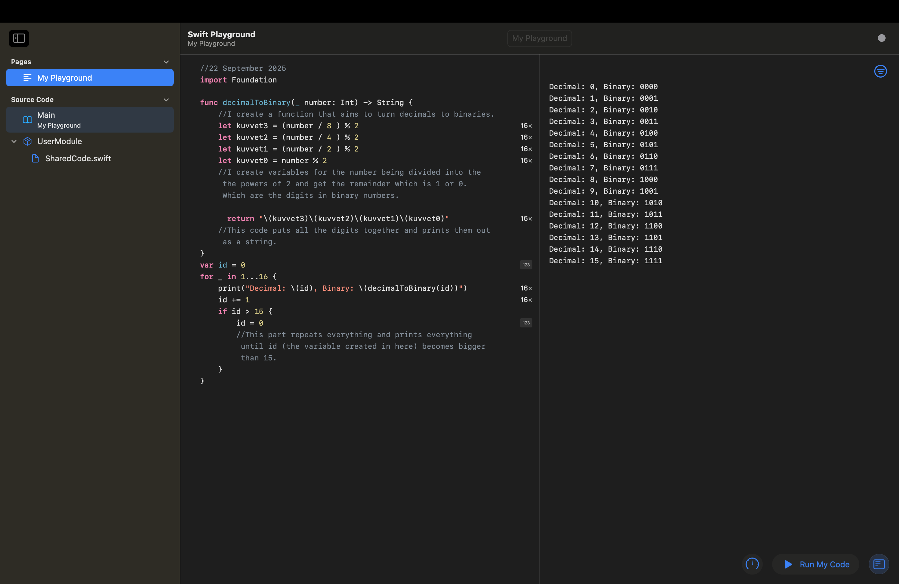  

    //22 September 2025
    import Foundation

    func decimalToBinary(_ number: Int) -> String {
    //I create a function that aims to turn decimals to binaries.
    let kuvvet3 = (number / 8 ) % 2
    let kuvvet2 = (number / 4 ) % 2
    let kuvvet1 = (number / 2 ) % 2
    let kuvvet0 = number % 2
    //I create variables for the number being divided into the the powers of 2 and get the remainder which is 1 or 0. Which are the digits in binary numbers. 
    
      return "\(kuvvet3)\(kuvvet2)\(kuvvet1)\(kuvvet0)"
    //This code puts all the digits together and prints them out as a string.
    }
    var id = 0
    for _ in 1...16 {
    print("Decimal: \(id), Binary: \(decimalToBinary(id))")
    id += 1
    if id > 15 {
        id = 0
        //This part repeats everything and prints everything until id (the variable created in here) becomes bigger than 15. 
    }
    }

 

## Swift Part 3, Binary Decimal Conversion

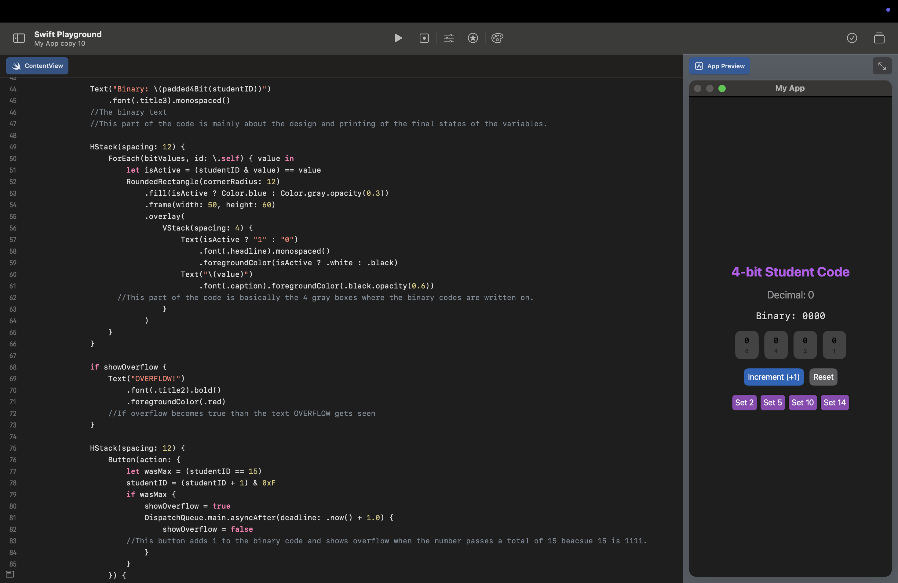  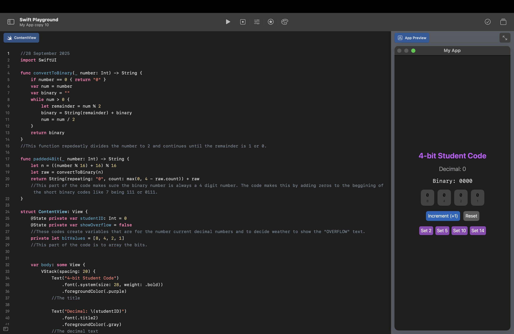  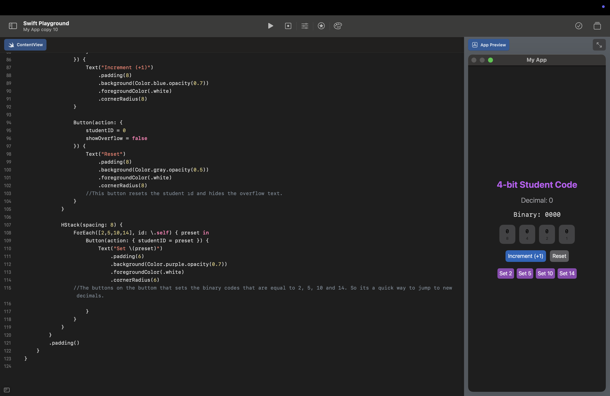  

    //28 September 2025
    import SwiftUI

    func convertToBinary(_ number: Int) -> String {
    if number == 0 { return "0" }
    var num = number
    var binary = ""
    while num > 0 {
        let remainder = num % 2
        binary = String(remainder) + binary
        num = num / 2
    }
    return binary
    }
    //This function repedeatly divides the number to 2 and continues until the remainder is 1 or 0. 

    func padded4Bit(_ number: Int) -> String {
    let n = ((number % 16) + 16) % 16
    let raw = convertToBinary(n)
    return String(repeating: "0", count: max(0, 4 - raw.count)) + raw
    //This part of the code makes sure the binary number is always a 4 digit number. The code makes this by adding zeros to the beggining of the short binary codes like 7 being 111 or 0111. 
    }

    struct ContentView: View {
    @State private var studentID: Int = 0
    @State private var showOverflow = false
    //These codes create variables that are for the number current decimal numbers and to decide weather to show the "OVERFLOW" text. 
    private let bitValues = [8, 4, 2, 1]
    //This part of the code is to array the bits. 
    
    
    var body: some View {
        VStack(spacing: 20) {
            Text("4-bit Student Code")
                .font(.system(size: 28, weight: .bold))
                .foregroundColor(.purple)
            //The title
            
            Text("Decimal: \(studentID)")
                .font(.title2)
                .foregroundColor(.gray)
            //The decimal text
            
            Text("Binary: \(padded4Bit(studentID))")
                .font(.title3).monospaced()
            //The binary text
            //This part of the code is mainly about the design and printing of the final states of the variables.
            
            HStack(spacing: 12) {
                ForEach(bitValues, id: \.self) { value in
                    let isActive = (studentID & value) == value
                    RoundedRectangle(cornerRadius: 12)
                        .fill(isActive ? Color.blue : Color.gray.opacity(0.3))
                        .frame(width: 50, height: 60)
                        .overlay(
                            VStack(spacing: 4) {
                                Text(isActive ? "1" : "0")
                                    .font(.headline).monospaced()
                                    .foregroundColor(isActive ? .white : .black)
                                Text("\(value)")
                                    .font(.caption).foregroundColor(.black.opacity(0.6))
                  //This part of the code is basically the 4 gray boxes where the binary codes are written on. 
                            }
                        )
                }
            }
            
            if showOverflow {
                Text("OVERFLOW!")
                    .font(.title2).bold()
                    .foregroundColor(.red)
                //If overflow becomes true than the text OVERFLOW gets seen
            }
            
            HStack(spacing: 12) {
                Button(action: {
                    let wasMax = (studentID == 15)
                    studentID = (studentID + 1) & 0xF
                    if wasMax {
                        showOverflow = true
                        DispatchQueue.main.asyncAfter(deadline: .now() + 1.0) {
                            showOverflow = false
                    //This button adds 1 to the binary code and shows overflow when the number passes a total of 15 beacsue 15 is 1111.
                        }
                    }
                }) {
                    Text("Increment (+1)")
                        .padding(8)
                        .background(Color.blue.opacity(0.7))
                        .foregroundColor(.white)
                        .cornerRadius(8)
                }
                
                Button(action: {
                    studentID = 0
                    showOverflow = false
                }) {
                    Text("Reset")
                        .padding(8)
                        .background(Color.gray.opacity(0.5))
                        .foregroundColor(.white)
                        .cornerRadius(8)
                    //This button resets the student ıd and hides the overflow text. 
                }
            }
            
            HStack(spacing: 8) {
                ForEach([2,5,10,14], id: \.self) { preset in
                    Button(action: { studentID = preset }) {
                        Text("Set \(preset)")
                            .padding(6)
                            .background(Color.purple.opacity(0.7))
                            .foregroundColor(.white)
                            .cornerRadius(6)
                //The buttons on the buttom that sets the binary codes that are equal to 2, 5, 10 and 14. So its a quick way to jump to new decimals. 
                
                    }
                }
            }
        }
        .padding()
    }
    }

 

## Swift Ice Cream Overflow

       

    // 28 September 2025
    import SwiftUI

    func convertToBinary(_ number: Int) -> String {
    if number == 0 { return "0" }
    var num = number
    var binary = ""
    while num > 0 {
        let remainder = num % 2
        binary = String(remainder) + binary
        num = num / 2
    }
    return binary
    }
    //This function repeatedly divides the number by 2 until the remainder is 1 or 0. 

    func padded4Bit(_ number: Int) -> String {
    let n = ((number % 16) + 16) % 16
    let raw = convertToBinary(n)
    return String(repeating: "0", count: max(0, 4 - raw.count)) + raw
    //This part ensures the binary number is always 4 digits by padding with zeros.
    }

    struct ContentView: View {
    @State private var studentID: Int = 0
    @State private var showOverflow = false
    private let bitValues = [8, 4, 2, 1]
    
    //Here I used the state code to create variables for the powers of 2. 
    @State private var scoopCount: Int = 0
    
    var body: some View {
        ZStack {
            VStack(spacing: 0) {
                //In here I drew the ice cream cone and the circles for each number in the scoopcount variable. I used the .offset(y: CGFloat(-index * 30)) code for the circles to be on each other on every overflow. 
                ForEach(0..<scoopCount, id: \.self) { index in
                    Circle()
                        .frame(width: 100, height: 50)
                        .foregroundColor(.yellow)
                        .offset(y: CGFloat(-index * 30))
                        .shadow(radius: 3)
                }
                Image(systemName: "cone.fill")
                    .font(.system(size: 200))
                    .rotationEffect(.degrees(180))
                    .foregroundColor(.blue)
            }
        }
        //In here I created the design for the binary conversions. 
        VStack(spacing: 20) {
            Text("4-bit Student Code")
                .font(.system(size: 28, weight: .bold))
                .foregroundColor(.purple)
            //The title text
            
            Text("Decimal: \(studentID)")
                .font(.title2)
                .foregroundColor(.gray)
            //The decimal text
            
            Text("Binary: \(padded4Bit(studentID))")
                .font(.title3).monospaced()
            //The binary text
            
            HStack(spacing: 12) {
                ForEach(bitValues, id: \.self) { value in
                    let isActive = (studentID & value) == value
                    RoundedRectangle(cornerRadius: 12)
                        .fill(isActive ? Color.blue : Color.gray.opacity(0.3))
                        .frame(width: 50, height: 60)
                        .overlay(
                            VStack(spacing: 4) {
                                Text(isActive ? "1" : "0")
                                    .font(.headline).monospaced()
                                    .foregroundColor(isActive ? .white : .black)
                                Text("\(value)")
                                    .font(.caption).foregroundColor(.black.opacity(0.6))
                                //In here I created the gray rectangles where the 1's and the 0's will take place. I also wrote the equilivients of the powers of 2. Like 1,2,4,8. 
                            }
                        )
                }
            }
            
            if showOverflow {
                Text("OVERFLOW!")
                    .font(.title2).bold()
                    .foregroundColor(.red)
                //This is the code for the OVERFLOW text. 
            }
            
            HStack(spacing: 12) {
                Button(action: {
                    let wasMax = (studentID == 15)
                    studentID = (studentID + 1) & 0xF
                    if wasMax {
                        showOverflow = true
                        scoopCount += 1
                        //This is the increment button which adds the decimal 1
                        
                        DispatchQueue.main.asyncAfter(deadline: .now() + 1.0) {
                            showOverflow = false
                        }
                    }
                }) {
                    Text("Increment (+1)")
                        .padding(8)
                        .background(Color.blue.opacity(0.7))
                        .foregroundColor(.white)
                        .cornerRadius(8)
                    //This is the design of the plus 1 button
                }
                
                Button(action: {
                    studentID = 0
                    showOverflow = false
                    scoopCount = 0
                //This is the function of the reset button which just makes everything zero and false      
                
                }) {
                    Text("Reset")
                        .padding(8)
                        .background(Color.gray.opacity(0.5))
                        .foregroundColor(.white)
                        .cornerRadius(8)
                    //The design of the reset button. 
                }
            }
            
            HStack(spacing: 8) {
                ForEach([2,5,10,14], id: \.self) { preset in
                    Button(action: { studentID = preset }) {
                        //The functions of the set buttons. They are basically preset actions that write the equilivent binary codes for 2, 5, 10, 14
                        Text("Set \(preset)")
                            .padding(6)
                            .background(Color.purple.opacity(0.7))
                            .foregroundColor(.white)
                            .cornerRadius(6)
                        //The designs of the set buttons. 
                    }
                }
            }
        }
    }
    }

 

## Swift Clock Game

          

    //6 October 2025
    import SwiftUI

    struct ContentView: View {
    @State private var clockHour: Int = 12
    @State private var clockMinute: Int = 0
    //I created the variables for the hour and minutes of the clock
    
    var isMorning: Bool { clockHour < 12 }
    //The variable to decide if the hour is am or pm
    var hourRotation: Double { Double(clockHour % 12) * 30 + Double(clockMinute) * 0.5 }
    //The variable of the hour angle of the hour hand
    var minuteRotation: Double { Double(clockMinute) * 6 }
    //The variable of the minute angle of the minute hand
    
    @State private var frogPosition: CGPoint = .zero
    //This is the position of the player in the game
    @State private var gameRunning = false
    //The variable to see if the game is running or not
    @State private var showMessage = ""
    //The variable to easily put on messages when I want. Messages like you lost.
    @State private var obstacles: [CGPoint] = []
    //This is the variable for the locations of the obstacles.
    
    let obstacleTimer = Timer.publish(every: 0.03, on: .main, in: .common).autoconnect()
    //This is basically a fast timer that is for 0.03 seconds.
    
    var body: some View {
        GeometryReader { geo in
            //The geo code is used to figure out the real size of the screen where the program will take place
            let size = min(geo.size.width, geo.size.height)
            let radius = size / 2
            //I use the geo sizes to put the clock game in the size of the screen automatically.
            
            VStack(spacing: 10) {
                // MARK: - Time Display
                Text("Hour: \(clockHour % 12 == 0 ? 12 : clockHour % 12)  Minute: \(clockMinute)  \(isMorning ? "AM" : "PM")")
                    .foregroundColor(.white)
                    .bold()
                    .padding(.top, 10)
                //This is the text for the clock to show weather the time is am or pm.
                
                ZStack {
                    // Background color
                    (isMorning ? Color.yellow.opacity(0.5) : Color.indigo.opacity(0.5))
                        .ignoresSafeArea()
                    //This part is about the background. When the hour is am its yellow when its pm the background is indigo.
                    //I used ignoresSafeArea to make sure all of the background is covered.
                    
                    // Clock face
                    Circle()
                        .fill(Color.white)
                        .frame(width: size, height: size)
                        .shadow(radius: 5)
                    
                    // Hour marks
                    ForEach(0..<12) { i in
                        Rectangle()
                            .fill(Color.black)
                            .frame(width: 2, height: 10)
                            .offset(y: -radius + 15)
                            .rotationEffect(.degrees(Double(i) * 30))
                        //The big circle of the clock. I used the variable size for the frame because previosly I stated size as geometry reader which basically looks at the size of the screen. So the circle is going to change when the size of the screen changes.
                        
                        //I used the for each code to create the little lines of the hour numbers. The number goes from 0 to 12 because there are 12 numbers on the clock.
                    }
                    
                    // Minute & hour hands
                    RoundedRectangle(cornerRadius: 20)
                        .fill(Color.blue)
                        .frame(width: 6, height: radius * 0.6)
                        .offset(y: -radius*0.3)
                        .rotationEffect(.degrees(minuteRotation))
                    //This is the design of the minute hand of the clock.
                    
                    RoundedRectangle(cornerRadius: 20)
                        .fill(Color.yellow)
                        .frame(width: 8, height: radius * 0.5)
                        .offset(y: -radius*0.25)
                        .rotationEffect(.degrees(hourRotation))
                    //This is the design of the hour hand of the clock.
                    
                    Circle()
                        .fill(Color.blue)
                        .frame(width: 12, height: 12)
                    //Little circle on the center
                    
          
                    ZStack {
                        ForEach(obstacles.indices, id: \.self) { i in
                            Rectangle()
                                .fill(Color.red)
                                .frame(width: 30, height: 30)
                                .position(obstacles[i])
                            //This is the little circle on the center of the clock that holds the minute and hour hands.
                            
                            //For each obstacles the computer choses a number in a list for example if there are 6 obstackles the list is: 0, 1, 2, 3, 4, 5.
                                                                                            
                            //The id: .self) makes sure the numbers are unique
                            
                            //I used i to pick obstacle numbers from the list and use them in the game.
                            
                           //This is the design of the obstacles
                            
                           //I used the .position(obstacle[i]) to update positions of obstacles.
                        }
                        
                        // Frog
                        Circle()
                            .fill(Color.green)
                            .frame(width: 30, height: 30)
                            .position(frogPosition)
                        //This is the design of the player of the game.
                        //The position is where the mouse touches the screen.
                    }
                    .frame(width: size, height: size)
                    //The game area is created
                    .clipShape(Circle())
                    //I used this code to cut the area to the circles size
                    .contentShape(Circle())
                    //An invisible circle boundry to disable the user from getting out of the watch.
                    .gesture(
                        DragGesture()
                    //For the drag of the mouse
                            .onChanged { value in
                                //Runs again when the location of the mouse changes while dragging.
                                let dx = value.location.x - radius
                                let dy = value.location.y - radius
                                let distance = sqrt(dx*dx + dy*dy)
                                //These 3 lines calculate the distance of the user from the circle's center to make sure the user doesn't leave the circle.
                                if distance < radius - 15 {
                                    frogPosition = value.location
                                    //If the mouse is inside the circle than the location of the user is the mouse's location.
                                } else {
                                    let angle = atan2(dy, dx)
                                    frogPosition = CGPoint(
                                        x: radius + (radius - 15) * cos(angle),
                                        y: radius + (radius - 15) * sin(angle)
                                        //If the mouse is outside of the circle than the location of the user is on the edge of the circle that is closest to the mouse.
                                    )
                                }
                            }
                    )
                    
                    // Overlay messages
                    if !showMessage.isEmpty {
                        Text(showMessage)
                            .font(.headline)
                            .foregroundColor(.white)
                            .padding()
                            .background(Color.black.opacity(0.7))
                            .cornerRadius(12)
                        //This is the code that will be the design when a message is shown on the screen.
                    }
                }
                
                VStack(spacing: 8) {
                    HStack(spacing: 20) {
                        Button("- Hour") { clockHour = (clockHour - 1 + 24) % 24 }
                        Button("+ Hour") { clockHour = (clockHour + 1) % 24 }
                    }
                    //The buttons to increase or decrease the hour by 1.
                    HStack(spacing: 20) {
                        Button("- Minute") { clockMinute = (clockMinute - 1 + 60) % 60 }
                        Button("+ Minute") { clockMinute = (clockMinute + 1) % 60 }
                    }
                    //The buttons to increase or decrease the minute by 1.
                }
                .foregroundColor(.white)
                .padding()
                .background(Color.black.opacity(0.5))
                .cornerRadius(12)
                //These codes are for the designs of these buttons.
            }
            
            .onAppear {
                let start = CGPoint(x: radius, y: radius + radius*0.5)
                frogPosition = start
                resetObstacles(size: size)
                gameRunning = true
                //I place the user at the bottom part of the clock for starting and start the game by switching gamerun to true. Also the obstacles are put into random positions.
            }
            .onReceive(obstacleTimer) { _ in
                guard gameRunning else { return }
                
                for i in obstacles.indices {
                    obstacles[i].y += 3
                    let dx = obstacles[i].x - radius
                    let dy = obstacles[i].y - radius
                    let distance = sqrt(dx*dx + dy*dy)
                    if distance > radius - 15 {
                        resetObstacle(index: i, size: size)
                        //This code checks if the obstacles hit the user or get out of the circle. It uses the timer variable I created before. So it does this function every 0.03 seconds.
                    }
                }
                
                checkCollision(size: size)
            }
        }
    }
    
    func resetObstacles(size: CGFloat) {
        obstacles = []
        let radius = size/2
        for _ in 0..<6 { // more obstacles for challenge
            let angle = Double.random(in: 0..<2*Double.pi)
            let r = Double.random(in: 0..<Double(radius - 30))
            obstacles.append(CGPoint(
                x: radius + CGFloat(r * cos(angle)),
                y: radius - CGFloat(r) - 30
                //This code basically creates 6 obstacles in random points of the circles center.
            ))
        }
    }
    
    func resetObstacle(index: Int, size: CGFloat) {
        //resets single obstacle positions
        let radius = size/2
        let angle = Double.random(in: 0..<2*Double.pi)
        let r = Double.random(in: 0..<Double(radius - 30))
        obstacles[index] = CGPoint(
            x: radius + CGFloat(r * cos(angle)),
            y: radius - CGFloat(r) - 30
        )
    }
    
    func checkCollision(size: CGFloat) {
        //checks if the user hit an obstacle
        let frogFrame = CGRect(x: frogPosition.x - 15, y: frogPosition.y - 15, width: 30, height: 30)
        for obs in obstacles {
            let obsFrame = CGRect(x: obs.x - 15, y: obs.y - 15, width: 30, height: 30)
            if frogFrame.intersects(obsFrame) {
                let radius = size/2
                frogPosition = CGPoint(x: radius, y: radius + radius*0.5)
                showMessage = "💥 Hit!"
                DispatchQueue.main.asyncAfter(deadline: .now() + 1) {
                    showMessage = ""
                    resetObstacles(size: size)
                    //If the user does hit an obstacle than the message hit is displayed.
                }
                break
            }
        }
    }
    }
    
 

## Swift Candy Shop Simulator

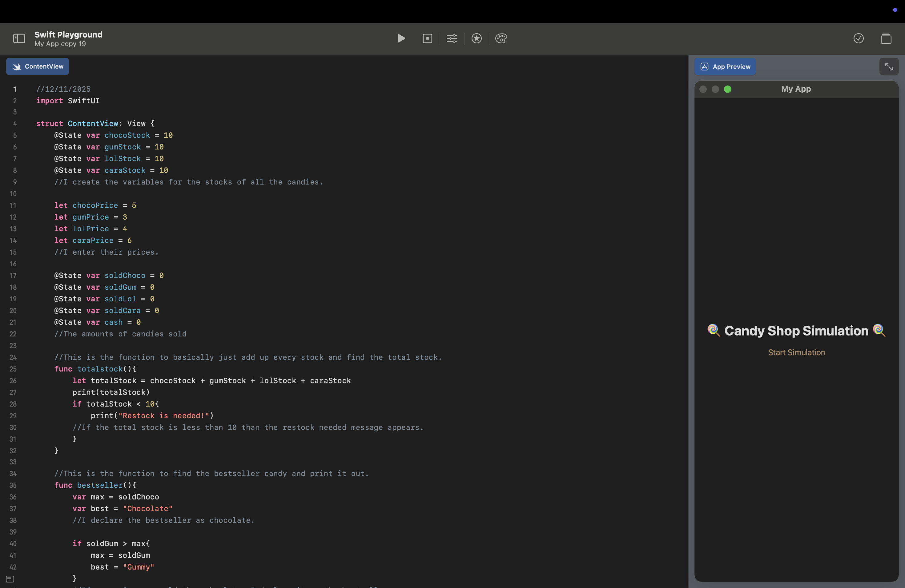  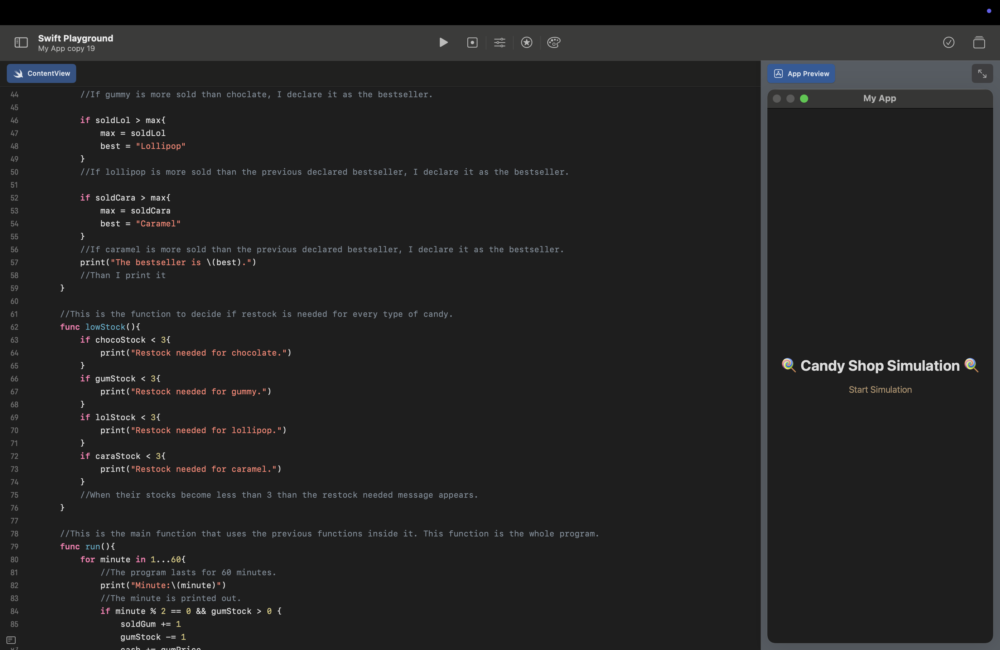  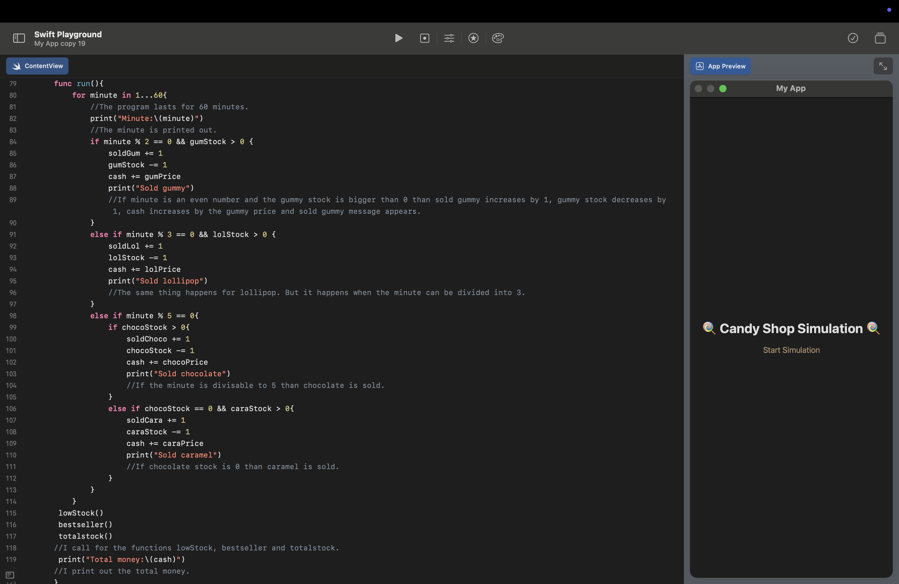  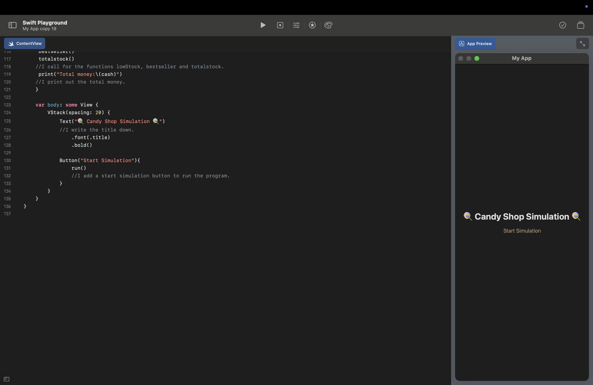

    //12/11/2025
    import SwiftUI

    struct ContentView: View {
    @State var chocoStock = 10
    @State var gumStock = 10
    @State var lolStock = 10
    @State var caraStock = 10
    //I create the variables for the stocks of all the candies. 
    
    let chocoPrice = 5
    let gumPrice = 3
    let lolPrice = 4
    let caraPrice = 6
    //I enter their prices.
    
    @State var soldChoco = 0
    @State var soldGum = 0
    @State var soldLol = 0
    @State var soldCara = 0
    @State var cash = 0
    //The amounts of candies sold
    
    //This is the function to basically just add up every stock and find the total stock. 
    func totalstock(){
        let totalStock = chocoStock + gumStock + lolStock + caraStock
        print(totalStock)
        if totalStock < 10{
            print("Restock is needed!")
        //If the total stock is less than 10 than the restock needed message appears. 
        }
    }

    //This is the function to find the bestseller candy and print it out. 
    func bestseller(){
        var max = soldChoco
        var best = "Chocolate"
        //I declare the bestseller as chocolate.
        
        if soldGum > max{
            max = soldGum
            best = "Gummy"
        }
        //If gummy is more sold than choclate, I declare it as the bestseller. 
        
        if soldLol > max{
            max = soldLol
            best = "Lollipop"
        }
        //If lollipop is more sold than the previous declared bestseller, I declare it as the bestseller. 
        
        if soldCara > max{
            max = soldCara
            best = "Caramel"
        }
        //If caramel is more sold than the previous declared bestseller, I declare it as the bestseller. 
        print("The bestseller is \(best).")
        //Than I print it
    }
    
    //This is the function to decide if restock is needed for every type of candy. 
    func lowStock(){
        if chocoStock < 3{
            print("Restock needed for chocolate.")
        }
        if gumStock < 3{
            print("Restock needed for gummy.")
        }
        if lolStock < 3{
            print("Restock needed for lollipop.")
        }
        if caraStock < 3{
            print("Restock needed for caramel.")
        }
        //When their stocks become less than 3 than the restock needed message appears. 
    }
    
    //This is the main function that uses the previous functions inside it. This function is the whole program.
    func run(){
        for minute in 1...60{
            //The program lasts for 60 minutes.
            print("Minute:\(minute)")
            //The minute is printed out.
            if minute % 2 == 0 && gumStock > 0 {
                soldGum += 1
                gumStock -= 1
                cash += gumPrice
                print("Sold gummy")
                //If minute is an even number and the gummy stock is bigger than 0 than sold gummy increases by 1, gummy stock decreases by 1, cash increases by the gummy price and sold gummy message appears. 
            }
            else if minute % 3 == 0 && lolStock > 0 {
                soldLol += 1
                lolStock -= 1
                cash += lolPrice
                print("Sold lollipop")
                //The same thing happens for lollipop. But it happens when the minute can be divided into 3. 
            }
            else if minute % 5 == 0{
                if chocoStock > 0{
                    soldChoco += 1
                    chocoStock -= 1
                    cash += chocoPrice
                    print("Sold chocolate")
                    //If the minute is divisable to 5 than chocolate is sold. 
                }
                else if chocoStock == 0 && caraStock > 0{
                    soldCara += 1
                    caraStock -= 1
                    cash += caraPrice
                    print("Sold caramel")
                    //If chocolate stock is 0 than caramel is sold.
                }
            }
        }
     lowStock()
     bestseller()
     totalstock()
    //I call for the functions lowStock, bestseller and totalstock. 
     print("Total money:\(cash)")   
    //I print out the total money. 
    }
    
    var body: some View {
        VStack(spacing: 20) {
            Text("🍭 Candy Shop Simulation 🍭")
            //I write the title down.
                .font(.title)
                .bold()
            
            Button("Start Simulation"){
                run()
                //I add a start simulation button to run the program. 
            }
        }
    }
    }

 

## List/Array Project

**List Preparation on Paper**

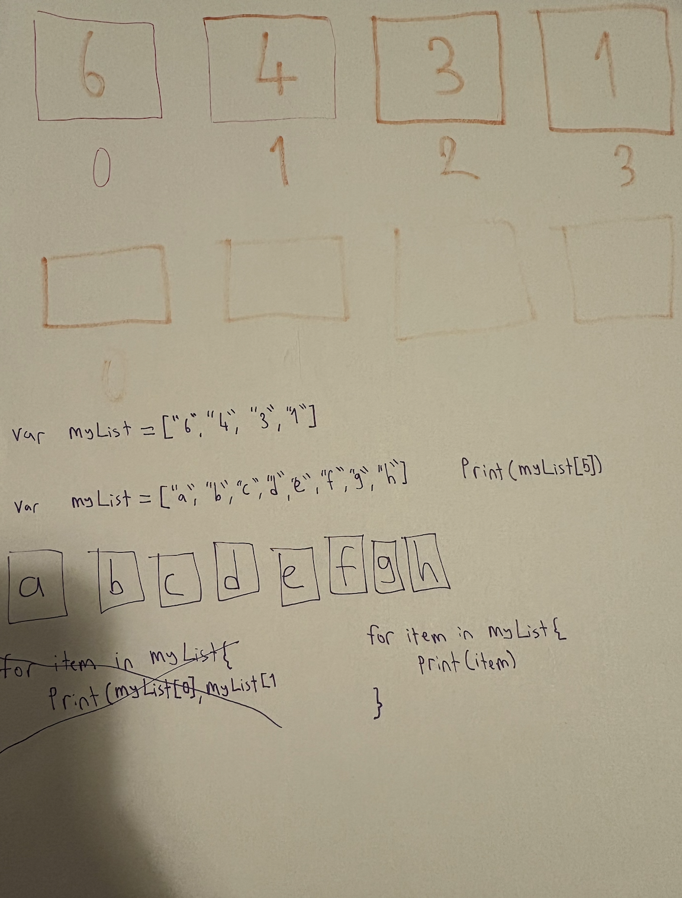

**V1 on Swift Playground Books**

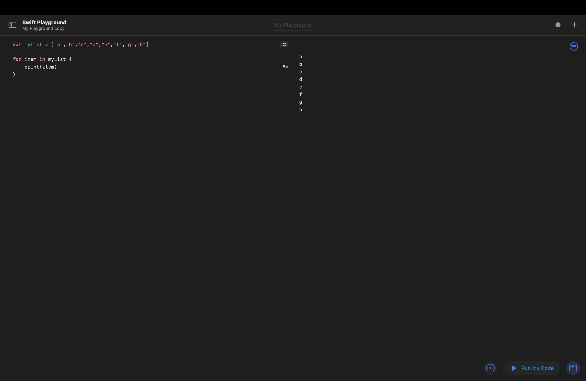

    var myList = ["a","b","c","d","e","f","g","h"]

    print(myList)

**V2 on Swift Playground Books**

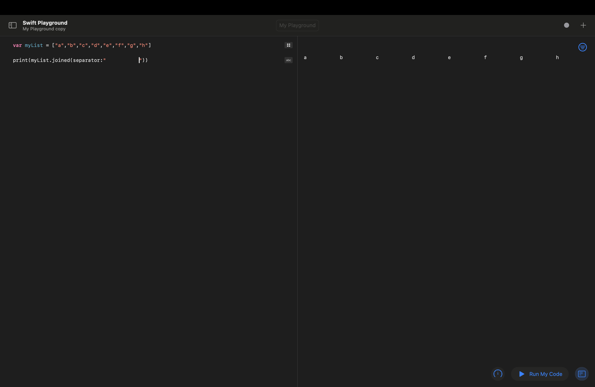

    var myList = ["a","b","c","d","e","f","g","h"]

    print(myList.joined(separator:"           "))

**V3 on Swift Playground**

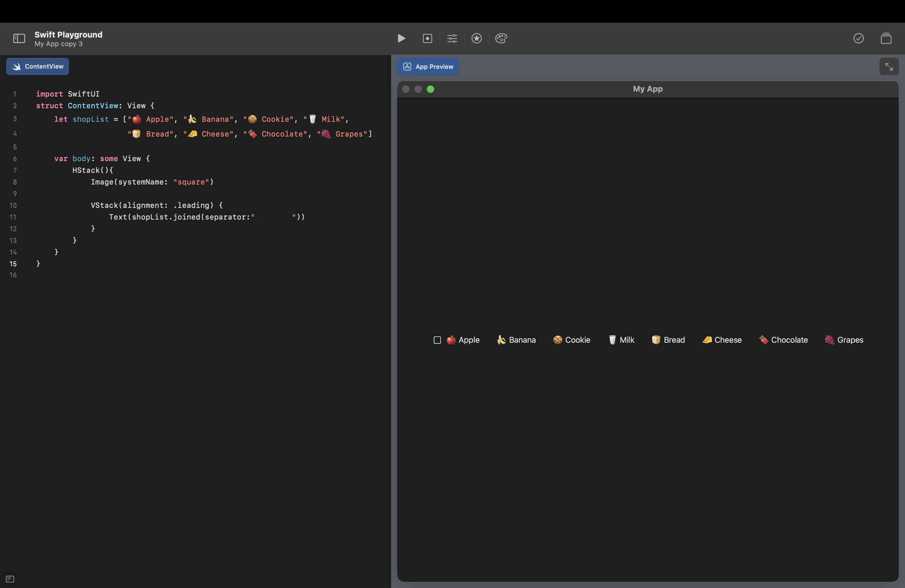

**V4 on Swift Playground**

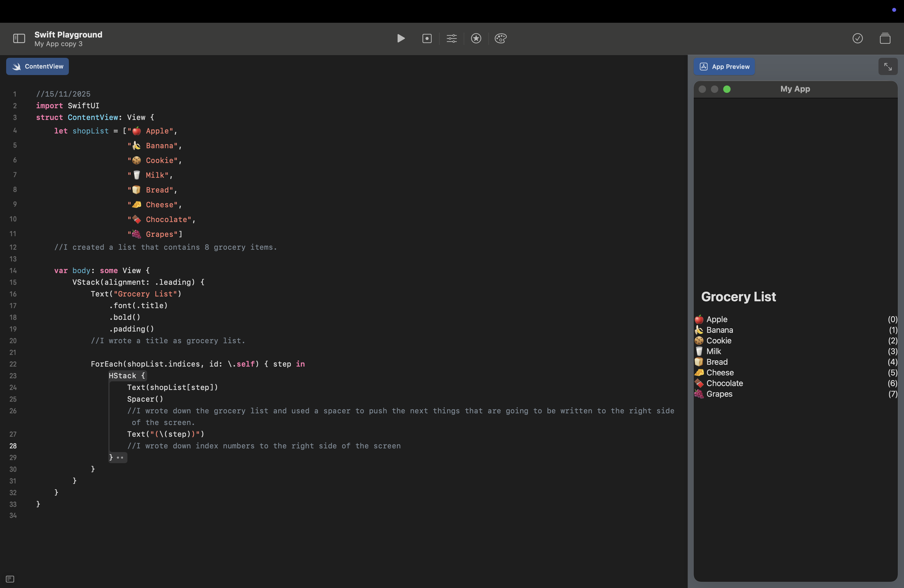

    //15/11/2025
    import SwiftUI
    struct ContentView: View {
    let shopList = ["🍎 Apple",
                    "🍌 Banana",
                    "🍪 Cookie",
                    "🥛 Milk",
                    "🍞 Bread",
                    "🧀 Cheese",
                    "🍫 Chocolate",
                    "🍇 Grapes"]
    //I created a list that contains 8 grocery items. 
    
    var body: some View {
        VStack(alignment: .leading) {
            Text("Grocery List")
                .font(.title)
                .bold()
                .padding()
            //I wrote a title as grocery list.
            
            ForEach(shopList.indices, id: \.self) { step in
                HStack {
                    Text(shopList[step])
                    Spacer()
                    //I wrote down the grocery list and used a spacer to push the next things that are going to be written to the right side of the screen. 
                    Text("(\(step))")
                    //I wrote down index numbers to the right side of the screen
                }
            }
        }
    }
    }

 

## Enigma Machine Cryptography Unplugged Project

  

**NOTE: I DIDN'T WRITE THE CODE. I USED AI.**

    import SwiftUI

    func applyPlugboard(_ letter: Character) -> Character {
    if letter == "A" { return "B" }
    if letter == "B" { return "A" }
    if letter == "C" { return "D" }
    if letter == "D" { return "C" }
    if letter == "E" { return "F" }
    if letter == "F" { return "E" }
    return letter
    }

    func applyRotor(_ letter: Character, shift: Int) -> Character {
    let alphabet = "ABCDEFGHIJKLMNOPQRSTUVWXYZ"
    var index = 0
    var position = 0
    

    for ch in alphabet {
        if ch == letter {
            index = position
            break
        }
        position += 1
    }
    

    var newIndex = index + shift
    while newIndex >= 26 {
        newIndex -= 26
    }
    

    position = 0
    var result: Character = "A"
    for ch in alphabet {
        if position == newIndex {
            result = ch
            break
        }
        position += 1
    }
    
    return result
    }

    struct ContentView: View {
    
    @State var inputText = ""
    @State var plugboardText = ""
    @State var finalText = ""
    @State var rotorShift = 1
    
    var body: some View {
        VStack(spacing: 20) {
            
            Text("Mini Enigma (1 Rotor, Plugboard)")
                .font(.title2).bold()
            

            VStack(alignment: .leading, spacing: 6) {
                Text("Input Letters:")
                    .font(.headline)
                TextField("Type a letter here", text: $inputText)
                    .textFieldStyle(RoundedBorderTextFieldStyle())
            }
            

            VStack(alignment: .leading, spacing: 6) {
                Text("Plugboard (A↔️B, C↔️D, E↔️F)")
                    .font(.headline)
                Text("After Plugboard: \(plugboardText)")
                    .font(.system(.body, design: .monospaced))
            }
            

            VStack(alignment: .leading, spacing: 6) {
                Text("Rotor (simple shift)")
                    .font(.headline)
                HStack {
                    Text("Rotor shift: \(rotorShift)")
                    Stepper("", value: $rotorShift, in: 0...25)
                        .labelsHidden()
                }
                Text("Final Output: \(finalText)")
                    .font(.system(.body, design: .monospaced))
            }
            
            Button("Encrypt") {
                let upper = inputText.uppercased()
                var tempPlugboard = ""
                var tempFinal = ""
                
                for ch in upper {
                    if ch >= "A" && ch <= "Z" {
                        let afterPlug = applyPlugboard(ch)
                        tempPlugboard.append(afterPlug)
                        
                        let afterRotor = applyRotor(afterPlug, shift: rotorShift)
                        tempFinal.append(afterRotor)
                    } else {

                        tempPlugboard.append(ch)
                        tempFinal.append(ch)
                    }
                }
                
                plugboardText = tempPlugboard
                finalText = tempFinal
            }
            .buttonStyle(.borderedProminent)
            
            Spacer()
        }
        .padding()
        .frame(width: 450, height: 450)
    }
    }

 

## Swift World Clock List Project

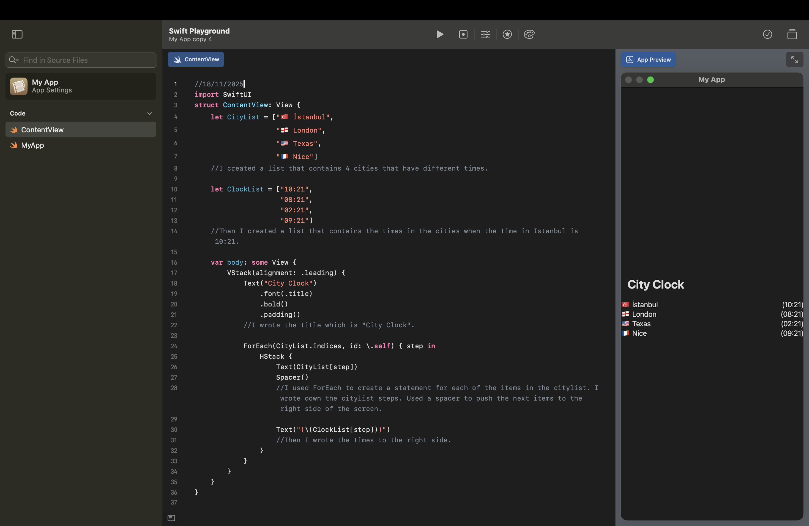 

    //18/11/2025
    import SwiftUI
    struct ContentView: View {
    let CityList = ["🇹🇷 İstanbul",
                    "🏴󠁧󠁢󠁥󠁮󠁧󠁿 London",
                    "🇺🇸 Texas",
                    "🇫🇷 Nice"]
    //I created a list that contains 4 cities that have different times. 
    
    let ClockList = ["10:21",
                     "08:21",
                     "02:21",
                     "09:21"]
    //Than I created a list that contains the times in the cities when the time in Istanbul is 10:21. 
    
    var body: some View {
        VStack(alignment: .leading) {
            Text("City Clock")
                .font(.title)
                .bold()
                .padding()
            //I wrote the title which is "City Clock".
            
            ForEach(CityList.indices, id: \.self) { step in
                HStack {
                    Text(CityList[step])
                    Spacer()
                    //I used ForEach to create a statement for each of the items in the citylist. I wrote down the citylist steps. Used a spacer to push the next items to the right side of the screen.
                    
                    Text("(\(ClockList[step]))")
                    //Then I wrote the times to the right side. 
                }
            }
        }
    }
    }

 

## Swift WWDC Student Design Competition

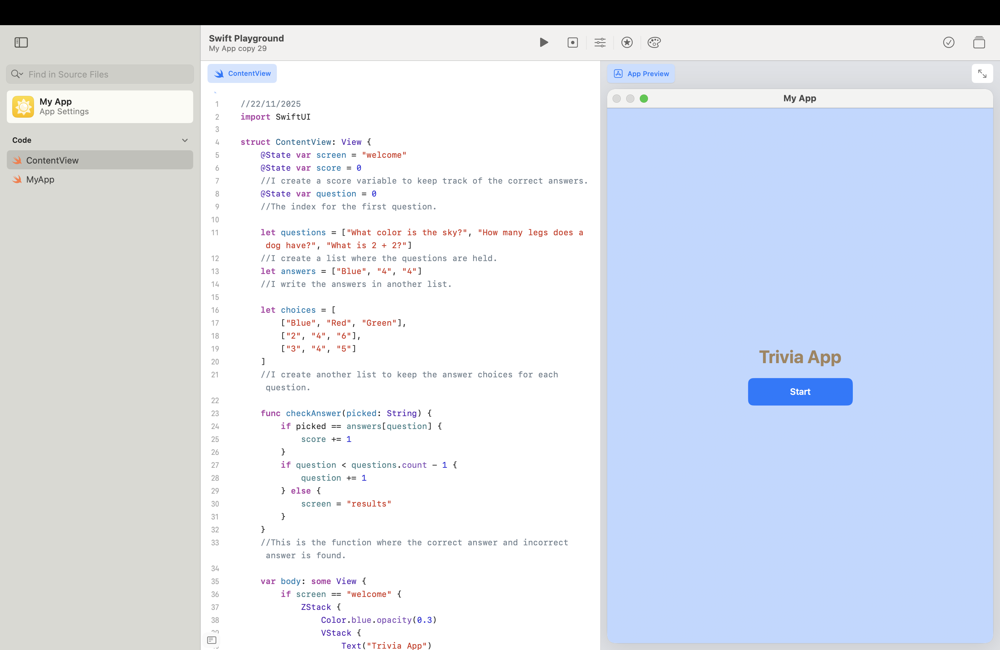 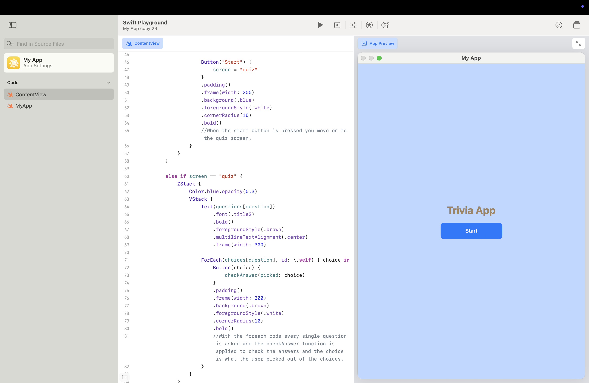 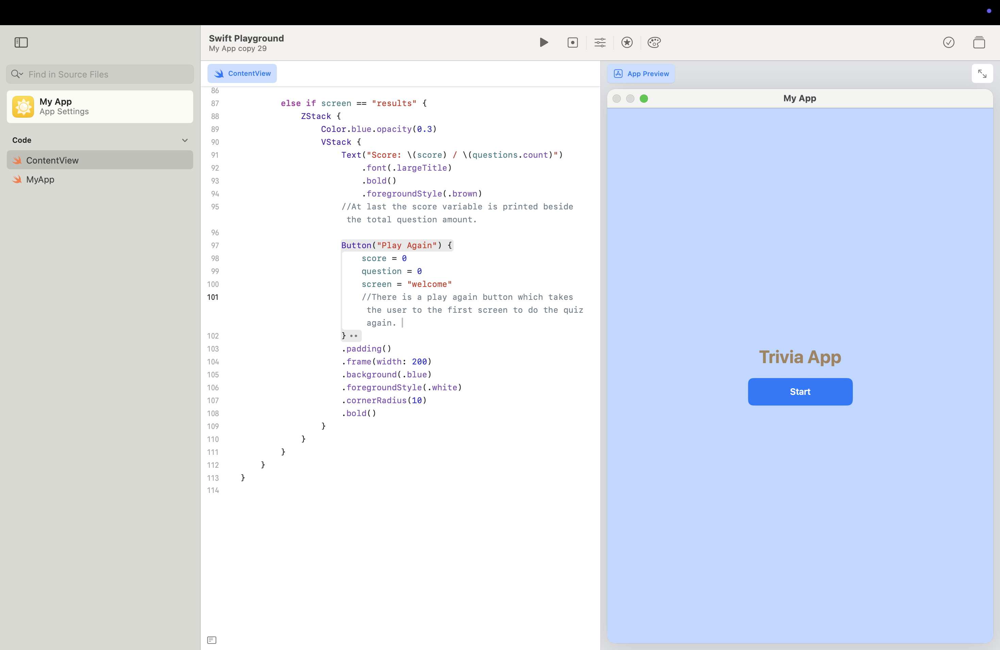

    //22/11/2025
    import SwiftUI

    struct ContentView: View {
    @State var screen = "welcome"
    @State var score = 0
    //I create a score variable to keep track of the correct answers. 
    @State var question = 0
    //The index for the first question. 
    
    let questions = ["What color is the sky?", "How many legs does a dog have?", "What is 2 + 2?"]
    //I create a list where the questions are held. 
    let answers = ["Blue", "4", "4"]
    //I write the answers in another list. 
    
    let choices = [
        ["Blue", "Red", "Green"],
        ["2", "4", "6"],
        ["3", "4", "5"]
    ]
    //I create another list to keep the answer choices for each question. 
    
    func checkAnswer(picked: String) {
        if picked == answers[question] {
            score += 1
        }
        if question < questions.count - 1 {
            question += 1
        } else {
            screen = "results"
        }
    }
    //This is the function where the correct answer and incorrect answer is found. 
    
    var body: some View {
        if screen == "welcome" {
            ZStack {
                Color.blue.opacity(0.3)
                VStack {
                    Text("Trivia App")
                        .font(.largeTitle)
                        .bold()
                        .foregroundStyle(.brown)
                    //This is the first screen where you start
                    
                    Button("Start") {
                        screen = "quiz"
                    }
                    .padding()
                    .frame(width: 200)
                    .background(.blue)
                    .foregroundStyle(.white)
                    .cornerRadius(10)
                    .bold()
                    //When the start button is pressed you move on to the quiz screen. 
                }
            }
        }
        
        else if screen == "quiz" {
            ZStack {
                Color.blue.opacity(0.3)
                VStack {
                    Text(questions[question])
                        .font(.title2)
                        .bold()
                        .foregroundStyle(.brown)
                        .multilineTextAlignment(.center)
                        .frame(width: 300)
                    
                    ForEach(choices[question], id: \.self) { choice in
                        Button(choice) {
                            checkAnswer(picked: choice)
                        }
                        .padding()
                        .frame(width: 200)
                        .background(.brown)
                        .foregroundStyle(.white)
                        .cornerRadius(10)
                        .bold()
                        //With the foreach code every single question is asked and the checkAnswer function is applied to check the answers and the choice is what the user picked out of the choices. 
                    }
                }
            }
        }
        
        else if screen == "results" {
            ZStack {
                Color.blue.opacity(0.3)
                VStack {
                    Text("Score: \(score) / \(questions.count)")
                        .font(.largeTitle)
                        .bold()
                        .foregroundStyle(.brown)
                    //At last the score variable is printed beside the total question amount. 
                    
                    Button("Play Again") {
                        score = 0
                        question = 0
                        screen = "welcome"
                        //There is a play again button which takes the user to the first screen to do the quiz again. 
                    }
                    .padding()
                    .frame(width: 200)
                    .background(.blue)
                    .foregroundStyle(.white)
                    .cornerRadius(10)
                    .bold()
                }
            }
        }
    }
    }

 

## Swift Ice Cream Shop List Project

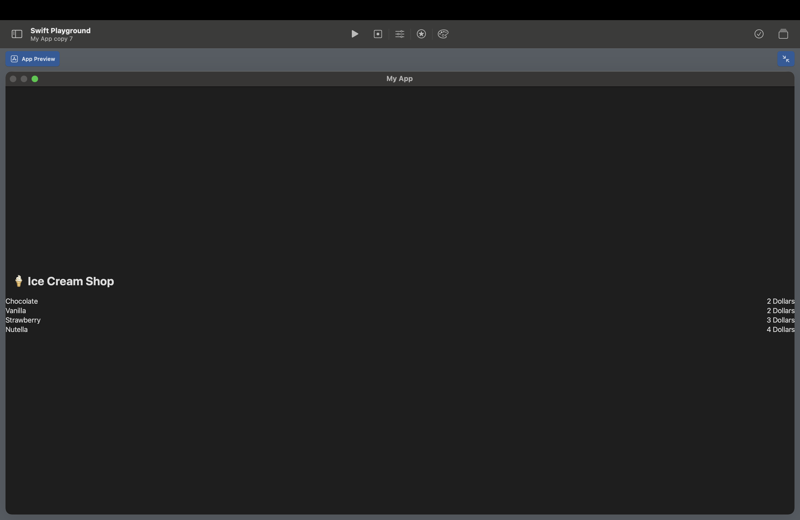 

    //18/11/2025
    import SwiftUI
    struct ContentView: View {
    let flavorList = ["Chocolate",
                    "Vanilla",
                    "Strawberry",
                    "Nutella"]
    //I created a list that contains 4 types of ice cream flavors in it. 
    
    let priceList = ["2 Dollars",
                     "2 Dollars",
                     "3 Dollars",
                     "4 Dollars"]
    //Then I created another list that contains the prices of these flavors. 
    
    var body: some View {
        VStack(alignment: .leading) {
            Text("🍦 Ice Cream Shop")
                .font(.title)
                .bold()
                .padding()
            //I wrote the title to the ice cream shop. 
            
            ForEach(flavorList.indices, id: \.self) { step in
                HStack {
                    Text(flavorList[step])
                    Spacer()
                    //I used ForEach to create a statement for all the items in the list. I wrote all the steps of the flavorList. Then used a spacer to push the next texts to the other side of the screen. 
                    
                    Text("\(priceList[step])")
                    //Finally I printed out the prices of the flavors in order. 
                }
            }
        }
    }
    }

 

## Swift My Initials With Code V1

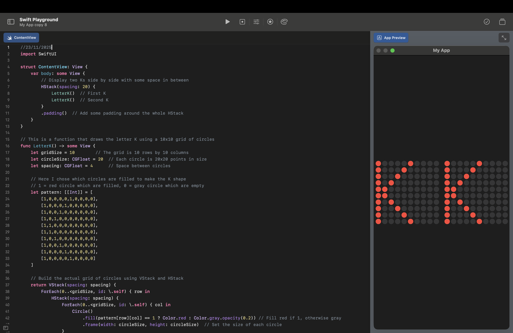 

    //23/11/2025
    import SwiftUI

    struct ContentView: View {
    var body: some View {
        // Display two Ks side by side with some space in between
        HStack(spacing: 20) {
            LetterK()  // First K
            LetterK()  // Second K
        }
        .padding()  // Add some padding around the whole HStack
    }
    }

    // This is a function that draws the letter K using a 10x10 grid of circles
    func LetterK() -> some View {
    let gridSize = 10        // The grid is 10 rows by 10 columns
    let circleSize: CGFloat = 20  // Each circle is 20x20 points in size
    let spacing: CGFloat = 4      // Space between circles
    
    // Here I chose which circles are filled to make the K shape
    // 1 = red circle which are filled, 0 = gray circle which are empty
    let pattern: [[Int]] = [
        [1,0,0,0,0,1,0,0,0,0],
        [1,0,0,0,1,0,0,0,0,0],
        [1,0,0,1,0,0,0,0,0,0],
        [1,0,1,0,0,0,0,0,0,0],
        [1,1,0,0,0,0,0,0,0,0],
        [1,1,0,0,0,0,0,0,0,0],
        [1,0,1,0,0,0,0,0,0,0],
        [1,0,0,1,0,0,0,0,0,0],
        [1,0,0,0,1,0,0,0,0,0],
        [1,0,0,0,0,1,0,0,0,0]
    ]
    
    // Build the actual grid of circles using VStack and HStack
    return VStack(spacing: spacing) {
        ForEach(0..<gridSize, id: \.self) { row in
            HStack(spacing: spacing) {
                ForEach(0..<gridSize, id: \.self) { col in
                    Circle()
                        .fill(pattern[row][col] == 1 ? Color.red : Color.gray.opacity(0.2)) // Fill red if 1, otherwise gray
                        .frame(width: circleSize, height: circleSize)  // Set the size of each circle
                }
            }
        }
    }
    }

 

## Swift My Initials With Code V2

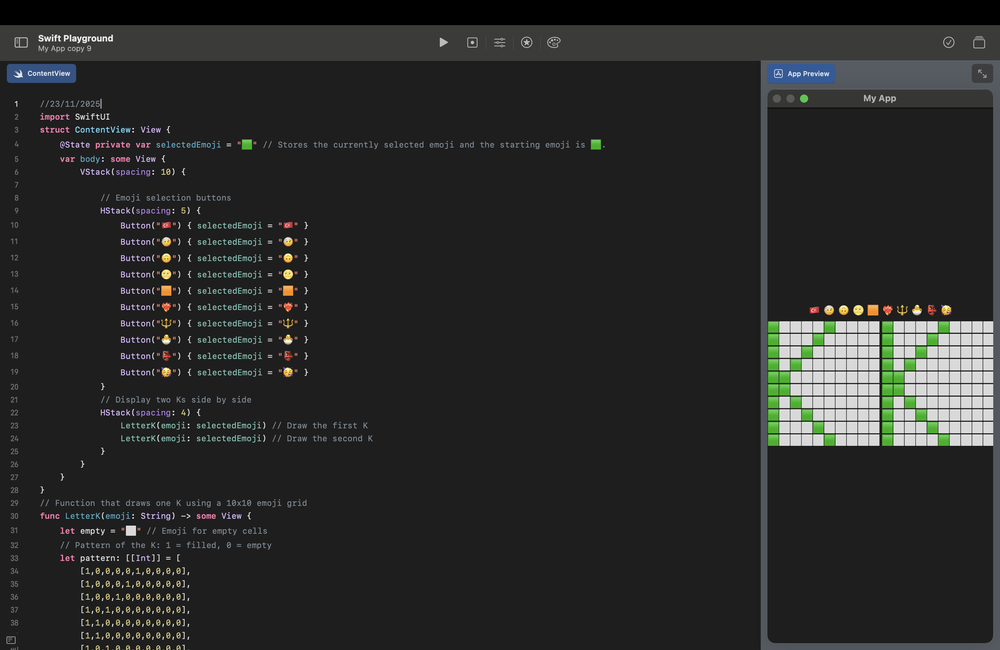  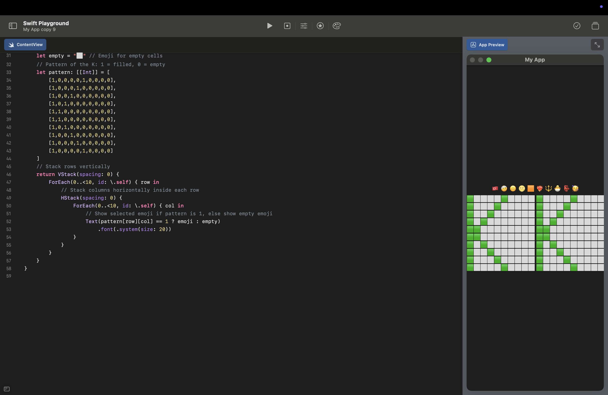 

    //23/11/2025
    import SwiftUI
    struct ContentView: View {
    @State private var selectedEmoji = "🟩" // Stores the currently selected emoji and the starting emoji is 🟩. 
    var body: some View {
        VStack(spacing: 10) {
            
            // Emoji selection buttons
            HStack(spacing: 5) {
                Button("🇹🇷") { selectedEmoji = "🇹🇷" }
                Button("🤕") { selectedEmoji = "🤕" }
                Button("🙃") { selectedEmoji = "🙃" }
                Button("🌝") { selectedEmoji = "🌝" }
                Button("🟧") { selectedEmoji = "🟧" }
                Button("❤️‍🔥") { selectedEmoji = "❤️‍🔥" }
                Button("🔱") { selectedEmoji = "🔱" }
                Button("🐣") { selectedEmoji = "🐣" }
                Button("👺") { selectedEmoji = "👺" }
                Button("🥳") { selectedEmoji = "🥳" }
            }
            // Display two Ks side by side
            HStack(spacing: 4) {
                LetterK(emoji: selectedEmoji) // Draw the first K
                LetterK(emoji: selectedEmoji) // Draw the second K
            }
        }
    }
    }
    // Function that draws one K using a 10x10 emoji grid
    func LetterK(emoji: String) -> some View {
    let empty = "⬜️" // Emoji for empty cells
    // Pattern of the K: 1 = filled, 0 = empty
    let pattern: [[Int]] = [
        [1,0,0,0,0,1,0,0,0,0],
        [1,0,0,0,1,0,0,0,0,0],
        [1,0,0,1,0,0,0,0,0,0],
        [1,0,1,0,0,0,0,0,0,0],
        [1,1,0,0,0,0,0,0,0,0],
        [1,1,0,0,0,0,0,0,0,0],
        [1,0,1,0,0,0,0,0,0,0],
        [1,0,0,1,0,0,0,0,0,0],
        [1,0,0,0,1,0,0,0,0,0],
        [1,0,0,0,0,1,0,0,0,0]
    ]
    // Stack rows vertically
    return VStack(spacing: 0) {
        ForEach(0..<10, id: \.self) { row in
            // Stack columns horizontally inside each row
            HStack(spacing: 0) {
                ForEach(0..<10, id: \.self) { col in
                    // Show selected emoji if pattern is 1, else show empty emoji
                    Text(pattern[row][col] == 1 ? emoji : empty)
                        .font(.system(size: 20))
                }
            }
        }
    }
    }

 

## Swift My Initials With Code V2.5

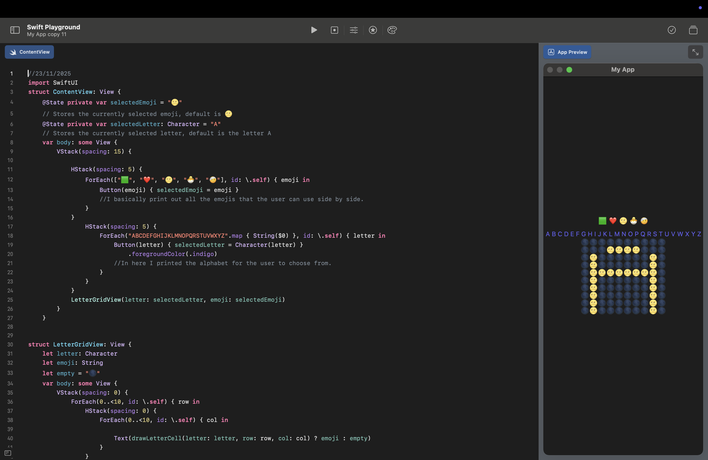  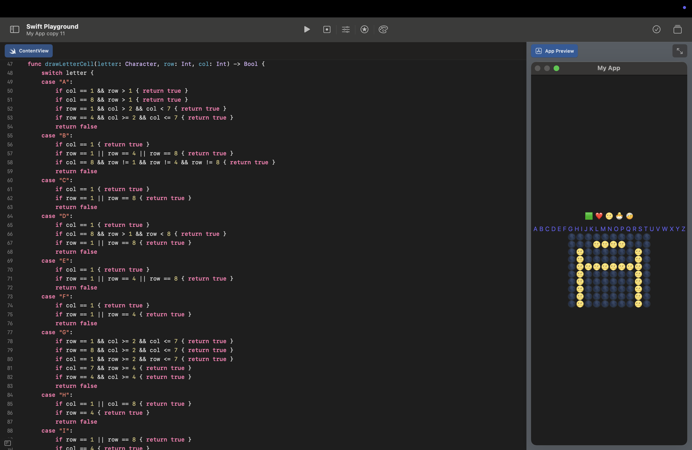  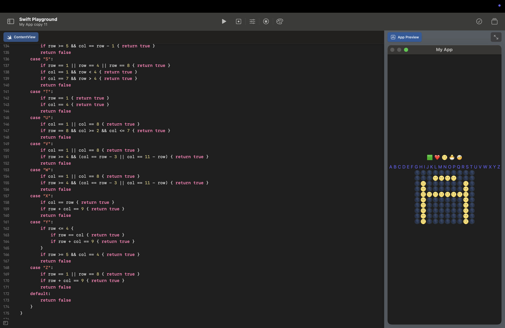

    //23/11/2025
    import SwiftUI
    struct ContentView: View {
    @State private var selectedEmoji = "🌝"
    // Stores the currently selected emoji, default is 🌝
    @State private var selectedLetter: Character = "A"
    // Stores the currently selected letter, default is the letter A
    var body: some View {
        VStack(spacing: 15) {

            HStack(spacing: 5) {
                ForEach(["🟩", "❤️", "🌝", "🐣", "🤕"], id: \.self) { emoji in
                    Button(emoji) { selectedEmoji = emoji }
                    //I basically print out all the emojis that the user can use side by side. 
                }
            }
                HStack(spacing: 5) { 
                    ForEach("ABCDEFGHIJKLMNOPQRSTUVWXYZ".map { String($0) }, id: \.self) { letter in
                        Button(letter) { selectedLetter = Character(letter) }
                            .foregroundColor(.indigo)
                        //In here I printed the alphabet for the user to choose from. 
                    }
                }
            }
            LetterGridView(letter: selectedLetter, emoji: selectedEmoji)
        }
    }

    struct LetterGridView: View {
    let letter: Character
    let emoji: String
    let empty = "🌑"
    var body: some View {
        VStack(spacing: 0) { 
            ForEach(0..<10, id: \.self) { row in
                HStack(spacing: 0) {
                    ForEach(0..<10, id: \.self) { col in
  
                        Text(drawLetterCell(letter: letter, row: row, col: col) ? emoji : empty)
                    }
                }
            }
        }
    }
    }
    func drawLetterCell(letter: Character, row: Int, col: Int) -> Bool {
    switch letter {
    case "A":
        if col == 1 && row > 1 { return true }
        if col == 8 && row > 1 { return true }
        if row == 1 && col > 2 && col < 7 { return true }
        if row == 4 && col >= 2 && col <= 7 { return true }
        return false
    case "B":
        if col == 1 { return true }
        if row == 1 || row == 4 || row == 8 { return true }
        if col == 8 && row != 1 && row != 4 && row != 8 { return true }
        return false
    case "C":
        if col == 1 { return true }
        if row == 1 || row == 8 { return true }
        return false
    case "D":
        if col == 1 { return true }
        if col == 8 && row > 1 && row < 8 { return true }
        if row == 1 || row == 8 { return true }
        return false
    case "E":
        if col == 1 { return true }
        if row == 1 || row == 4 || row == 8 { return true }
        return false
    case "F":
        if col == 1 { return true }
        if row == 1 || row == 4 { return true }
        return false
    case "G":
        if row == 1 && col >= 2 && col <= 7 { return true }
        if row == 8 && col >= 2 && col <= 7 { return true }
        if col == 1 && row >= 2 && row <= 7 { return true }
        if col == 7 && row >= 4 { return true }
        if row == 4 && col >= 4 { return true }
        return false
    case "H":
        if col == 1 || col == 8 { return true }
        if row == 4 { return true }
        return false
    case "I":
        if row == 1 || row == 8 { return true }
        if col == 4 { return true }
        return false
    case "J":
        if row == 1 { return true }
        if col == 4 && row <= 7 { return true }
        if row == 8 && col >= 2 { return true }
        if col == 2 && row >= 6 { return true }
        return false
    case "K":
        if col == 1 { return true }
        if row + col == 9 { return true }
        if row == col - 1 { return true }
        return false
    case "L":
        if col == 1 { return true }
        if row == 8 { return true }
        return false
    case "M":
        if col == 1 || col == 8 { return true }
        if row == col && row <= 4 { return true }
        if row + col == 9 && row <= 4 { return true }
        return false
    case "N":
        if col == 1 || col == 8 { return true }
        if row == col { return true }
        return false
    case "O":
        if (row == 1 || row == 8) && col >= 2 && col <= 7 { return true }
        if (col == 1 || col == 8) && row >= 2 && row <= 7 { return true }
        return false
    case "P":
        if col == 1 { return true }
        if (row == 1 || row == 4) && col <= 6 { return true }
        if col == 6 && row <= 3 { return true }
        return false
    case "Q":
        if (row == 1 || row == 8) && col >= 2 && col <= 7 { return true }
        if (col == 1 || col == 8) && row >= 2 && row <= 7 { return true }
        if row >= 5 && col >= 5 { return true }
        return false
    case "R":
        if col == 1 { return true }
        if (row == 1 || row == 4) && col <= 6 { return true }
        if col == 6 && row <= 3 { return true }
        if row >= 5 && col == row - 1 { return true }
        return false
    case "S":
        if row == 1 || row == 4 || row == 8 { return true }
        if col == 1 && row < 4 { return true }
        if col == 7 && row > 4 { return true }
        return false
    case "T":
        if row == 1 { return true }
        if col == 4 { return true }
        return false
    case "U":
        if col == 1 || col == 8 { return true }
        if row == 8 && col >= 2 && col <= 7 { return true }
        return false
    case "V":
        if col == 1 || col == 8 { return true }
        if row >= 4 && (col == row - 3 || col == 11 - row) { return true }
        return false
    case "W":
        if col == 1 || col == 8 { return true }
        if row >= 4 && (col == row - 3 || col == 11 - row) { return true }
        return false
    case "X":
        if col == row { return true }
        if row + col == 9 { return true }
        return false
    case "Y":
        if row <= 4 {
            if row == col { return true }
            if row + col == 9 { return true }
        }
        if row >= 5 && col == 4 { return true }
        return false
    case "Z":
        if row == 1 || row == 8 { return true }
        if row + col == 9 { return true }
        return false
    default:
        return false
    }
    }

 

## Swift Pixel Art

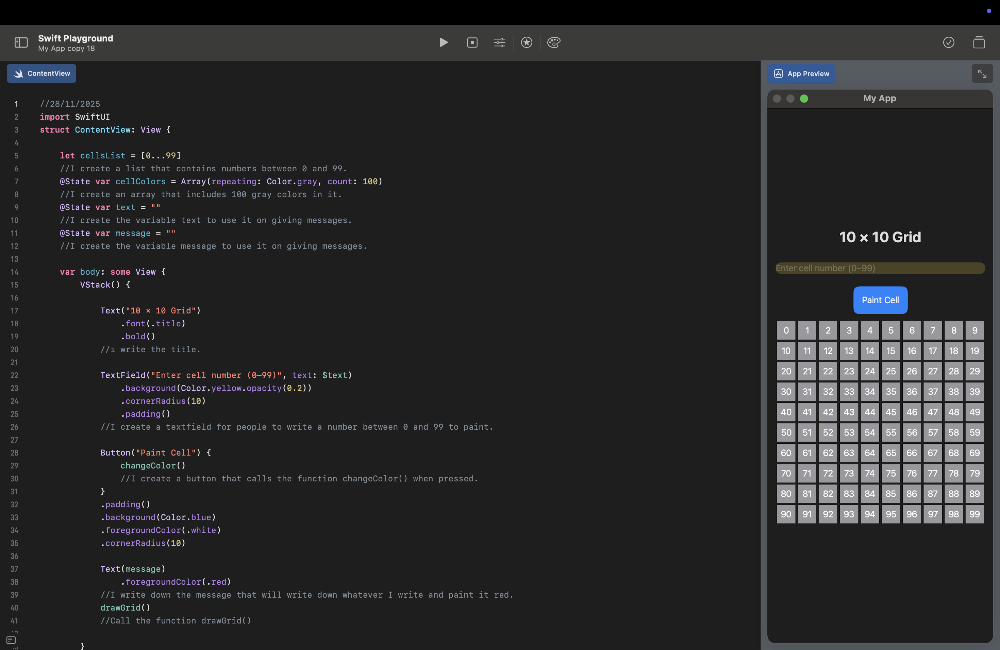 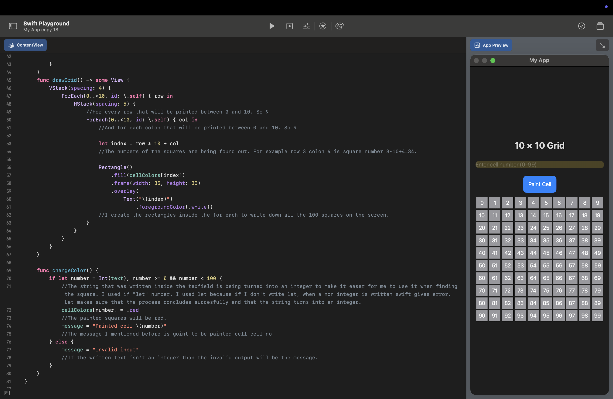 

    //28/11/2025
    import SwiftUI
    struct ContentView: View {
    
    let cellsList = [0...99]
    //I create a list that contains numbers between 0 and 99. 
    @State var cellColors = Array(repeating: Color.gray, count: 100)
    //I create an array that includes 100 gray colors in it. 
    @State var text = ""
    //I create the variable text to use it on giving messages. 
    @State var message = ""
    //I create the variable message to use it on giving messages.
    
    var body: some View {
        VStack() {
            
            Text("10 × 10 Grid")
                .font(.title)
                .bold()
            //ı write the title. 
            
            TextField("Enter cell number (0–99)", text: $text)
                .background(Color.yellow.opacity(0.2))
                .cornerRadius(10)
                .padding()
            //I create a textfield for people to write a number between 0 and 99 to paint. 
            
            Button("Paint Cell") {
                changeColor()
                //I create a button that calls the function changeColor() when pressed. 
            }
            .padding()
            .background(Color.blue)
            .foregroundColor(.white)
            .cornerRadius(10)
            
            Text(message)
                .foregroundColor(.red)
            //I write down the message that will write down whatever I write and paint it red. 
            drawGrid()
            //Call the function drawGrid()
            
        }
    }
    func drawGrid() -> some View {
        VStack(spacing: 4) {
            ForEach(0..<10, id: \.self) { row in
                HStack(spacing: 5) {
                    //For every row that will be printed between 0 and 10. So 9
                    ForEach(0..<10, id: \.self) { col in
                        //And for each colon that will be printed between 0 and 10. So 9
                        
                        let index = row * 10 + col
                        //The numbers of the squares are being found out. For example row 3 colon 4 is square number 3*10+4=34. 
                        
                        Rectangle()
                            .fill(cellColors[index])
                            .frame(width: 35, height: 35)
                            .overlay(
                                Text("\(index)")
                                    .foregroundColor(.white))
                        //I create the rectangles inside the for each to write down all the 100 squares on the screen. 
                    }
                }
            }
        }
    }
    
    func changeColor() {
        if let number = Int(text), number >= 0 && number < 100 {
            //The string that was written inside the texfield is being turned into an integer to make it easer for me to use it when finding the square. I used if "let" number. I used let because if I don't write let, when a non integer is written swift gives error. Let makes sure that the process concludes succesfully and that the string turns into an integer.  
            cellColors[number] = .red
            //The painted squares will be red. 
            message = "Painted cell \(number)"
            //The message I mentioned before is goint to be painted cell cell no
        } else {
            message = "Invalid input"
            //If the written text isn't an integer than the invalid output will be the message. 
        }
    }
    }

 

## Swift Big Idea 3 Code Project

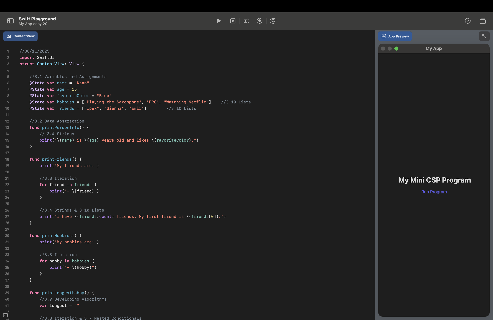  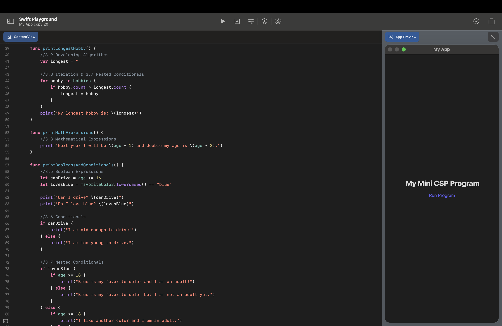  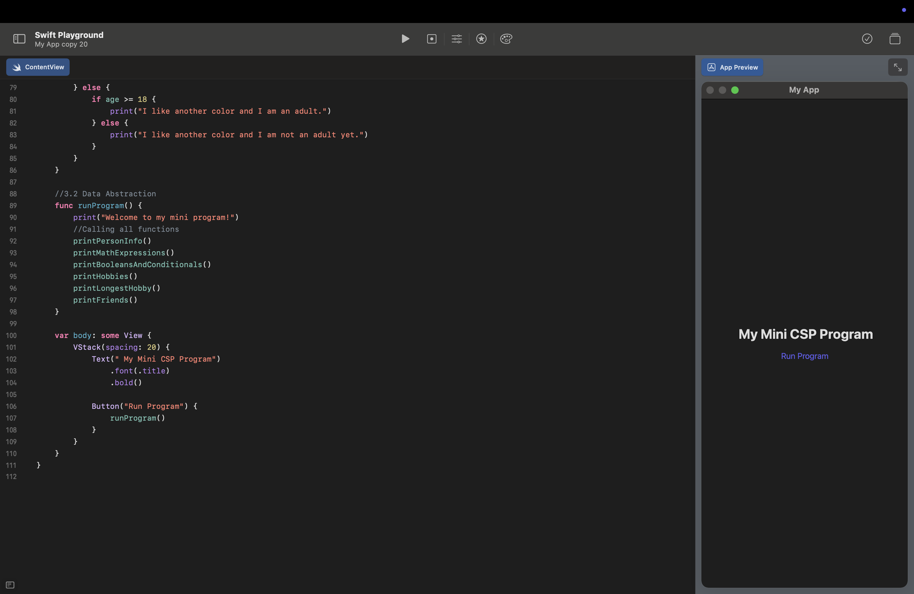

    //30/11/2025
    import SwiftUI
    struct ContentView: View {
    
    //3.1 Variables and Assignments
    @State var name = "Kaan"
    @State var age = 15
    @State var favoriteColor = "Blue"
    @State var hobbies = ["Playing the Saxohpone", "FRC", "Watching Netflix"]    //3.10 Lists
    @State var friends = ["İpek", "Sienna", "Emir"]        //3.10 Lists
    
    //3.2 Data Abstraction
    func printPersonInfo() {
        // 3.4 Strings
        print("\(name) is \(age) years old and likes \(favoriteColor).")
    }
    
    func printFriends() {
        print("My friends are:")
        
        //3.8 Iteration
        for friend in friends {
            print("- \(friend)")
        }
        
        //3.4 Strings & 3.10 Lists
        print("I have \(friends.count) friends. My first friend is \(friends[0]).")
    }
    
    func printHobbies() {
        print("My hobbies are:")
        
        //3.8 Iteration
        for hobby in hobbies {
            print("- \(hobby)")
        }
    }
    
    func printLongestHobby() {
        //3.9 Developing Algorithms
        var longest = ""
        
        //3.8 Iteration & 3.7 Nested Conditionals
        for hobby in hobbies {
            if hobby.count > longest.count {
                longest = hobby
            }
        }
        print("My longest hobby is: \(longest)")
    }
    
    func printMathExpressions() {
        //3.3 Mathematical Expressions
        print("Next year I will be \(age + 1) and double my age is \(age * 2).")
    }
    
    func printBooleansAndConditionals() {
        //3.5 Boolean Expressions
        let canDrive = age >= 16
        let lovesBlue = favoriteColor.lowercased() == "blue"
        
        print("Can I drive? \(canDrive)")
        print("Do I love blue? \(lovesBlue)")
        
        //3.6 Conditionals
        if canDrive {
            print("I am old enough to drive!")
        } else {
            print("I am too young to drive.")
        }
        
        //3.7 Nested Conditionals
        if lovesBlue {
            if age >= 18 {
                print("Blue is my favorite color and I am an adult!")
            } else {
                print("Blue is my favorite color but I am not an adult yet.")
            }
        } else {
            if age >= 18 {
                print("I like another color and I am an adult.")
            } else {
                print("I like another color and I am not an adult yet.")
            }
        }
    }
    
    //3.2 Data Abstraction
    func runProgram() {
        print("Welcome to my mini program!")
        //Calling all functions
        printPersonInfo()
        printMathExpressions()
        printBooleansAndConditionals()
        printHobbies()
        printLongestHobby()
        printFriends()
    }
    
    var body: some View {
        VStack(spacing: 20) {
            Text(" My Mini CSP Program")
                .font(.title)
                .bold()
            
            Button("Run Program") {
                runProgram()
            }
        }
    }
    }

 

## Swift Robot Program

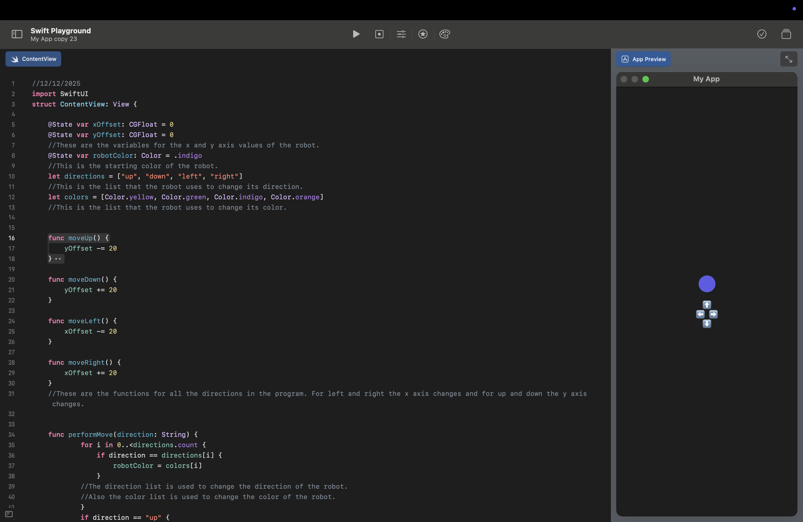  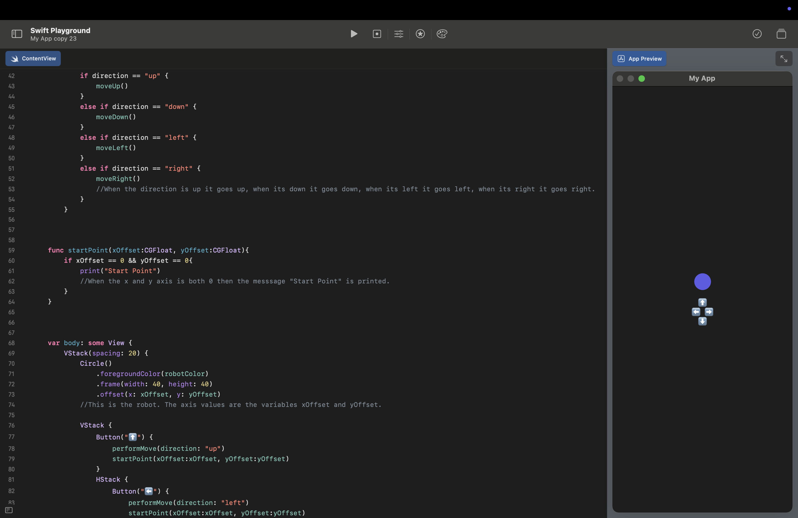  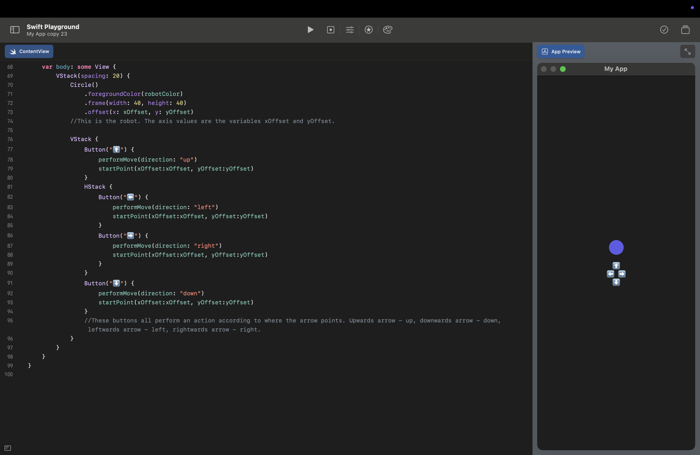
   
    //12/12/2025
    import SwiftUI
    struct ContentView: View {

    @State var xOffset: CGFloat = 0
    @State var yOffset: CGFloat = 0
    //These are the variables for the x and y axis values of the robot. 
    @State var robotColor: Color = .indigo
    //This is the starting color of the robot. 
    let directions = ["up", "down", "left", "right"]
    //This is the list that the robot uses to change its direction. 
    let colors = [Color.yellow, Color.green, Color.indigo, Color.orange]
    //This is the list that the robot uses to change its color. 

    
    func moveUp() {
        yOffset -= 20
    }
    
    func moveDown() {
        yOffset += 20
    }
    
    func moveLeft() {
        xOffset -= 20
    }
    
    func moveRight() {
        xOffset += 20
    }
    //These are the functions for all the directions in the program. For left and right the x axis changes and for up and down the y axis changes. 

    
    func performMove(direction: String) {
            for i in 0..<directions.count {
                if direction == directions[i] {
                    robotColor = colors[i]
                }
            //The direction list is used to change the direction of the robot. 
            //Also the color list is used to change the color of the robot. 
            }
            if direction == "up" {
                moveUp()
            }
            else if direction == "down" {
                moveDown()
            }
            else if direction == "left" {
                moveLeft()
            }
            else if direction == "right" {
                moveRight()
                //When the direction is up it goes up, when its down it goes down, when its left it goes left, when its right it goes right. 
            }
        }

    
    
    func startPoint(xOffset:CGFloat, yOffset:CGFloat){
        if xOffset == 0 && yOffset == 0{
            print("Start Point")
            //When the x and y axis is both 0 then the messsage "Start Point" is printed. 
        }
    }
    
    
    
    var body: some View {
        VStack(spacing: 20) {
            Circle()
                .foregroundColor(robotColor)
                .frame(width: 40, height: 40)
                .offset(x: xOffset, y: yOffset)
            //This is the robot. The axis values are the variables xOffset and yOffset. 
            
            VStack {
                Button("⬆️") {
                    performMove(direction: "up")
                    startPoint(xOffset:xOffset, yOffset:yOffset)
                }
                HStack {
                    Button("⬅️") {
                        performMove(direction: "left")
                        startPoint(xOffset:xOffset, yOffset:yOffset)
                    }
                    Button("➡️") {
                        performMove(direction: "right")
                        startPoint(xOffset:xOffset, yOffset:yOffset)
                    }
                }
                Button("⬇️") {
                    performMove(direction: "down")
                    startPoint(xOffset:xOffset, yOffset:yOffset)
                }
                //These buttons all perform an action according to where the arrow points. Upwards arrow - up, downwards arrow - down, leftwards arrow - left, rightwards arrow - right.  
            }
        }
    }
    }

 

## Swift Rock Paper Scissors Program

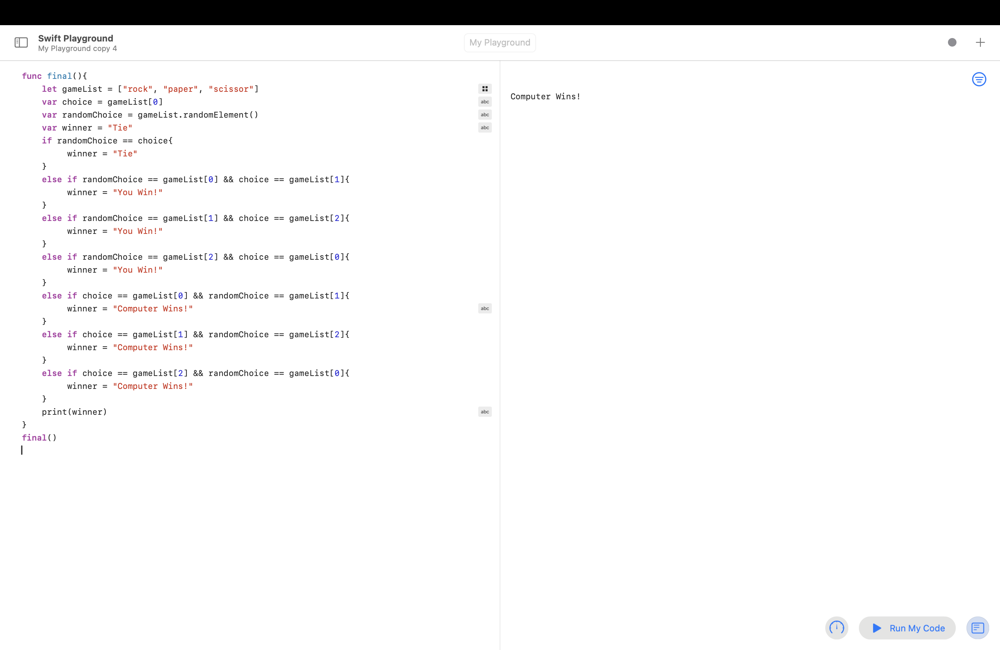

    //16/02/2026
    func final(){
        let gameList = ["rock", "paper", "scissor"]
    //The list to choose choices from. 
    var choice = gameList[0]
    //A fix choice from the user. 
    var randomChoice = gameList.randomElement()
    //The code that uses randomization.
    var winner = "Tie"
    //At start there is considered to be a tie. 
    if randomChoice == choice{
         winner = "Tie"
        //If the choices are the same then there is a tie. 
    }
    else if randomChoice == gameList[0] && choice == gameList[1]{
         winner = "You Win!"
    }
    else if randomChoice == gameList[1] && choice == gameList[2]{
         winner = "You Win!"
    }
    else if randomChoice == gameList[2] && choice == gameList[0]{
         winner = "You Win!" 
    }
    else if choice == gameList[0] && randomChoice == gameList[1]{
         winner = "Computer Wins!"
    }
    else if choice == gameList[1] && randomChoice == gameList[2]{
         winner = "Computer Wins!"
    }
    else if choice == gameList[2] && randomChoice == gameList[0]{
         winner = "Computer Wins!" 
    }
    //I wrote the possible outcomes and labeled them weather the computer or the human wins. 
    print(winner)
    //Then the winner is printed out.
    }
    final()
    //The function is called.

 

## Swift AP Computer Science Principles Final Project: Bun n Barrel

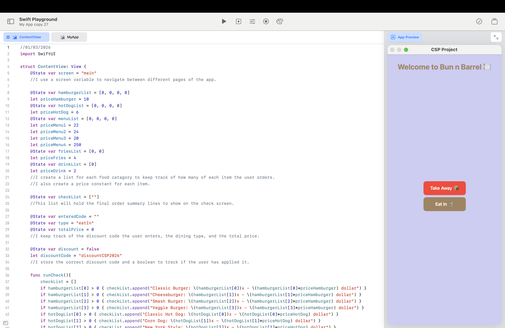 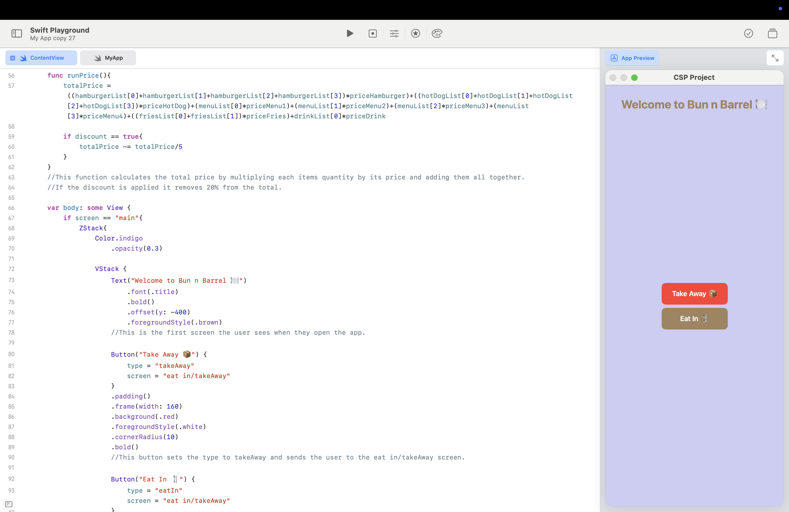 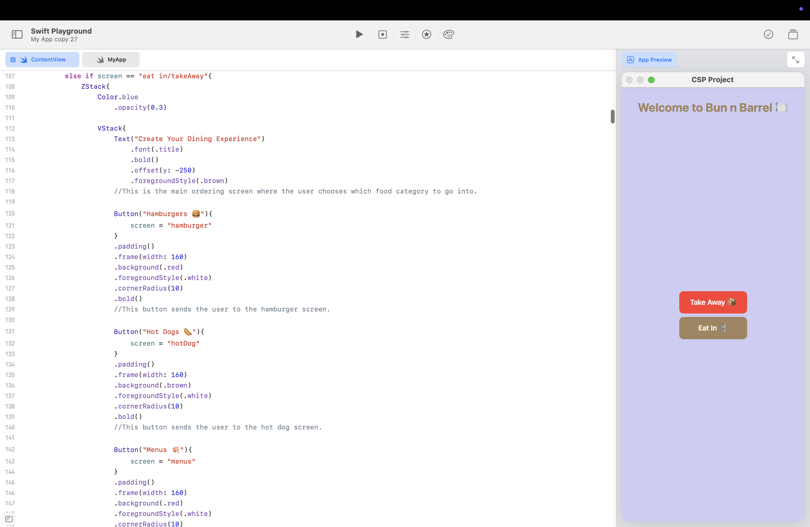 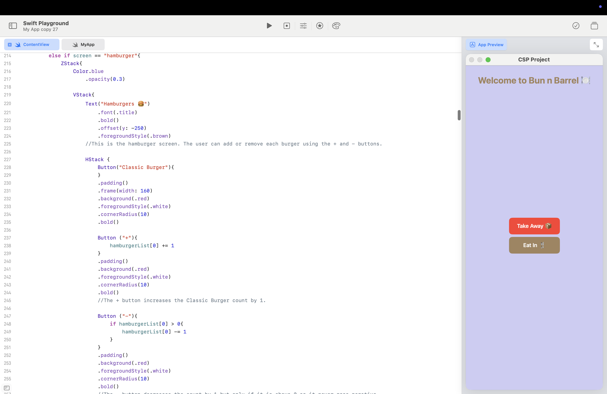 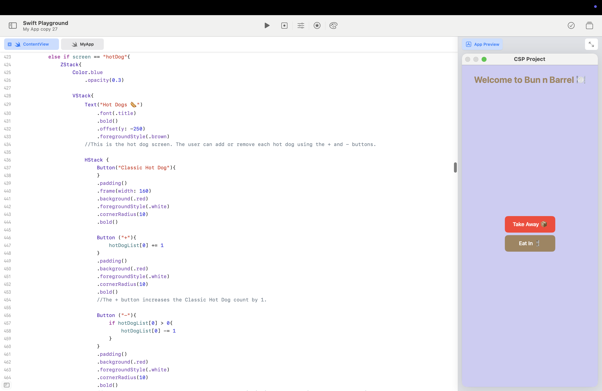   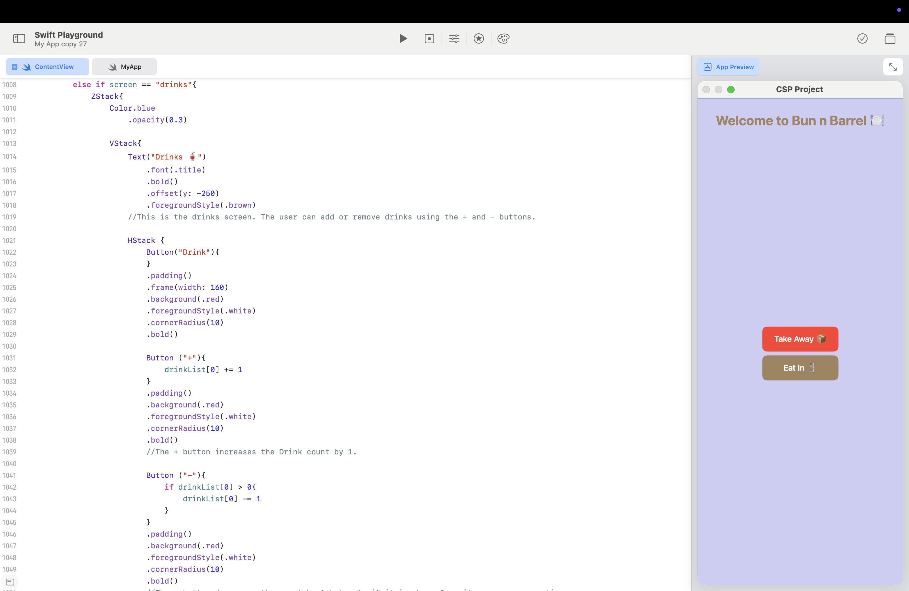 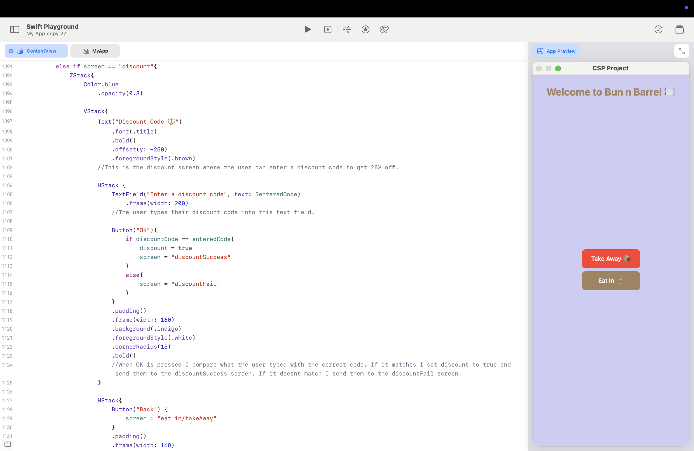 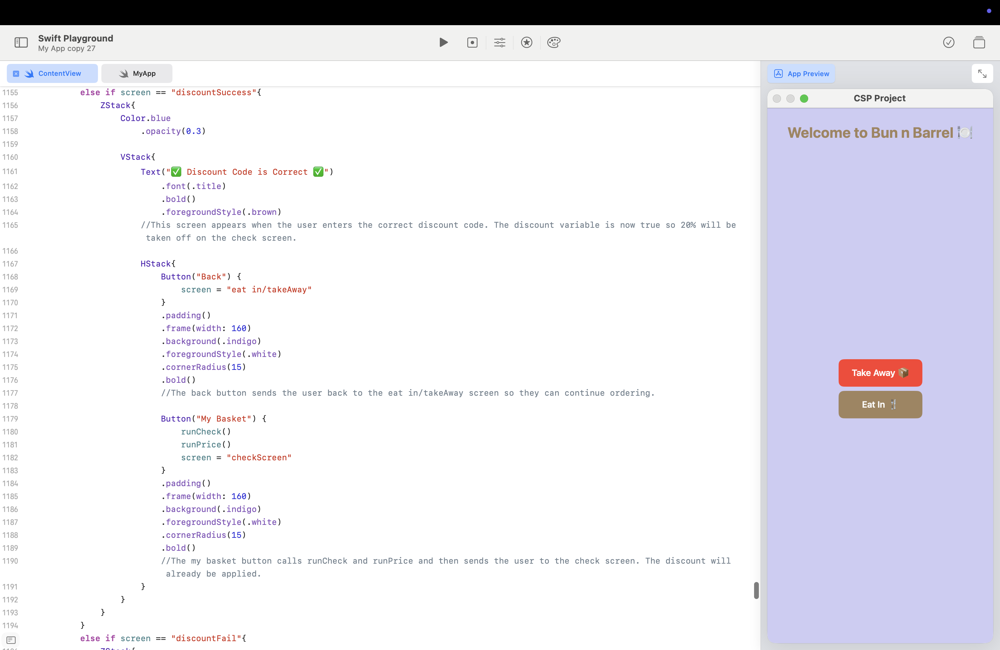 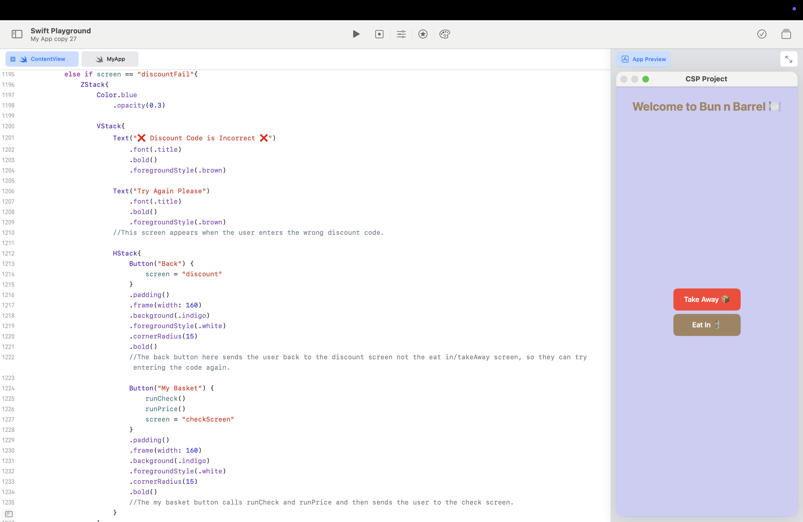 

    //01/03/2026
    import SwiftUI

    struct ContentView: View {
    @State var screen = "main"
    //I use a screen variable to navigate between different pages of the app.
    
    @State var hamburgerList = [0, 0, 0, 0]
    let priceHamburger = 10
    @State var hotDogList = [0, 0, 0, 0]
    let priceHotDog = 6
    @State var menuList = [0, 0, 0, 0]
    let priceMenu1 = 22
    let priceMenu2 = 24
    let priceMenu3 = 20
    let priceMenu4 = 250
    @State var friesList = [0, 0]
    let priceFries = 4
    @State var drinkList = [0]
    let priceDrink = 2
    //I create a list for each food catagory to keep track of how many of each item the user orders.
    //I also create a price constant for each item.
    
    @State var checkList = [""]
    //This list will hold the final order summary lines to show on the check screen.
    
    @State var enteredCode = ""
    @State var type = "eatIn"
    @State var totalPrice = 0
    //I keep track of the discount code the user enters, the dining type, and the total price.
    
    @State var discount = false
    let discountCode = "discountCSP2026"
    //I store the correct discount code and a boolean to track if the user has applied it.
    
    func runCheck(){
        checkList = []
        if hamburgerList[0] > 0 { checkList.append("Classic Burger: \(hamburgerList[0])x - \(hamburgerList[0]*priceHamburger) dollar") }
        if hamburgerList[1] > 0 { checkList.append("Cheeseburger: \(hamburgerList[1])x - \(hamburgerList[1]*priceHamburger) dollar") }
        if hamburgerList[2] > 0 { checkList.append("Smash Burger: \(hamburgerList[2])x - \(hamburgerList[2]*priceHamburger) dollar") }
        if hamburgerList[3] > 0 { checkList.append("Veggie Burger: \(hamburgerList[3])x - \(hamburgerList[3]*priceHamburger) dollar") }
        if hotDogList[0] > 0 { checkList.append("Classic Hot Dog: \(hotDogList[0])x - \(hotDogList[0]*priceHotDog) dollar") }
        if hotDogList[1] > 0 { checkList.append("Corn Dog: \(hotDogList[1])x - \(hotDogList[1]*priceHotDog) dollar") }
        if hotDogList[2] > 0 { checkList.append("New York Style: \(hotDogList[2])x - \(hotDogList[2]*priceHotDog) dollar") }
        if hotDogList[3] > 0 { checkList.append("Chicago Dog: \(hotDogList[3])x - \(hotDogList[3]*priceHotDog) dollar") }
        if menuList[0] > 0 { checkList.append("Classic Menu: \(menuList[0])x - \(menuList[0]*priceMenu1) dollar") }
        if menuList[1] > 0 { checkList.append("Old School Menu: \(menuList[1])x - \(menuList[1]*priceMenu2) dollar") }
        if menuList[2] > 0 { checkList.append("Vegan Menu: \(menuList[2])x - \(menuList[2]*priceMenu3) dollar") }
        if menuList[3] > 0 { checkList.append("Party Menu: \(menuList[3])x - \(menuList[3]*priceMenu4) dollar") }
        if friesList[0] > 0 { checkList.append("Fries: \(friesList[0])x - \(friesList[0]*priceFries) dollar") }
        if friesList[1] > 0 { checkList.append("Cheese Fries: \(friesList[1])x - \(friesList[1]*priceFries) dollar") }
        if drinkList[0] > 0 { checkList.append("Drink: \(drinkList[0])x - \(drinkList[0]*priceDrink) dollar") }
    }
    //This function builds the checkList. It checks each item and if the quantity is more than 0 it adds that item to the list with its quantity and price.
    
    func runPrice(){
        totalPrice = ((hamburgerList[0]+hamburgerList[1]+hamburgerList[2]+hamburgerList[3])*priceHamburger)+((hotDogList[0]+hotDogList[1]+hotDogList[2]+hotDogList[3])*priceHotDog)+(menuList[0]*priceMenu1)+(menuList[1]*priceMenu2)+(menuList[2]*priceMenu3)+(menuList[3]*priceMenu4)+((friesList[0]+friesList[1])*priceFries)+drinkList[0]*priceDrink
        
        if discount == true{
            totalPrice -= totalPrice/5
        }
    }
    //This function calculates the total price by multiplying each items quantity by its price and adding them all together.
    //If the discount is applied it removes 20% from the total.
    
    var body: some View {
        if screen == "main"{
            ZStack{
                Color.indigo
                    .opacity(0.3)
                
                VStack {
                    Text("Welcome to Bun n Barrel 🍽️")
                        .font(.title)
                        .bold()
                        .offset(y: -400)
                        .foregroundStyle(.brown)
                    //This is the first screen the user sees when they open the app.
                    
                    Button("Take Away 📦") {
                        type = "takeAway"
                        screen = "eat in/takeAway"
                    }
                    .padding()
                    .frame(width: 160)
                    .background(.red)
                    .foregroundStyle(.white)
                    .cornerRadius(10)
                    .bold()
                    //This button sets the type to takeAway and sends the user to the eat in/takeAway screen.
                    
                    Button("Eat In 🍴") {
                        type = "eatIn"
                        screen = "eat in/takeAway"
                    }
                    .padding()
                    .frame(width: 160)
                    .background(.brown)
                    .foregroundStyle(.white)
                    .cornerRadius(10)
                    .bold()
                    //This button sets the type to eatIn and sends the user to the eat in/takeAway screen.
                }
            }
        }
        
        else if screen == "eat in/takeAway"{
            ZStack{
                Color.blue
                    .opacity(0.3)
                
                VStack{
                    Text("Create Your Dining Experience")
                        .font(.title)
                        .bold()
                        .offset(y: -250)
                        .foregroundStyle(.brown)
                    //This is the main ordering screen where the user chooses which food category to go into.
                    
                    Button("Hamburgers 🍔"){
                        screen = "hamburger"
                    }
                    .padding()
                    .frame(width: 160)
                    .background(.red)
                    .foregroundStyle(.white)
                    .cornerRadius(10)
                    .bold()
                    //This button sends the user to the hamburger screen.
                    
                    Button("Hot Dogs 🌭"){
                        screen = "hotDog"
                    }
                    .padding()
                    .frame(width: 160)
                    .background(.brown)
                    .foregroundStyle(.white)
                    .cornerRadius(10)
                    .bold()
                    //This button sends the user to the hot dog screen.
                    
                    Button("Menus 💥"){
                        screen = "menus"
                    }
                    .padding()
                    .frame(width: 160)
                    .background(.red)
                    .foregroundStyle(.white)
                    .cornerRadius(10)
                    .bold()
                    //This button sends the user to the menus screen.
                    
                    Button("Fries 🍟"){
                        screen = "fries"
                    }
                    .padding()
                    .frame(width: 160)
                    .background(.brown)
                    .foregroundStyle(.white)
                    .cornerRadius(10)
                    .bold()
                    //This button sends the user to the fries screen.
                    
                    Button("Drinks 🥤"){
                        screen = "drinks"
                    }
                    .padding()
                    .frame(width: 160)
                    .background(.red)
                    .foregroundStyle(.white)
                    .cornerRadius(10)
                    .bold()
                    //This button sends the user to the drinks screen.
                    
                    Button("Discount Code 🔱"){
                        screen = "discount"
                    }
                    .padding()
                    .frame(width: 160)
                    .background(.brown)
                    .foregroundStyle(.white)
                    .cornerRadius(10)
                    .bold()
                    //This button sends the user to the discount screen.
                    
                    HStack{
                        Button("Back") {
                            screen = "main"
                        }
                        .padding()
                        .frame(width: 160)
                        .background(.indigo)
                        .foregroundStyle(.white)
                        .cornerRadius(15)
                        .bold()
                        //The back button sends the user back to the main screen.
                        
                        Button("My Basket") {
                            runCheck()
                            runPrice()
                            screen = "checkScreen"
                        }
                        .padding()
                        .frame(width: 160)
                        .background(.indigo)
                        .foregroundStyle(.white)
                        .cornerRadius(15)
                        .bold()
                        //The my basket button calls runCheck and runPrice and then sends the user to the check screen.
                    }
                }
            }
        }
        else if screen == "hamburger"{
            ZStack{
                Color.blue
                    .opacity(0.3)
                
                VStack{
                    Text("Hamburgers 🍔")
                        .font(.title)
                        .bold()
                        .offset(y: -250)
                        .foregroundStyle(.brown)
                    //This is the hamburger screen. The user can add or remove each burger using the + and - buttons.
                    
                    HStack {
                        Button("Classic Burger"){
                        }
                        .padding()
                        .frame(width: 160)
                        .background(.red)
                        .foregroundStyle(.white)
                        .cornerRadius(10)
                        .bold()
                        
                        Button ("+"){
                            hamburgerList[0] += 1
                        }
                        .padding()
                        .background(.red)
                        .foregroundStyle(.white)
                        .cornerRadius(10)
                        .bold()
                        //The + button increases the Classic Burger count by 1.
                        
                        Button ("-"){
                            if hamburgerList[0] > 0{
                                hamburgerList[0] -= 1
                            }
                        }
                        .padding()
                        .background(.red)
                        .foregroundStyle(.white)
                        .cornerRadius(10)
                        .bold()
                        //The - button decreases the count by 1 but only if it is above 0 so it never goes negative.
                        
                        Button ("\(hamburgerList[0])"){
                        }
                        .padding()
                        .background(.red)
                        .foregroundStyle(.white)
                        .cornerRadius(10)
                        .bold()
                        //This button displays the current quantity of Classic Burgers.
                    }
                    
                    HStack {
                        Button("Cheeseburger"){
                        }
                        .padding()
                        .frame(width: 160)
                        .background(.brown)
                        .foregroundStyle(.white)
                        .cornerRadius(10)
                        .bold()
                        
                        Button ("+"){
                            hamburgerList[1] += 1
                        }
                        .padding()
                        .background(.brown)
                        .foregroundStyle(.white)
                        .cornerRadius(10)
                        .bold()
                        //The + button increases the Cheeseburger count by 1.
                        
                        Button ("-"){
                            if hamburgerList[1] > 0{
                                hamburgerList[1] -= 1
                            }
                        }
                        .padding()
                        .background(.brown)
                        .foregroundStyle(.white)
                        .cornerRadius(10)
                        .bold()
                        //The - button decreases the count by 1 but only if it is above 0 so it never goes negative.
                        
                        Button ("\(hamburgerList[1])"){
                        }
                        .padding()
                        .background(.brown)
                        .foregroundStyle(.white)
                        .cornerRadius(10)
                        .bold()
                        //This button displays the current quantity of Cheeseburgers.
                    }
                    
                    HStack {
                        Button("Smash Burger"){
                        }
                        .padding()
                        .frame(width: 160)
                        .background(.red)
                        .foregroundStyle(.white)
                        .cornerRadius(10)
                        .bold()
                        
                        Button ("+"){
                            hamburgerList[2] += 1
                        }
                        .padding()
                        .background(.red)
                        .foregroundStyle(.white)
                        .cornerRadius(10)
                        .bold()
                        //The + button increases the Smash Burger count by 1.
                        
                        Button ("-"){
                            if hamburgerList[2] > 0{
                                hamburgerList[2] -= 1
                            }
                        }
                        .padding()
                        .background(.red)
                        .foregroundStyle(.white)
                        .cornerRadius(10)
                        .bold()
                        //The - button decreases the count by 1 but only if it is above 0 so it never goes negative.
                        
                        Button ("\(hamburgerList[2])"){
                        }
                        .padding()
                        .background(.red)
                        .foregroundStyle(.white)
                        .cornerRadius(10)
                        .bold()
                        //This button displays the current quantity of Smash Burgers.
                    }
                    
                    HStack {
                        Button("Veggie Burger"){
                        }
                        .padding()
                        .frame(width: 160)
                        .background(.brown)
                        .foregroundStyle(.white)
                        .cornerRadius(10)
                        .bold()
                        
                        Button ("+"){
                            hamburgerList[3] += 1
                        }
                        .padding()
                        .background(.brown)
                        .foregroundStyle(.white)
                        .cornerRadius(10)
                        .bold()
                        //The + button increases the Veggie Burger count by 1.
                        
                        Button ("-"){
                            if hamburgerList[3] > 0{
                                hamburgerList[3] -= 1
                            }
                        }
                        .padding()
                        .background(.brown)
                        .foregroundStyle(.white)
                        .cornerRadius(10)
                        .bold()
                        //The - button decreases the count by 1 but only if it is above 0 so it never goes negative.
                        
                        Button ("\(hamburgerList[3])"){
                        }
                        .padding()
                        .background(.brown)
                        .foregroundStyle(.white)
                        .cornerRadius(10)
                        .bold()
                        //This button displays the current quantity of Veggie Burgers.
                    }
                    
                    HStack{
                        Button("Back") {
                            screen = "eat in/takeAway"
                        }
                        .padding()
                        .frame(width: 160)
                        .background(.indigo)
                        .foregroundStyle(.white)
                        .cornerRadius(15)
                        .bold()
                        //The back button sends the user back to the eat in/takeAway screen.
                        
                        Button("My Basket") {
                            runCheck()
                            runPrice()
                            screen = "checkScreen"
                        }
                        .padding()
                        .frame(width: 160)
                        .background(.indigo)
                        .foregroundStyle(.white)
                        .cornerRadius(15)
                        .bold()
                        //The my basket button calls runCheck and runPrice and then sends the user to the check screen.
                    }
                }
            }
        }
        else if screen == "hotDog"{
            ZStack{
                Color.blue
                    .opacity(0.3)
                
                VStack{
                    Text("Hot Dogs 🌭")
                        .font(.title)
                        .bold()
                        .offset(y: -250)
                        .foregroundStyle(.brown)
                    //This is the hot dog screen. The user can add or remove each hot dog using the + and - buttons.
                    
                    HStack {
                        Button("Classic Hot Dog"){
                        }
                        .padding()
                        .frame(width: 160)
                        .background(.red)
                        .foregroundStyle(.white)
                        .cornerRadius(10)
                        .bold()
                        
                        Button ("+"){
                            hotDogList[0] += 1
                        }
                        .padding()
                        .background(.red)
                        .foregroundStyle(.white)
                        .cornerRadius(10)
                        .bold()
                        //The + button increases the Classic Hot Dog count by 1.
                        
                        Button ("-"){
                            if hotDogList[0] > 0{
                                hotDogList[0] -= 1
                            }
                        }
                        .padding()
                        .background(.red)
                        .foregroundStyle(.white)
                        .cornerRadius(10)
                        .bold()
                        //The - button decreases the count by 1 but only if it is above 0 so it never goes negative.
                        
                        Button ("\(hotDogList[0])"){
                        }
                        .padding()
                        .background(.red)
                        .foregroundStyle(.white)
                        .cornerRadius(10)
                        .bold()
                        //This button displays the current quantity of Classic Hot Dogs.
                    }
                    
                    HStack {
                        Button("Corn Dog"){
                        }
                        .padding()
                        .frame(width: 160)
                        .background(.brown)
                        .foregroundStyle(.white)
                        .cornerRadius(10)
                        .bold()
                        
                        Button ("+"){
                            hotDogList[1] += 1
                        }
                        .padding()
                        .background(.brown)
                        .foregroundStyle(.white)
                        .cornerRadius(10)
                        .bold()
                        //The + button increases the Corn Dog count by 1.
                        
                        Button ("-"){
                            if hotDogList[1] > 0{
                                hotDogList[1] -= 1
                            }
                        }
                        .padding()
                        .background(.brown)
                        .foregroundStyle(.white)
                        .cornerRadius(10)
                        .bold()
                        //The - button decreases the count by 1 but only if it is above 0 so it never goes negative.
                        
                        Button ("\(hotDogList[1])"){
                        }
                        .padding()
                        .background(.brown)
                        .foregroundStyle(.white)
                        .cornerRadius(10)
                        .bold()
                        //This button displays the current quantity of Corn Dogs.
                    }
                    
                    HStack {
                        Button("New York Style"){
                        }
                        .padding()
                        .frame(width: 160)
                        .background(.red)
                        .foregroundStyle(.white)
                        .cornerRadius(10)
                        .bold()
                        
                        Button ("+"){
                            hotDogList[2] += 1
                        }
                        .padding()
                        .background(.red)
                        .foregroundStyle(.white)
                        .cornerRadius(10)
                        .bold()
                        //The + button increases the New York Style count by 1.
                        
                        Button ("-"){
                            if hotDogList[2] > 0{
                                hotDogList[2] -= 1
                            }
                        }
                        .padding()
                        .background(.red)
                        .foregroundStyle(.white)
                        .cornerRadius(10)
                        .bold()
                        //The - button decreases the count by 1 but only if it is above 0 so it never goes negative.
                        
                        Button ("\(hotDogList[2])"){
                        }
                        .padding()
                        .background(.red)
                        .foregroundStyle(.white)
                        .cornerRadius(10)
                        .bold()
                        //This button displays the current quantity of New York Style Hot Dogs.
                    }
                    
                    HStack {
                        Button("Chicago Dog"){
                        }
                        .padding()
                        .frame(width: 160)
                        .background(.brown)
                        .foregroundStyle(.white)
                        .cornerRadius(10)
                        .bold()
                        
                        Button ("+"){
                            hotDogList[3] += 1
                        }
                        .padding()
                        .background(.brown)
                        .foregroundStyle(.white)
                        .cornerRadius(10)
                        .bold()
                        //The + button increases the Chicago Dog count by 1.
                        
                        Button ("-"){
                            if hotDogList[3] > 0{
                                hotDogList[3] -= 1
                            }
                        }
                        .padding()
                        .background(.brown)
                        .foregroundStyle(.white)
                        .cornerRadius(10)
                        .bold()
                        //The - button decreases the count by 1 but only if it is above 0 so it never goes negative.
                        
                        Button ("\(hotDogList[3])"){
                        }
                        .padding()
                        .background(.brown)
                        .foregroundStyle(.white)
                        .cornerRadius(10)
                        .bold()
                        //This button displays the current quantity of Chicago Dogs.
                    }
                    
                    HStack{
                        Button("Back") {
                            screen = "eat in/takeAway"
                        }
                        .padding()
                        .frame(width: 160)
                        .background(.indigo)
                        .foregroundStyle(.white)
                        .cornerRadius(15)
                        .bold()
                        //The back button sends the user back to the eat in/takeAway screen.
                        
                        Button("My Basket") {
                            runCheck()
                            runPrice()
                            screen = "checkScreen"
                        }
                        .padding()
                        .frame(width: 160)
                        .background(.indigo)
                        .foregroundStyle(.white)
                        .cornerRadius(15)
                        .bold()
                        //The my basket button calls runCheck and runPrice and then sends the user to the check screen.
                    }
                }
            }
        }
        else if screen == "menus"{
            ZStack{
                Color.blue
                    .opacity(0.3)
                
                VStack{
                    Text("Menus 💥")
                        .font(.title)
                        .bold()
                        .offset(y: -250)
                        .foregroundStyle(.brown)
                    //This is the menus screen where the user can order bundle deals instead of individual items.
                    
                    HStack {
                        Button("Classic Menu"){
                        }
                        .padding()
                        .frame(width: 160)
                        .background(.red)
                        .foregroundStyle(.white)
                        .cornerRadius(10)
                        .bold()
                        
                        Button ("+"){
                            menuList[0] += 1
                        }
                        .padding()
                        .background(.red)
                        .foregroundStyle(.white)
                        .cornerRadius(10)
                        .bold()
                        //The + button increases the Classic Menu count by 1.
                        
                        Button ("-"){
                            if menuList[0] > 0{
                                menuList[0] -= 1
                            }
                        }
                        .padding()
                        .background(.red)
                        .foregroundStyle(.white)
                        .cornerRadius(10)
                        .bold()
                        //The - button decreases the count by 1 but only if it is above 0 so it never goes negative.
                        
                        Button ("\(menuList[0])"){
                        }
                        .padding()
                        .background(.red)
                        .foregroundStyle(.white)
                        .cornerRadius(10)
                        .bold()
                        //This button displays the current quantity of Classic Menus.
                    }
                    
                    Text("2 Classic Burgers")
                        .bold()
                    Text("1 Classic Hot Dog")
                        .bold()
                    Text("2 Fries")
                        .bold()
                    Text("2 Drinks")
                        .bold()
                    //These lines show what is inside the Classic Menu.
                    
                    HStack {
                        Button("Old School Menu"){
                        }
                        .padding()
                        .frame(width: 160)
                        .background(.brown)
                        .foregroundStyle(.white)
                        .cornerRadius(10)
                        .bold()
                        
                        Button ("+"){
                            menuList[1] += 1
                        }
                        .padding()
                        .background(.brown)
                        .foregroundStyle(.white)
                        .cornerRadius(10)
                        .bold()
                        //The + button increases the Old School Menu count by 1.
                        
                        Button ("-"){
                            if menuList[1] > 0{
                                menuList[1] -= 1
                            }
                        }
                        .padding()
                        .background(.brown)
                        .foregroundStyle(.white)
                        .cornerRadius(10)
                        .bold()
                        //The - button decreases the count by 1 but only if it is above 0 so it never goes negative.
                        
                        Button ("\(menuList[1])"){
                        }
                        .padding()
                        .background(.brown)
                        .foregroundStyle(.white)
                        .cornerRadius(10)
                        .bold()
                        //This button displays the current quantity of Old School Menus.
                    }
                    
                    Text("2 Smash Burgers")
                        .bold()
                    Text("1 NY Style Hot Dog")
                        .bold()
                    Text("2 Cheese Fries")
                        .bold()
                    Text("2 Drinks")
                        .bold()
                    //These lines show what is inside the Old School Menu.
                    
                    HStack {
                        Button("Vegan Menu"){
                        }
                        .padding()
                        .frame(width: 160)
                        .background(.red)
                        .foregroundStyle(.white)
                        .cornerRadius(10)
                        .bold()
                        
                        Button ("+"){
                            menuList[2] += 1
                        }
                        .padding()
                        .background(.red)
                        .foregroundStyle(.white)
                        .cornerRadius(10)
                        .bold()
                        //The + button increases the Vegan Menu count by 1.
                        
                        Button ("-"){
                            if menuList[2] > 0{
                                menuList[2] -= 1
                            }
                        }
                        .padding()
                        .background(.red)
                        .foregroundStyle(.white)
                        .cornerRadius(10)
                        .bold()
                        //The - button decreases the count by 1 but only if it is above 0 so it never goes negative.
                        
                        Button ("\(menuList[2])"){
                        }
                        .padding()
                        .background(.red)
                        .foregroundStyle(.white)
                        .cornerRadius(10)
                        .bold()
                        //This button displays the current quantity of Vegan Menus.
                    }
                    
                    Text("2 Veggie Burgers")
                        .bold()
                    Text("2 Fries")
                        .bold()
                    Text("2 Drinks")
                        .bold()
                    //These lines show what is inside the Vegan Menu.
                    
                    HStack {
                        Button("Party Menu"){
                        }
                        .padding()
                        .frame(width: 160)
                        .background(.brown)
                        .foregroundStyle(.white)
                        .cornerRadius(10)
                        .bold()
                        
                        Button ("+"){
                            menuList[3] += 1
                        }
                        .padding()
                        .background(.brown)
                        .foregroundStyle(.white)
                        .cornerRadius(10)
                        .bold()
                        //The + button increases the Party Menu count by 1.
                        
                        Button ("-"){
                            if menuList[3] > 0{
                                menuList[3] -= 1
                            }
                        }
                        .padding()
                        .background(.brown)
                        .foregroundStyle(.white)
                        .cornerRadius(10)
                        .bold()
                        //The - button decreases the count by 1 but only if it is above 0 so it never goes negative.
                        
                        Button ("\(menuList[3])"){
                        }
                        .padding()
                        .background(.brown)
                        .foregroundStyle(.white)
                        .cornerRadius(10)
                        .bold()
                        //This button displays the current quantity of Party Menus.
                    }
                    
                    Text("10 Smash Burgers")
                        .bold()
                    Text("10 Smash Burgers")
                        .bold()
                    Text("10 Chicago Dogs")
                        .bold()
                    Text("12 Cheese Fries")
                        .bold()
                    Text("8 Fries")
                        .bold()
                    Text("20 Drinks")
                        .bold()
                    //These lines show what is inside the Party Menu.
                    
                    HStack{
                        Button("Back") {
                            screen = "eat in/takeAway"
                        }
                        .padding()
                        .frame(width: 160)
                        .background(.indigo)
                        .foregroundStyle(.white)
                        .cornerRadius(15)
                        .bold()
                        //The back button sends the user back to the eat in/takeAway screen.
                        
                        Button("My Basket") {
                            runCheck()
                            runPrice()
                            screen = "checkScreen"
                        }
                        .padding()
                        .frame(width: 160)
                        .background(.indigo)
                        .foregroundStyle(.white)
                        .cornerRadius(15)
                        .bold()
                        //The my basket button calls runCheck and runPrice and then sends the user to the check screen.
                    }
                }
            }
        }
        else if screen == "fries"{
            ZStack{
                Color.blue
                    .opacity(0.3)
                
                VStack{
                    Text("Fries 🍟")
                        .font(.title)
                        .bold()
                        .offset(y: -250)
                        .foregroundStyle(.brown)
                    //This is the fries screen. The user can add or remove fries using the + and - buttons.
                    
                    HStack {
                        Button("Fries"){
                        }
                        .padding()
                        .frame(width: 160)
                        .background(.red)
                        .foregroundStyle(.white)
                        .cornerRadius(10)
                        .bold()
                        
                        Button ("+"){
                            friesList[0] += 1
                        }
                        .padding()
                        .background(.red)
                        .foregroundStyle(.white)
                        .cornerRadius(10)
                        .bold()
                        //The + button increases the Fries count by 1.
                        
                        Button ("-"){
                            if friesList[0] > 0{
                                friesList[0] -= 1
                            }
                        }
                        .padding()
                        .background(.red)
                        .foregroundStyle(.white)
                        .cornerRadius(10)
                        .bold()
                        //The - button decreases the count by 1 but only if it is above 0 so it never goes negative.
                        
                        Button ("\(friesList[0])"){
                        }
                        .padding()
                        .background(.red)
                        .foregroundStyle(.white)
                        .cornerRadius(10)
                        .bold()
                        //This button displays the current quantity of Fries.
                    }
                    
                    HStack {
                        Button("Cheese Fries"){
                        }
                        .padding()
                        .frame(width: 160)
                        .background(.brown)
                        .foregroundStyle(.white)
                        .cornerRadius(10)
                        .bold()
                        
                        Button ("+"){
                            friesList[1] += 1
                        }
                        .padding()
                        .background(.brown)
                        .foregroundStyle(.white)
                        .cornerRadius(10)
                        .bold()
                        //The + button increases the Cheese Fries count by 1.
                        
                        Button ("-"){
                            if friesList[1] > 0{
                                friesList[1] -= 1
                            }
                        }
                        .padding()
                        .background(.brown)
                        .foregroundStyle(.white)
                        .cornerRadius(10)
                        .bold()
                        //The - button decreases the count by 1 but only if it is above 0 so it never goes negative.
                        
                        Button ("\(friesList[1])"){
                        }
                        .padding()
                        .background(.brown)
                        .foregroundStyle(.white)
                        .cornerRadius(10)
                        .bold()
                        //This button displays the current quantity of Cheese Fries.
                    }
                    
                    HStack{
                        Button("Back") {
                            screen = "eat in/takeAway"
                        }
                        .padding()
                        .frame(width: 160)
                        .background(.indigo)
                        .foregroundStyle(.white)
                        .cornerRadius(15)
                        .bold()
                        //The back button sends the user back to the eat in/takeAway screen.
                        
                        Button("My Basket") {
                            runCheck()
                            runPrice()
                            screen = "checkScreen"
                        }
                        .padding()
                        .frame(width: 160)
                        .background(.indigo)
                        .foregroundStyle(.white)
                        .cornerRadius(15)
                        .bold()
                        //The my basket button calls runCheck and runPrice and then sends the user to the check screen.
                    }
                }
            }
        }
        else if screen == "drinks"{
            ZStack{
                Color.blue
                    .opacity(0.3)
                
                VStack{
                    Text("Drinks 🥤")
                        .font(.title)
                        .bold()
                        .offset(y: -250)
                        .foregroundStyle(.brown)
                    //This is the drinks screen. The user can add or remove drinks using the + and - buttons.
                    
                    HStack {
                        Button("Drink"){
                        }
                        .padding()
                        .frame(width: 160)
                        .background(.red)
                        .foregroundStyle(.white)
                        .cornerRadius(10)
                        .bold()
                        
                        Button ("+"){
                            drinkList[0] += 1
                        }
                        .padding()
                        .background(.red)
                        .foregroundStyle(.white)
                        .cornerRadius(10)
                        .bold()
                        //The + button increases the Drink count by 1.
                        
                        Button ("-"){
                            if drinkList[0] > 0{
                                drinkList[0] -= 1
                            }
                        }
                        .padding()
                        .background(.red)
                        .foregroundStyle(.white)
                        .cornerRadius(10)
                        .bold()
                        //The - button decreases the count by 1 but only if it is above 0 so it never goes negative.
                        
                        Button ("\(drinkList[0])"){
                        }
                        .padding()
                        .background(.red)
                        .foregroundStyle(.white)
                        .cornerRadius(10)
                        .bold()
                        //This button displays the current quantity of Drinks.
                    }
                    
                    HStack{
                        Button("Back") {
                            screen = "eat in/takeAway"
                        }
                        .padding()
                        .frame(width: 160)
                        .background(.indigo)
                        .foregroundStyle(.white)
                        .cornerRadius(15)
                        .bold()
                        //The back button sends the user back to the eat in/takeAway screen.
                        
                        Button("My Basket") {
                            runCheck()
                            runPrice()
                            screen = "checkScreen"
                        }
                        .padding()
                        .frame(width: 160)
                        .background(.indigo)
                        .foregroundStyle(.white)
                        .cornerRadius(15)
                        .bold()
                        //The my basket button calls runCheck and runPrice and then sends the user to the check screen.
                    }
                }
            }
        }
        else if screen == "discount"{
            ZStack{
                Color.blue
                    .opacity(0.3)
                
                VStack{
                    Text("Discount Code 🔱")
                        .font(.title)
                        .bold()
                        .offset(y: -250)
                        .foregroundStyle(.brown)
                    //This is the discount screen where the user can enter a discount code to get 20% off.
                    
                    HStack {
                        TextField("Enter a discount code", text: $enteredCode)
                            .frame(width: 200)
                        //The user types their discount code into this text field.
                        
                        Button("OK"){
                            if discountCode == enteredCode{
                                discount = true
                                screen = "discountSuccess"
                            }
                            else{
                                screen = "discountFail"
                            }
                        }
                        .padding()
                        .frame(width: 160)
                        .background(.indigo)
                        .foregroundStyle(.white)
                        .cornerRadius(15)
                        .bold()
                        //When OK is pressed I compare what the user typed with the correct code. If it matches I set discount to true and send them to the discountSuccess screen. If it doesnt match I send them to the discountFail screen.
                    }
                    
                    HStack{
                        Button("Back") {
                            screen = "eat in/takeAway"
                        }
                        .padding()
                        .frame(width: 160)
                        .background(.indigo)
                        .foregroundStyle(.white)
                        .cornerRadius(15)
                        .bold()
                        //The back button sends the user back to the eat in/takeAway screen without applying any discount.
                        
                        Button("My Basket") {
                            runCheck()
                            runPrice()
                            screen = "checkScreen"
                        }
                        .padding()
                        .frame(width: 160)
                        .background(.indigo)
                        .foregroundStyle(.white)
                        .cornerRadius(15)
                        .bold()
                        //The my basket button calls runCheck and runPrice and then sends the user to the check screen.
                    }
                }
            }
        }
        else if screen == "discountSuccess"{
            ZStack{
                Color.blue
                    .opacity(0.3)
                
                VStack{
                    Text("✅ Discount Code is Correct ✅")
                        .font(.title)
                        .bold()
                        .foregroundStyle(.brown)
                    //This screen appears when the user enters the correct discount code. The discount variable is now true so 20% will be taken off on the check screen.
                    
                    HStack{
                        Button("Back") {
                            screen = "eat in/takeAway"
                        }
                        .padding()
                        .frame(width: 160)
                        .background(.indigo)
                        .foregroundStyle(.white)
                        .cornerRadius(15)
                        .bold()
                        //The back button sends the user back to the eat in/takeAway screen so they can continue ordering.
                        
                        Button("My Basket") {
                            runCheck()
                            runPrice()
                            screen = "checkScreen"
                        }
                        .padding()
                        .frame(width: 160)
                        .background(.indigo)
                        .foregroundStyle(.white)
                        .cornerRadius(15)
                        .bold()
                        //The my basket button calls runCheck and runPrice and then sends the user to the check screen. The discount will already be applied.
                    }
                }
            }
        }
        else if screen == "discountFail"{
            ZStack{
                Color.blue
                    .opacity(0.3)
                
                VStack{
                    Text("❌ Discount Code is Incorrect ❌")
                        .font(.title)
                        .bold()
                        .foregroundStyle(.brown)
                    
                    Text("Try Again Please")
                        .font(.title)
                        .bold()
                        .foregroundStyle(.brown)
                    //This screen appears when the user enters the wrong discount code.
                    
                    HStack{
                        Button("Back") {
                            screen = "discount"
                        }
                        .padding()
                        .frame(width: 160)
                        .background(.indigo)
                        .foregroundStyle(.white)
                        .cornerRadius(15)
                        .bold()
                        //The back button here sends the user back to the discount screen not the eat in/takeAway screen, so they can try entering the code again.
                        
                        Button("My Basket") {
                            runCheck()
                            runPrice()
                            screen = "checkScreen"
                        }
                        .padding()
                        .frame(width: 160)
                        .background(.indigo)
                        .foregroundStyle(.white)
                        .cornerRadius(15)
                        .bold()
                        //The my basket button calls runCheck and runPrice and then sends the user to the check screen.
                    }
                }
            }
        }
        else if screen == "checkScreen"{
            ZStack{
                Color.blue
                    .opacity(0.3)
                
                VStack{
                    Text("Your Check")
                        .font(.title)
                        .bold()
                        .foregroundStyle(.brown)
                    //This is the check screen where the user can see everything they ordered.
                    
                    ForEach(checkList, id: \.self) { item in
                        Text(item)
                            .bold()
                            .foregroundStyle(.brown)
                    }
                    //I use a ForEach to loop through the checkList and display every item the user ordered with its quantity and price.
                    
                    if discount == true{
                        Text("%20 Discount")
                            .bold()
                            .foregroundStyle(.indigo)
                    }
                    //If the discount was applied I show it on the receit so the user knows they got the discount.
                    
                    Text("Total Price: \(totalPrice) dollar")
                        .bold()
                        .foregroundStyle(.green)
                    //The final total price is shown here. If the discount was applied it is already calculated into this number.
                    
                    Text("🧡 Thank you for dining at Bun n Barrel 🧡")
                        .bold()
                        .foregroundStyle(.brown)
                    
                    Button("Back") {
                        screen = "eat in/takeAway"
                    }
                    .padding()
                    .frame(width: 160)
                    .background(.indigo)
                    .foregroundStyle(.white)
                    .cornerRadius(15)
                    .bold()
                    //The back button sends the user back to the eat in/takeAway screen in case they want to change their order.
                }
            }
        }
    }
    }
