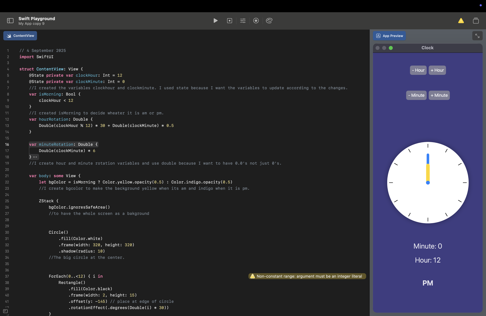
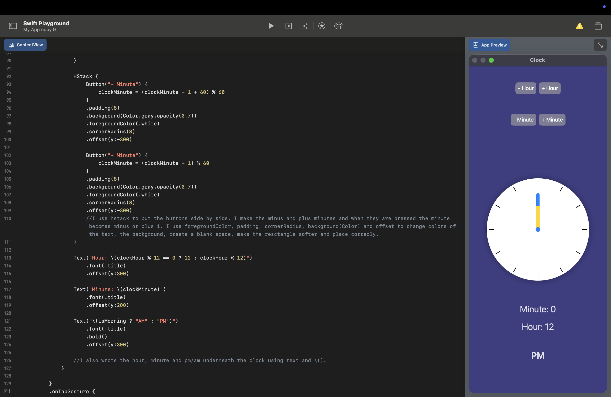

**[Home](README.md)** | **[Projects](Projects.md)** | **[Resources](Resources.md)** | **[Documentary](Documentary.md)**

# **[Documentary](Documentary.md)**

 

## Scratch Tic Tac Toe 

    

 

## Swift Box/Tic Tac Toe

//1 September 2025

import SwiftUI

struct ContentView: View {

    var body: some View {
    
        ZStack{
        
            Rectangle()
                .fill(Color.pink)
                .frame(width:120, height:120)
                .offset(x:250)
           
            Text("X")
                .foregroundStyle(.blue)
                .font(.largeTitle)
                .offset(x:250)
            
            Rectangle()
                .fill(Color.pink)
                .frame(width:120, height:120)
                .offset(x:250,y:250)
            Text("X")
                .foregroundStyle(.blue)
                .font(.largeTitle)
                .offset(x:250,y:250)
            
            Rectangle()
                .fill(Color.pink)
                .frame(width:120, height:120)
                .offset()
            Text("O")
                .foregroundStyle(.blue)
                .font(.largeTitle)
                .offset()
            
            Rectangle()
                .fill(Color.pink)
                .frame(width:120, height:120)
                .offset(y:250)
            Text("O")
                .foregroundStyle(.blue)
                .font(.largeTitle)
                .offset(y:250)
            
            Rectangle()
                .fill(Color.pink)
                .frame(width:120, height:120)
                .offset(x:-250)
            Text("X")
                .foregroundStyle(.blue)
                .font(.largeTitle)
                .offset(x:-250)
            
            Rectangle()
                .fill(Color.pink)
                .frame(width:120, height:120)
                .offset(x:-250,y:250)
            Text("X")
                .foregroundStyle(.blue)
                .font(.largeTitle)
                .offset(x:-250,y:250)
            
            Rectangle()
                .fill(Color.pink)
                .frame(width:120, height:120)
                .offset(y:-250)
            Text("O")
                .foregroundStyle(.blue)
                .font(.largeTitle)
                .offset(y:-250)
            
            Rectangle()
                .fill(Color.pink)
                .frame(width:120, height:120)
                .offset(x:250, y:-250)
            Text("X")
                .foregroundStyle(.blue)
                .font(.largeTitle)
                .offset(x:250,y:-250)
            
            Rectangle()
                .fill(Color.pink)
                .frame(width:120, height:120)
                .offset(x:-250,y:-250)
            Text("X")
                .foregroundStyle(.blue)
                .font(.largeTitle)
                .offset(x:-250,y:-250)
        }
    }
}

 

## Swift Favorites

//1 September 2025

import SwiftUI

struct ContentView: View {

    var favoriteEmoji = "😡"
    let favoriteNumber = 3
    var favoriteColor = "Mavi"
    
    var body: some View {
        VStack(spacing: 20) {
            Text("Benim favori emojim: \(favoriteEmoji)")
            Text("Favori sayım: \(favoriteNumber)")
            Text("Favori rengim: \(favoriteColor)")
        }
       
    }
}

 

## Swift Ice Cream Shop

//1 September 2025

import SwiftUI

struct ContentView: View {

    var body: some View{
    
        let ConePrice = 15
        let ConeAmount = 3
        let Total = ConePrice*ConeAmount
        
        VStack{
            Text("One cone price is \(ConePrice).")
                .bold()
                .foregroundColor(.blue)
            Text("The cone amount you chose is \(ConeAmount).")
                .bold()
                .foregroundColor(.yellow)
            Text("The total price is \(Total)")
                .bold()
                .foregroundColor(.green)
        }
                
    }
}

 

## Swift Hamburger Cafe

//2 September 2025

import SwiftUI

struct ContentView: View {

    var body: some View {
        let ham = 68
        let numh = 2
        let pat = 25
        let nump = 1
        let drink = 15
        let numd = 2
        let sum = numh+ham + pat*nump + drink*numd
        let sumh = ham*numh 
        let sump = pat*nump
        let sumd = drink*numd
        VStack {
            Text("Check")
                .font(.largeTitle)
                .bold()
                .padding()
            Text("Hamburger: \(ham) x \(numh) = \(sumh)")
            Text("Potatos: \(pat) x \(nump) = \(sump)")
            Text("Drinks: \(drink) x \(numd) = \(sumd)")
            Text("Total:\(sum) TL")
                .font(.subheadline)
                .foregroundStyle(.blue)
                .bold()
                .padding()
        }
        
    }
}

 

## Swift Calculator

  

//3 September 2025

import SwiftUI

struct ContentView: View {

    @State private var number1 = ""
    @State private var number2 = ""
    @State private var final = ""

    func addition() {
        let one = Double(number1) ?? 0
        let two = Double(number2) ?? 0
        final = String(one + two)
    }
    
    func subtraction() {
        let one = Double(number1) ?? 0
        let two = Double(number2) ?? 0
        final = String(one - two)
        
    }
    func divison() {
        let one = Double(number1) ?? 0
        let two = Double(number2) ?? 0
        final = String(one/two)
        
    }
    func multiplication() {
        let one = Double(number1) ?? 0
        let two = Double(number2) ?? 0
        final = String(one*two)
        
    }
    
    
    
    var body: some View {
        VStack(spacing: 15) {
            Text("🧮 Calculator 🧮")
                .font(.largeTitle)
                .bold()
            TextField("Enter a number", text: $number1)
            //I used VStack to stack up the texts vertically. The TextField is the way to gather the input from the user. It's like input(int("") from Phyton, you ask the question written on the text part and get the desired data from the user. 
            
            TextField("Enter a second number", text: $number2)
            
            Button(action: addition) {
                Text("Addition")
                    .foregroundColor(.blue)
                    .bold()
            //I used the buttons to create something that can activate something when clicked on. So each of the addition, subtraction, divison, multiplication is actually are buttons. They can be clicked and when they do the correct variable from we wrote on the very start gets shown for the answer. These buttons are almost the same the other operations can be made by just changing names, text features and variables.
            }
            Button(action: subtraction) {
                Text("Subtraction")
                    .foregroundColor(.yellow)
                    .bold()
            }
            
            Button(action: divison) {
                Text("Division")
                    .foregroundColor(.green)
                    .bold()
            }
            Button(action: multiplication) {
                Text("Multiplication")
                    .foregroundColor(.yellow)
                    .bold()
            }
            Text("Answer: \(final)")
                .foregroundColor(.blue)
                .bold()
            //This part of the code is very basic you just write a text and show the correct variable after that.
        }
        .padding()
    }
    
    
}

 

## Profile Image

  

//4 September 2025

import SwiftUI

struct ContentView: View {

    var body: some View {
        ZStack{
            Color.teal
                .opacity(0.3)
            //The background color
            
            RoundedRectangle(cornerRadius: 150)
                .frame(width: 275, height: 350)
                .foregroundColor(.brown)
            //The face
            
            Rectangle()
                .frame(width: 80, height: 200)
                .offset(y: 200)
                .foregroundColor(.brown)
            //The neck
            
            RoundedRectangle(cornerRadius: 100)
                .foregroundColor(.gray)
                .frame(width: 350, height: 400)
                .offset(y:400)
                .shadow(radius: 10)
            //The body
            
            
            Circle()
                .trim(from: 0.5, to: 1.0)
                .frame(width: 300)
                .offset(y: -50)
                .foregroundColor(.orange).shadow(radius: 10)
            //The hair
            
            Ellipse()
                .frame (width: 50, height: 30)
                .offset(x: -55)
                .foregroundColor(.white)
            //The outer layer of the left eye  
            
            Ellipse()
                .frame (width: 50, height: 30)
                .offset(x: 55)
                .foregroundColor(.white)
            //The outer layer of the right eye
            
            Ellipse()
                .frame (width: 15, height: 15)
                .offset(x: -55)
                .foregroundColor(.brown)
            //The inner layer of the left eye
            
            Ellipse()
                .frame (width: 15, height: 15)
                .offset(x: 55)
                .foregroundColor(.brown)
            //The inner layer of the right eye
            
            Image(systemName: "line.diagonal")
                .offset(y:40)
                .bold()
            //The nose
            
            Ellipse()
                .frame(width: 60, height: 20)
                .offset(y: 80)
            //The mouth
            
            Text(".)")
                .font(.largeTitle)
                .bold()
                .foregroundColor(.orange)
                .offset(y:280)
                .offset(x:75)
            //The team logo
            
            Text("6  4  3  1")
                .font(.largeTitle)
                .foregroundColor(.orange)
                .bold()
                .offset(y:360)
            //The team number
        }
    }
}

 

## Swift Clock

      

//4 September 2025

import SwiftUI

struct ContentView: View {

    @State private var hour: Int = 12
    @State private var minute: Int = 0

    var AMPM: Bool {
        return hour < 12
    }
    var hourangle: Double {
        return Double(hour % 12) * 30 + Double(minute) * 0.5
    }
    var minangle: Double {
        return Double(minute) * 6
    }
    
    var body: some View {
        let backcolor = AMPM ? Color.yellow : Color.indigo.opacity(0.5)
       
            ZStack {
                Text("Hour: \(hour % 12 == 0 ? 12 : hour % 12)")
                    .font(.title)
                    .bold()
                    .foregroundColor(.blue)
                    .offset(y:200)
                
                Text("Minutes: \(minute)")
                    .font(.title)
                    .bold()
                    .foregroundColor(.blue)
                    .offset(y:250)
                
                Text(AMPM ? "AM" : "PM")
                    .font(.title)
                    .bold()
                    .foregroundColor(.blue)
                    .offset(y:300)
                
                Button("- Hour") {
                    hour = (hour - 1 + 24) % 24
                }
                    .padding()
                    .foregroundColor(.green)
                    .bold()
                    .offset(y:-200)
                    .offset(x:100)
                        
                Button("+ Hour") {
                    hour = (hour + 1) % 24
                }
                    .padding()
                    .foregroundColor(.green)
                    .bold()
                    .offset(y:-200)
                    .offset(x:-100)
               
                Button("- Minute") {
                        minute = (minute - 1 + 60) % 60
                }
                    .padding()
                    .foregroundColor(.green)
                    .bold()
                    .offset(y:-300)
                    .offset(x:-100)
                
                Button("+ Minute") {
                    minute = (minute + 1) % 60
                }
                    .padding()
                    .foregroundColor(.green)
                    .bold()
                    .offset(y:-300)
                    .offset(x:100)
            
                
                backcolor
                    .ignoresSafeArea()
            
                
                Circle()
                    .fill(Color.white)
                    .frame(width: 300, height: 300)
                
                
                RoundedRectangle(cornerRadius: 25.0)
                    .fill(Color.yellow)
                    .frame(width: 15, height: 100)
                    .offset(y: -62)
                    .rotationEffect(.degrees(minangle))
                    
            
                RoundedRectangle(cornerRadius: 25.0)
                    .fill(Color.blue)
                    .frame(width: 15, height: 75)
                    .offset(y: -50)
                    .rotationEffect(.degrees(hourangle))
                
                Circle()
                    .fill(Color.blue)
                    .frame(width: 15, height: 15)
                
                
                ForEach(0..<12) { i in
                    Rectangle()
                        .fill(Color.black)
                        .frame(width: 2, height: 15)
                        .offset(y: -135)
                        .rotationEffect(.degrees(Double(i) * 30))
                }
            }
        
        .onTapGesture {
            minute += 1
            if minute == 60 {
                minute = 0
                hour = (hour + 1) % 24
            }
        }
        .animation(.easeInOut(duration: 0.5), value: hourangle + minangle)
    }
}
          
    

