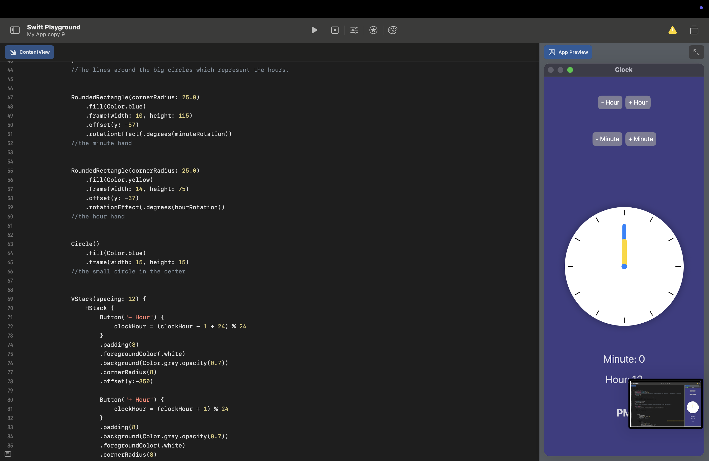
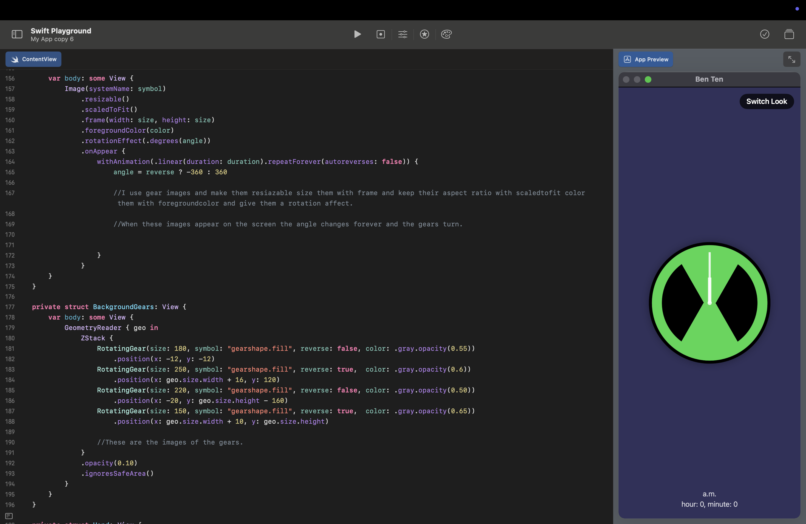

**[Home](README.md)** | **[Projects](Projects.md)** | **[Resources](Resources.md)** | **[Documentary](Documentary.md)** | **[Big Ideas](Big_Ideas.md)** | **[Data Compression](Data_Compression.md)**

# **[Documentary](Documentary.md)**

 

## Scratch Tic Tac Toe 

    

 

## Swift Box/Tic Tac Toe

    //1 September 2025
    import SwiftUI

    struct ContentView: View {
    var body: some View {
        ZStack{
            //ZStack ensures that subsequent objects overwrite the first object. This means that with this code, it can overwrite X or squares.
            Rectangle()
                .fill(Color.pink)
                .frame(width:120, height:120)
                .offset(x:250)
            //This code is to create the squares where the X's and O's are staying on. Fill enables the rectangle to be the color that is chosen, frame is to size the shape and offset is to place the rectangle to the correct place. 
            Text("X")
                .foregroundStyle(.blue)
                .font(.largeTitle)
                .offset(x:250)
            //This code is to create the X on top of the squares. The code starts with text because x is a letter and it is technically a text. ForegroundStyle is to color the text, font is to change the size or shape of the X and offset is to place it on the page. (You can write the O with the same codes by just changing the text to "O")
            
            Rectangle()
                .fill(Color.pink)
                .frame(width:120, height:120)
                .offset(x:250,y:250)
            Text("X")
                .foregroundStyle(.blue)
                .font(.largeTitle)
                .offset(x:250,y:250)
            
            Rectangle()
                .fill(Color.pink)
                .frame(width:120, height:120)
                .offset()
            Text("O")
                .foregroundStyle(.blue)
                .font(.largeTitle)
                .offset()
            
            Rectangle()
                .fill(Color.pink)
                .frame(width:120, height:120)
                .offset(y:250)
            Text("O")
                .foregroundStyle(.blue)
                .font(.largeTitle)
                .offset(y:250)
            
            Rectangle()
                .fill(Color.pink)
                .frame(width:120, height:120)
                .offset(x:-250)
            Text("X")
                .foregroundStyle(.blue)
                .font(.largeTitle)
                .offset(x:-250)
            
            Rectangle()
                .fill(Color.pink)
                .frame(width:120, height:120)
                .offset(x:-250,y:250)
            Text("X")
                .foregroundStyle(.blue)
                .font(.largeTitle)
                .offset(x:-250,y:250)
            
            Rectangle()
                .fill(Color.pink)
                .frame(width:120, height:120)
                .offset(y:-250)
            Text("O")
                .foregroundStyle(.blue)
                .font(.largeTitle)
                .offset(y:-250)
            
            Rectangle()
                .fill(Color.pink)
                .frame(width:120, height:120)
                .offset(x:250, y:-250)
            Text("X")
                .foregroundStyle(.blue)
                .font(.largeTitle)
                .offset(x:250,y:-250)
            
            Rectangle()
                .fill(Color.pink)
                .frame(width:120, height:120)
                .offset(x:-250,y:-250)
            Text("X")
                .foregroundStyle(.blue)
                .font(.largeTitle)
                .offset(x:-250,y:-250)
        }
    }
    }

 

## Swift Favorites

       //1 September 2025
    import SwiftUI

    struct ContentView: View {
    var favoriteEmoji = "😡"
    let favoriteNumber = 3
    var favoriteColor = "Mavi"
    //By using var I set some variables. I set my favorite emoji and number and color. The number part doesn't use var. It uses let instead because for integers let is supposed to be used. 
    
    var body: some View {
        VStack(spacing: 20) {
            Text("Benim favori emojim: \(favoriteEmoji)")
            Text("Favori sayım: \(favoriteNumber)")
            Text("Favori rengim: \(favoriteColor)")
            //By using VStack I stack all the texts I wrote beneath vertically. With the spacing being 20 pixels every text has a 20 pixel space between them. I wrote my favorite emoji, number and color with half text and half variables. I used text to make it look like normal sentences and I wrote the variable names in the format of \() like \(favoriteNumber). The slash and paranthesis keep the text different from the variables and so my variables and texts unite to create 3 sentences. 
            
            
        }
       
    }
    }

 

## Swift Ice Cream Shop

       //1 September 2025
    import SwiftUI

    struct ContentView: View {
    var body: some View{
        let ConePrice = 15
        let ConeAmount = 3
        let Total = ConePrice*ConeAmount
        //This code is basically a library of my variables. With the let codes I can set integer variables like the price and amount of cones. By multiplyin these two variables I find the total. 
        
        VStack{
            Text("One cone price is \(ConePrice).")
                .bold()
                .foregroundColor(.blue)
            Text("The cone amount you chose is \(ConeAmount).")
                .bold()
                .foregroundColor(.yellow)
            Text("The total price is \(Total)")
                .bold()
                .foregroundColor(.green)
            //With VStack you can put texts or shapes or etc. vertically. So I used texts and the variables I wrote before and united them to create sentences that showed the user all the variables in a correct way. I made the texts bol with the code .bold() and changed the colors with .foregroundColor(.color).
        }
                
    }
    }

 

## Swift Hamburger Cafe

    //2 September 2025
    import SwiftUI

    struct ContentView: View {
    var body: some View {
        let ham = 68
        //Hamburger price
        let numh = 2
        //Hamburger amount
        let pat = 25
        //Potato price
        let nump = 1
        //Potato amount
        let drink = 15
        //Drink price
        let numd = 2
        //Drink amount
        let sum = numh+ham + pat*nump + drink*numd
        //Total price
        let sumh = ham*numh 
        //Total hamburger price
        let sump = pat*nump
        //Total potato price
        let sumd = drink*numd
        //Total drink price
        //I wrote all the variables into here and because they are all integers I used let instead of var.
        VStack {
            Text("Check")
                .font(.largeTitle)
                .bold()
                .padding()
            Text("Hamburger: \(ham) x \(numh) = \(sumh)")
            Text("Potatos: \(pat) x \(nump) = \(sump)")
            Text("Drinks: \(drink) x \(numd) = \(sumd)")
            Text("Total:\(sum) TL")
                .font(.subheadline)
                .foregroundStyle(.blue)
                .bold()
                .padding()
            //With VStack you can vertically put the texts, objects and etc. together. I wrote a title for the cafe and then I used operations to calculate the total and gave 3 variables plus the total check. 
            
            
            
        }
        
    }
    }

 

## Swift Calculator

  

     //3 September 2025
    import SwiftUI

    struct ContentView: View {
    @State private var number1 = ""
    @State private var number2 = ""
    @State private var final = ""
    //This code is basically declaring the input that will furtherly be gotten by the user.
    func addition() {
        let one = Double(number1) ?? 0
        let two = Double(number2) ?? 0
        final = String(one + two)
    }
    //By adding functions I basically create blocks that when used does the things written underneath them. So they are blocks that you create and make your work more practical. This function is the addition one and I wrote the other codes by changing the names and operations.
    func subtraction() {
        let one = Double(number1) ?? 0
        let two = Double(number2) ?? 0
        final = String(one - two)
        
    }
    func divison() {
        let one = Double(number1) ?? 0
        let two = Double(number2) ?? 0
        final = String(one/two)
        
    }
    func multiplication() {
        let one = Double(number1) ?? 0
        let two = Double(number2) ?? 0
        final = String(one*two)
        
    }
    
    
    
    var body: some View {
        VStack(spacing: 15) {
            Text("🧮 Calculator 🧮")
                .font(.largeTitle)
                .bold()
            TextField("Enter a number", text: $number1)
            //I used VStack to stack up the texts vertically. The TextField is the way to gather the input from the user. It's like input(int("") from Phyton, you ask the question written on the text part and get the desired data from the user. 
            
            TextField("Enter a second number", text: $number2)
            
            Button(action: addition) {
                Text("Addition")
                    .foregroundColor(.blue)
                    .bold()
            //I used the buttons to create something that can activate something when clicked on. So each of the addition, subtraction, divison, multiplication is actually are buttons. They can be clicked and when they do the correct variable from we wrote on the very start gets shown for the answer. These buttons are almost the same the other operations can be made by just changing names, text features and variables.
            }
            Button(action: subtraction) {
                Text("Subtraction")
                    .foregroundColor(.yellow)
                    .bold()
            }
            
            Button(action: divison) {
                Text("Division")
                    .foregroundColor(.green)
                    .bold()
            }
            Button(action: multiplication) {
                Text("Multiplication")
                    .foregroundColor(.yellow)
                    .bold()
            }
            Text("Answer: \(final)")
                .foregroundColor(.blue)
                .bold()
            //This part of the code is very basic you just write a text and show the correct variable after that.
        }
        .padding()
    }
    
    
    }

 

## Profile Image

  

    //4 September 2025
    import SwiftUI

    struct ContentView: View {
    var body: some View {
        ZStack{
            Color.teal
                .opacity(0.3)
            //The background color
            
            RoundedRectangle(cornerRadius: 150)
                .frame(width: 275, height: 350)
                .foregroundColor(.brown)
            //The face
            
            Rectangle()
                .frame(width: 80, height: 200)
                .offset(y: 200)
                .foregroundColor(.brown)
            //The neck
            
            RoundedRectangle(cornerRadius: 100)
                .foregroundColor(.gray)
                .frame(width: 350, height: 400)
                .offset(y:400)
                .shadow(radius: 10)
            //The body
            
            
            Circle()
                .trim(from: 0.5, to: 1.0)
                .frame(width: 300)
                .offset(y: -50)
                .foregroundColor(.orange).shadow(radius: 10)
            //The hair
            
            Ellipse()
                .frame (width: 50, height: 30)
                .offset(x: -55)
                .foregroundColor(.white)
            //The outer layer of the left eye  
            
            Ellipse()
                .frame (width: 50, height: 30)
                .offset(x: 55)
                .foregroundColor(.white)
            //The outer layer of the right eye
            
            Ellipse()
                .frame (width: 15, height: 15)
                .offset(x: -55)
                .foregroundColor(.brown)
            //The inner layer of the left eye
            
            Ellipse()
                .frame (width: 15, height: 15)
                .offset(x: 55)
                .foregroundColor(.brown)
            //The inner layer of the right eye
            
            Image(systemName: "line.diagonal")
                .offset(y:40)
                .bold()
            //The nose
            
            Ellipse()
                .frame(width: 60, height: 20)
                .offset(y: 80)
            //The mouth
            
            Text(".)")
                .font(.largeTitle)
                .bold()
                .foregroundColor(.orange)
                .offset(y:280)
                .offset(x:75)
            //The team logo
            
            Text("6  4  3  1")
                .font(.largeTitle)
                .foregroundColor(.orange)
                .bold()
                .offset(y:360)
            //The team number
        }
    }
    }

 

## Swift Clock

      

    // 4 September 2025
    import SwiftUI

    struct ContentView: View {
    @State private var clockHour: Int = 12
    @State private var clockMinute: Int = 0
    //I created the variables clockhour and clockminute. I used state because I want the variables to update according to the changes. 
    var isMorning: Bool {
        clockHour < 12
    }
    //I created isMorning to decide wheater it is am or pm. 
    var hourRotation: Double {
        Double(clockHour % 12) * 30 + Double(clockMinute) * 0.5
    }
    
    var minuteRotation: Double {
        Double(clockMinute) * 6
    }
    //I create hour and minute rotation variables and use double because I want to have 0.0's not just 0's.
    
    var body: some View {
        let bgColor = isMorning ? Color.yellow.opacity(0.5) : Color.indigo.opacity(0.5)
        //I create bgcolor to make the background yellow when its am and indigo when it is pm. 
        
        ZStack {
            bgColor.ignoresSafeArea()
            //to have the whole screen as a bakground
            
           
            Circle()
                .fill(Color.white)
                .frame(width: 320, height: 320)
                .shadow(radius: 10)
            //The big circle at the center.
            
           
            ForEach(0..<12) { i in
                Rectangle()
                    .fill(Color.black)
                    .frame(width: 2, height: 15)
                    .offset(y: -145) // place at edge of circle
                    .rotationEffect(.degrees(Double(i) * 30))
            }
            //The lines around the big circles which represent the hours.
            
            
            RoundedRectangle(cornerRadius: 25.0)
                .fill(Color.blue)
                .frame(width: 10, height: 115)
                .offset(y: -57)
                .rotationEffect(.degrees(minuteRotation))
            //the minute hand
            
            
            RoundedRectangle(cornerRadius: 25.0)
                .fill(Color.yellow)
                .frame(width: 14, height: 75)
                .offset(y: -37)
                .rotationEffect(.degrees(hourRotation))
            //the hour hand
            
           
            Circle()
                .fill(Color.blue)
                .frame(width: 15, height: 15)
            //the small circle in the center
            
          
            VStack(spacing: 12) {
                HStack {
                    Button("- Hour") {
                        clockHour = (clockHour - 1 + 24) % 24
                    }
                    .padding(8)
                    .foregroundColor(.white)
                    .background(Color.gray.opacity(0.7))
                    .cornerRadius(8)
                    .offset(y:-350)
                    
                    Button("+ Hour") {
                        clockHour = (clockHour + 1) % 24
                    }
                    .padding(8)
                    .background(Color.gray.opacity(0.7))
                    .foregroundColor(.white)
                    .cornerRadius(8)
                    .offset(y:-350)
                    //I use hstack to put the buttons side by side. I make the minus and plus hour and when they are pressed the hour becomes minus or plus 1. I use foregroundColor, padding, cornerRadius, background(Color) and offset to change colors of the text, the background, create a blank space, make the resctangle softer and place correcly. 
                    
                }
                
                HStack {
                    Button("- Minute") {
                        clockMinute = (clockMinute - 1 + 60) % 60
                    }
                    .padding(8)
                    .background(Color.gray.opacity(0.7))
                    .foregroundColor(.white)
                    .cornerRadius(8)
                    .offset(y:-300)
                    
                    Button("+ Minute") {
                        clockMinute = (clockMinute + 1) % 60
                    }
                    .padding(8)
                    .background(Color.gray.opacity(0.7))
                    .foregroundColor(.white)
                    .cornerRadius(8)
                    .offset(y:-300)
                    //I use hstack to put the buttons side by side. I make the minus and plus minutes and when they are pressed the minute becomes minus or plus 1. I use foregroundColor, padding, cornerRadius, background(Color) and offset to change colors of the text, the background, create a blank space, make the resctangle softer and place correcly. 
                }
                
                Text("Hour: \(clockHour % 12 == 0 ? 12 : clockHour % 12)")
                    .font(.title)
                    .offset(y:300)
                
                Text("Minute: \(clockMinute)")
                    .font(.title)
                    .offset(y:200)
                
                Text("\(isMorning ? "AM" : "PM")")
                    .font(.title)
                    .bold()
                    .offset(y:300)
                
                //I also wrote the hour, minute and pm/am underneath the clock using text and \().
            }

        }
        .onTapGesture {
            clockMinute += 1
            if clockMinute == 60 {
                clockMinute = 0
                clockHour = (clockHour + 1) % 24
                //With this code when the screen is pressed the minute increases by 1 and when the minute becomes 60 it becomes 0 and hour increases by 1. 
            }
        }
        .animation(.easeInOut(duration: 0.4), value: clockHour + clockMinute)
        //This is an animation that makes the movement of the hour and minute hands in the clock to move more smoothly. 
    }
    }

 

## Swift Ben Ten Watch

         

    //12/07/2025
    import SwiftUI

    struct ContentView: View {
    @State private var showFirstWatch = true 
    @State private var hour: Int = 0
    @State private var minute: Int = 0
    
    //I create the variables for the style of the watch, minute and the hour. State helps the variables to change
    
    private var isAM: Bool { (hour % 24) < 12 }
    private var minuteAngle: Double { Double(minute) * 6 }
    private var hourAngle: Double { Double(hour % 12) * 30 + Double(minute) * 0.5 }
    
    //I create integer variables that are am/pm, minute hand's angle and the hour hand's angle. I use double to make it like 0.0 instead of 0. 
    
    var body: some View {
        ZStack {
            //In this part I draw the Ben Ten watch. I use ZStack to stack the shapes on top of each other. I use frame to size, foregroundcolor to color, shadow to put shadows, offset to place, and resiable and scaled to fit for the triangles ı got from the shape library. I use rotation to rotate the triangle images. 
            if showFirstWatch {
   
                ZStack {
                    Color.indigo.opacity(0.3).ignoresSafeArea()
                    //Background color
                    Circle()
                        .frame(width: 288)
                        .foregroundColor(.black)
                        .shadow(radius: 10)
                    //The big circle behind
                    
                    Image(systemName: "triangle.fill")
                        .resizable()
                        .scaledToFit()
                        .frame(width: 143, height: 143)
                        .foregroundColor(.green)
                        .rotationEffect(.degrees(180))
                        .offset(y: -59)
                    //The upper triangle
                    Image(systemName: "triangle.fill")
                        .resizable()
                        .scaledToFit()
                        .frame(width: 143, height: 143)
                        .foregroundColor(.green)
                        .offset(y: 59)
                    //The lower triangle
                    Circle()
                        .stroke(.green.opacity(1), lineWidth: 23.5)
                        .frame(width: 250)
                    //The green ring around the triangles
                    Rectangle()
                        .frame(width: 5, height: 120)
                        .offset(y: -60)
                        .rotationEffect(.degrees(minuteAngle))
                        .animation(.easeInOut(duration: 0.4), value: minuteAngle)
                    //The minute hand
                    Rectangle()
                        .frame(width: 8, height: 60)
                        .offset(y: -30)
                        .rotationEffect(.degrees(hourAngle))
                        .animation(.easeInOut(duration: 0.4), value: hourAngle)
                    //The hour hand
                    Circle()
                        .frame(width: 10, height: 10)
                    //The little circle at the center. 
                }
            } else {
                //If the variable showFirstWatch isn't true then this style of the watch is seen.
                ZStack {
                    BackgroundGears()
                    //Shapes of gears that are behind
                    Circle().stroke(.gray.opacity(0.6), lineWidth: 4)
                        .frame(width: 288, height: 288)
                    //The ring around the gears
                    
                    RotatingGear(size: 224, symbol: "gearshape", reverse: true,  color: .gray.opacity(0.55))
                    RotatingGear(size: 128, symbol: "gearshape", reverse: false, color: .gray.opacity(0.65))
                    RotatingGear(size: 64,  symbol: "gear",      reverse: false, color: .gray.opacity(0.7))
                        .offset(x: 72, y: -72)
                    RotatingGear(size: 48,  symbol: "gear",      reverse: true,  color: .gray.opacity(0.7))
                        .offset(x: -56, y: 72)
                    //The gears in the watch
                    
                    Hand(width: 5, length: 100, color: .white.opacity(0.85))
                        .rotationEffect(.degrees(minuteAngle))
                        .animation(.easeInOut(duration: 0.4), value: minuteAngle)
                    //The minute hand
                    Hand(width: 8, length: 60, color: .white)
                        .rotationEffect(.degrees(hourAngle))
                        .animation(.easeInOut(duration: 0.4), value: hourAngle)
                    //The hour hand
                    Circle()
                        .fill(Color.green)
                        .overlay(Circle().stroke(Color.black, lineWidth: 2))
                        .frame(width: 16, height: 16)
                    //The little circle on the center
                }
            }
        }

        .overlay(alignment: .bottom) {
            VStack(spacing: 4) {
                Text(isAM ? "a.m." : "p.m.")
                    .foregroundStyle(.white.opacity(0.8))
                Text("hour: \(hour), minute: \(minute)")
                    .foregroundStyle(.white.opacity(0.8))
                //The am/pm and minute and hour texts at the bottom. overlay is to put the text on the place selected on the screen
            }
            .padding(.bottom, 24)
            //A blank line to make it look better
        }

        .overlay(alignment: .topTrailing) {
            Button(action: {
                withAnimation(.easeInOut) {
                    showFirstWatch.toggle()
                    //The switch button. Overlay is used to place, buttonaction is used to show the function of the button, toggle is used to change the variable
                }
            }) {
                Text("Switch Look")
                    .font(.headline)
                    .padding(.horizontal, 16)
                    .padding(.vertical, 8)
                    .background(Color.black.opacity(0.7))
                    .foregroundColor(.white)
                    .clipShape(Capsule())
                //The button's look. ClicShape is to create the capsule-like look. 
            }
            .padding()
        }

        .contentShape(Rectangle())
        .onTapGesture {
            withAnimation(.easeInOut(duration: 0.4)) {
                minute += 15
                if minute >= 60 {
                    minute = 0
                    hour = (hour + 1) % 24
                    
                    //When touched the minute increases by 15. If minute passes or gets equal to 60 then minute turns to 0 and hour increases by 1 from the 24
                }
            }
        }
    }
    }

    private struct RotatingGear: View {
    let size: CGFloat
    let symbol: String
    let reverse: Bool
    let color: Color
    var duration: Double = 20
    //I create variables to make the gears that are on the edges of the screen
    
    @State private var angle: Double = 0
    
    var body: some View {
        Image(systemName: symbol)
            .resizable()
            .scaledToFit()
            .frame(width: size, height: size)
            .foregroundColor(color)
            .rotationEffect(.degrees(angle))
            .onAppear {
                withAnimation(.linear(duration: duration).repeatForever(autoreverses: false)) {
                    angle = reverse ? -360 : 360
                    
                    //I use gear images and make them resiazable size them with frame and keep their aspect ratio with scaledtofit color them with foregroundcolor and give them a rotation affect.
                    
                    //When these images appear on the screen the angle changes forever and the gears turn.
                    
                    
                }
            }
    }
    }

    private struct BackgroundGears: View {
    var body: some View {
        GeometryReader { geo in
            ZStack {
                RotatingGear(size: 180, symbol: "gearshape.fill", reverse: false, color: .gray.opacity(0.55))
                    .position(x: -12, y: -12)
                RotatingGear(size: 250, symbol: "gearshape.fill", reverse: true,  color: .gray.opacity(0.6))
                    .position(x: geo.size.width + 16, y: 120)
                RotatingGear(size: 220, symbol: "gearshape.fill", reverse: false, color: .gray.opacity(0.50))
                    .position(x: -20, y: geo.size.height - 160)
                RotatingGear(size: 150, symbol: "gearshape.fill", reverse: true,  color: .gray.opacity(0.65))
                    .position(x: geo.size.width + 10, y: geo.size.height)
                
                //These are the images of the gears.
            }
            .opacity(0.10)
            .ignoresSafeArea()
        }
    }
    }

    private struct Hand: View {
    let width: CGFloat
    let length: CGFloat
    let color: Color
    
    var body: some View {
        Rectangle()
            .fill(color)
            .frame(width: width, height: length)
            .offset(y: -length / 2)
        //I create the hand variables for the hour and minute hands and fill them with color size and place them.
    }
    }
