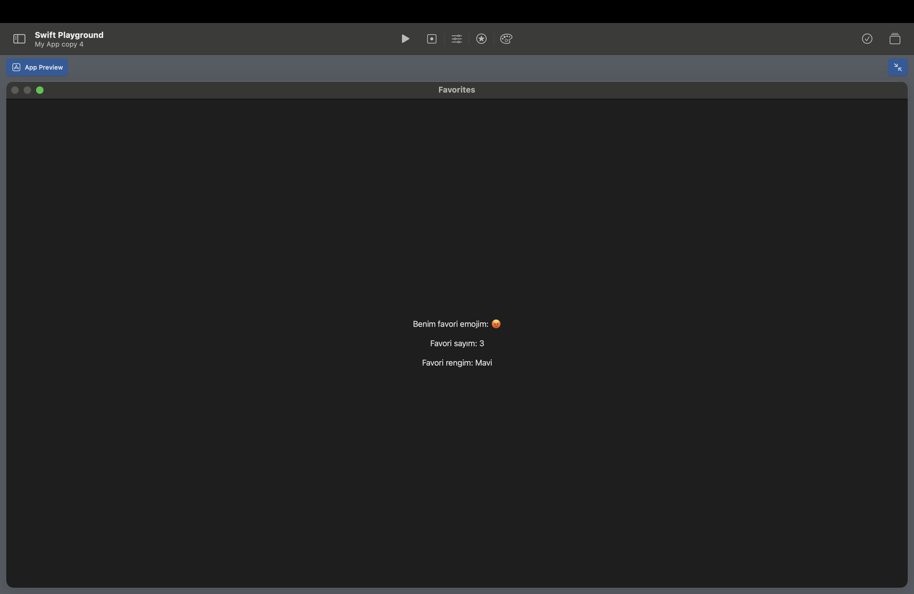

**[Home](README.md)** | **[Projects](Projects.md)** | **[Resources](Resources.md)** | **[Documentation](Documentary.md)** | **[Big Ideas](Big_Ideas.md)** | **[Data Compression](Data_Compression.md)** | **[Quiz Documentation](Quiz_Documentation.md)**

# **[Projects](Projects.md)**

 

## [Scratch Tic Tac Toe](https://scratch.mit.edu/projects/1212334765)

 

## [Swift Tic Tac Toe](https://github.com/kaankoca-debug/kaankoca-debug.github.io/tree/main/Projects/Swift)

 

## [Swift Favorites](https://github.com/kaankoca-debug/kaankoca-debug.github.io/tree/main/Projects/Swift/My%20App%20copy%204.swiftpm)

 

## [Swift Ice Cream Shop](https://github.com/kaankoca-debug/kaankoca-debug.github.io/tree/main/Projects/Swift/My%20App%20copy%205.swiftpm)

 

## [Swift Burger Cafe](https://github.com/kaankoca-debug/kaankoca-debug.github.io/tree/main/Projects/Swift/My%20App%20copy%206.swiftpm)

 

## [Swift Calculator](https://github.com/kaankoca-debug/kaankoca-debug.github.io/tree/main/Projects/Swift/My%20App%20copy%207.swiftpm)

 

## [Swift Profile](https://github.com/kaankoca-debug/kaankoca-debug.github.io/tree/main/Projects/Swift/My%20App%20copy%208.swiftpm)

 

## [Swift Clock](https://github.com/kaankoca-debug/kaankoca-debug.github.io/tree/main/Projects/Swift/My%20App%20copy%209.swiftpm)

 

## [Swift Ben Ten Watch](https://github.com/kaankoca-debug/kaankoca-debug.github.io/blob/main/Projects/Swift/My%20App%20copy%206.swiftpm.zip)

 

 

## [Swift Binary Converter 1](https://github.com/kaankoca-debug/kaankoca-debug.github.io/tree/main/Projects/Swift/My%20Playground.playgroundbook)

 

 

## [Swift Binary Converter 2](https://github.com/kaankoca-debug/kaankoca-debug.github.io/tree/main/Projects/Swift/My%20App%20copy%2010.swiftpm)

