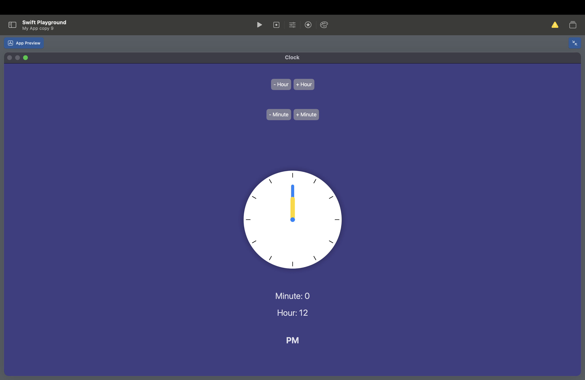

**[Home](README.md)** | **[Projects](Projects.md)** | **[Resources](Resources.md)** | **[Documentation](Documentary.md)** | **[Big Ideas](Big_Ideas.md)** | **[Data Compression](Data_Compression.md)** | **[Quiz Documentation](Quiz_Documentation.md)** | **[AP Topics](AP_Topics.md)** | **[Pseudocode/Swift](Pseudocode_Swift.md)**

# **[Projects](Projects.md)**

 

## [Scratch Tic Tac Toe](https://scratch.mit.edu/projects/1212334765)

 

## [Swift Tic Tac Toe](https://github.com/kaankoca-debug/kaankoca-debug.github.io/tree/main/Projects/Swift)

 

## [Swift Favorites](https://github.com/kaankoca-debug/kaankoca-debug.github.io/tree/main/Projects/Swift/My%20App%20copy%204.swiftpm)

 

## [Swift Ice Cream Shop](https://github.com/kaankoca-debug/kaankoca-debug.github.io/tree/main/Projects/Swift/My%20App%20copy%205.swiftpm)

 

## [Swift Burger Cafe](https://github.com/kaankoca-debug/kaankoca-debug.github.io/tree/main/Projects/Swift/My%20App%20copy%206.swiftpm)

 

## [Swift Calculator](https://github.com/kaankoca-debug/kaankoca-debug.github.io/tree/main/Projects/Swift/My%20App%20copy%207.swiftpm)

 

## [Swift Profile](https://github.com/kaankoca-debug/kaankoca-debug.github.io/tree/main/Projects/Swift/My%20App%20copy%208.swiftpm)

 

## [Swift Clock](https://github.com/kaankoca-debug/kaankoca-debug.github.io/tree/main/Projects/Swift/My%20App%20copy%209.swiftpm)

 

## [Swift Ben Ten Watch](https://github.com/kaankoca-debug/kaankoca-debug.github.io/blob/main/Projects/Swift/My%20App%20copy%206.swiftpm.zip)

 

 

## [Swift Binary Converter 1](https://github.com/kaankoca-debug/kaankoca-debug.github.io/tree/main/Projects/Swift/My%20Playground.playgroundbook)

 

 

## [Swift Binary Converter 2](https://github.com/kaankoca-debug/kaankoca-debug.github.io/tree/main/Projects/Swift/My%20App%20copy%2010.swiftpm)

 

## [Swift Ice Cream Overflow](https://github.com/kaankoca-debug/kaankoca-debug.github.io/blob/main/Projects/Swift/My%20App%20copy%2013.swiftpm.zip)

 

## [Swift Clock Game](https://github.com/kaankoca-debug/kaankoca-debug.github.io/blob/main/Projects/Swift/My%20App%20copy%2015.swiftpm.zip)

 

## [Swift Candy Shop Simulator](https://github.com/kaankoca-debug/kaankoca-debug.github.io/blob/main/Projects/Swift/My%20App%20copy%2019.swiftpm.zip)

  

 

## [Swift List Projects]()

      

**Reflection:**

As my theme I chose the alphabet becasue it was not hard to work with, and it was honestly the first idea that came to my mind when I started this project.

I found that in lists, the first item isn't seen as 1 its seen as index 0, and it continues increasing by 1. 

If I had more items in the list I would probably keep their fonts smaller because they wouldn't fit in the screen. Other than that I wouldn't chaneg anything because I think it's pretty straightforward. 

 

## [Enigma Machine Unplugged Project](https://github.com/kaankoca-debug/kaankoca-debug.github.io/blob/main/Projects/Swift/My%20App.swiftpm.zip)
  

**NOTE: I DIDN'T WRITE THE CODE. I USED AI.**

**Reflection:**
When I started the project I decided to teach people how to use the Enigma Machine with an unplugged and simple version of the machine. But first I had to understand how the machine worked. To fully understand it I chatted with ChatGPT for hours trying to make sure I wa sperfect at the topic. I first asked what the machine was and how it worked than I asked ChatGPT to create me quizzes. After the first quiz I saw that I didn't understand the machine. Than I made 10 other quizzes when each one was getting harder. After the "Ultimate Enigma Exam" I was sure that I was ready to create a game. I asked ChatGPT to create me images of examples for unplugged games like this and I used some parts of many different images and created a sketch with my sister who is good at drawing. After the sketch I used white cardboard, some markers and a pin to create the unplugged game. After creating the physical version I had to create a video for people to be more interested in the game. I wrote a script about World War 2 where this machine was originally used in and created the video from iMovie. I think it was a very instructional project where I learned almost everything I know about Cryptology. 

 

## [Swift City Clock List Project](https://github.com/kaankoca-debug/kaankoca-debug.github.io/blob/main/Projects/Swift/My%20App%20copy%204.swiftpm.zip)
 

 

## [Swift Ice Cream Shop List Project](https://github.com/kaankoca-debug/kaankoca-debug.github.io/blob/main/Projects/Swift/My%20App%20copy%207.swiftpm.zip)
 

 
