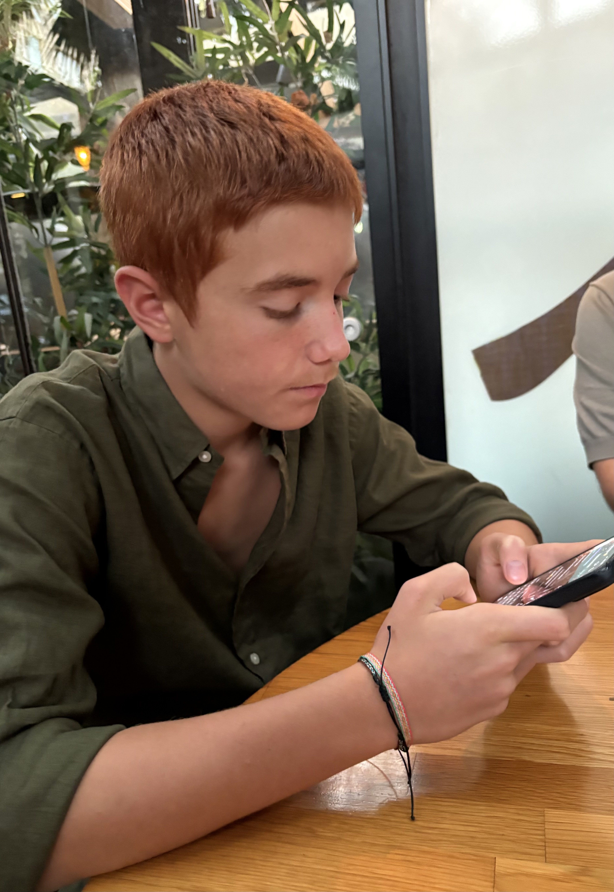

**[Home](README.md)** | **[Projects](Projects.md)** | **[Resources](Resources.md)** | **[Documentation](Documentary.md)** | **[Big Ideas](Big_Ideas.md)** | **[Data Compression](Data_Compression.md)** | **[Quiz Documentation](Quiz_Documentation.md)** | **[AP Topics](AP_Topics.md)**

# GitHub Pages

Hello I am Kaan Koca a 10th grade high school student from Hisar Schools located in İstanbul Türkiye. I created this GitHub page for my education and learning on coding, documentation and website creation. I am taking the course AP Computer Science Principles. In this course I am learning to code, document, compress data, collab in teams, create education videos and many more. This page will be the place where I will store my learning in. I will code programs, I will document them, create videos that teach people how I coded it, write paragraphs for collabration, program function, design and debugging, will create videos for the paragraphs, compress images, write reflections about my tests and put them all in HERE. If you want to view my journey in 10th grade AP CSP you can look at these pages.

## Kaan Koca Hisar CS

 
